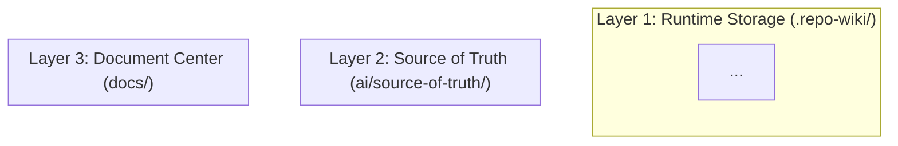

# Task Log: Task 6.4 - Architecture contract recovery and three-layer Mermaid design

## Summary

成功重写 `docs/01-architecture.md` 契约和模板，添加三层架构 Mermaid 图，强制要求解释 `.repo-wiki`、`ai/source-of-truth` 和 `docs` 三层关系，并将页面聚焦于设计推理而非原始模块/API 枚举。

## Details

### 1. 重写 01-architecture.md.j2 模板

新模板包含以下固定章节：
- 系统分层（三层架构概述）
- 服务协作关系（Scanner, Indexer, Generator, Adapter, Verifier）
- 核心数据流（数据流转路径）
- 存储与检索设计（分层存储说明和检索策略）
- 增量更新与治理闭环（按需生成和质量验证）
- Mermaid 架构图（4 个图：三层架构图、服务交互时序图、数据流图、检索流程图、增量更新流程图）

### 2. 添加 Architecture Contract Required Keys

扩展 architecture 契约的 required_keys：
- `architecture_description` - 架构概述描述
- `three_layer_overview` - 三层架构详细说明
- `service_collaboration` - 服务协作关系描述
- `core_data_flow` - 核心数据流描述
- `storage_retrieval_design` - 存储与检索设计说明
- `incremental_update_governance` - 增量更新与治理闭环说明
- `governance_checkpoints` - 治理检查点列表
- `module_overview_table` - 模块概览表格
- `tech_stack` - 技术栈表格

### 3. 更新 _build_core_context 方法

在 `engine.py` 中扩展 `_build_core_context` 方法，生成新字段：
- 自动生成三层架构描述
- 自动生成服务协作关系时序图 Mermaid
- 自动生成核心数据流描述和流程图
- 自动生成存储层次说明和检索策略
- 自动生成增量更新流程和治理检查点
- 自动生成模块概览表格（使用 domain 和 runtime_role 元数据）
- 自动生成技术栈表格

### 4. 添加 Architecture 验证函数

在 `contracts.py` 中添加验证函数：
- `validate_architecture_has_mermaid()` - 验证包含至少 2 个 Mermaid 图块
- `validate_architecture_not_module_enum()` - 验证不是纯模块/API 枚举

验证规则：
- 至少 2 个 Mermaid 图块
- 必须解释 .repo-wiki、ai/source-of-truth、docs 三层
- 模块/表格枚举比例 < 60%

## Output

### Modified Files

- `/templates/docs/01-architecture.md.j2` - 重写为三层架构设计文档
- `/repo_wiki/generator/contracts.py` - 扩展 architecture contract 和添加验证函数
- `/repo_wiki/generator/engine.py` - 更新 `_build_core_context` 生成新字段

### Key Template Sections

```markdown
## 系统分层

${three_layer_overview}

### 三层架构图



## 服务协作关系

${service_collaboration}

### 服务交互流程

```mermaid
sequenceDiagram
    participant Scanner
    participant Indexer
    ...
```

## 核心数据流

${core_data_flow}

## 存储与检索设计

${storage_retrieval_design}

## 增量更新与治理闭环

${incremental_update_governance}
```

### Validation Functions

```python
def validate_architecture_has_mermaid(content: str) -> tuple[bool, str]:
    # Check for mermaid blocks and three-layer explanation
    ...

def validate_architecture_not_module_enum(content: str) -> tuple[bool, str]:
    # Check that content focuses on design reasoning
    ...
```

## Issues

None

## Next Steps

Phase 06 所有任务已完成：
- Task 6.1: 文档契约重构和文档中心层 ✓
- Task 6.2: 业务域分类器和模块映射契约 ✓
- Task 6.3: Prose-first overview 契约和生成升级 ✓
- Task 6.4: 架构契约恢复和三层 Mermaid 设计 ✓
