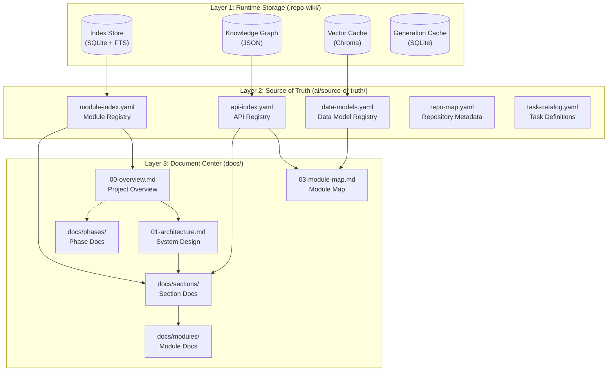
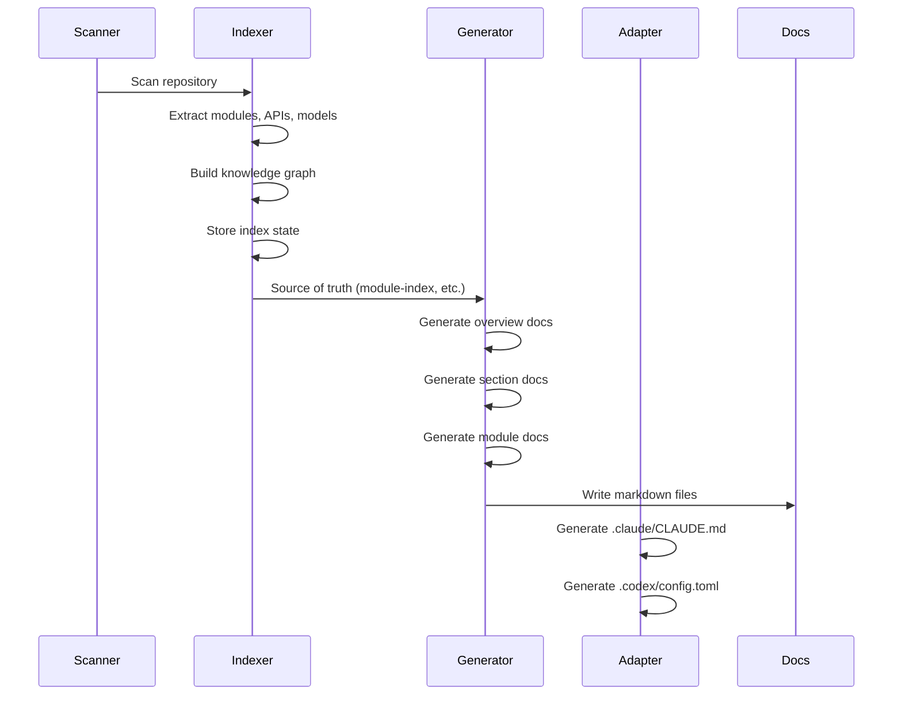
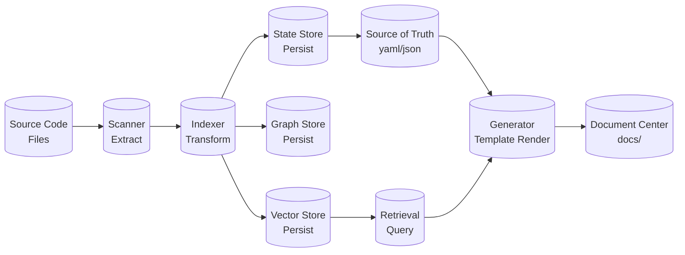
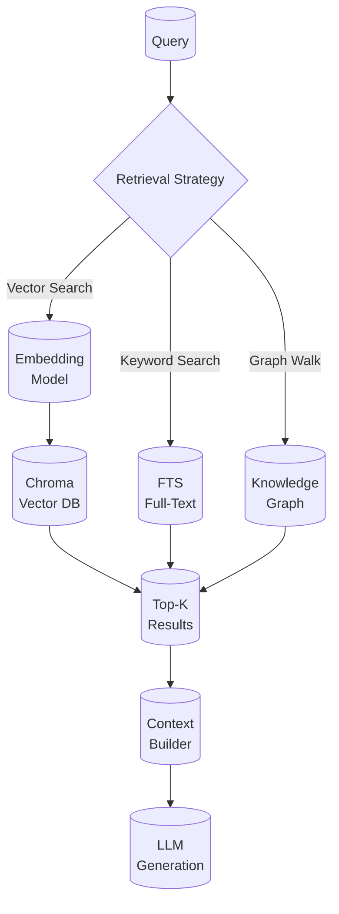
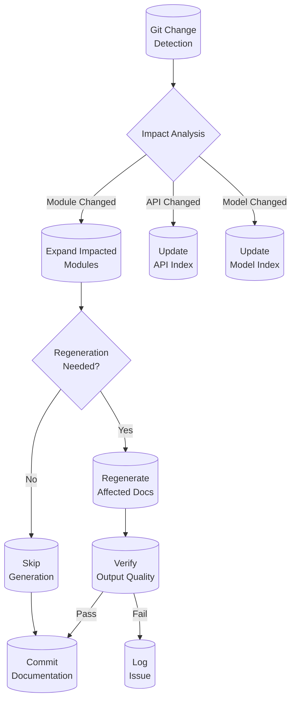

# repo-agent - 系统架构

repo-agent 采用三层架构设计，将运行时存储层、结构化事实层和文档中心层分离。这种设计确保了知识的持久化、可追溯性和可读性的平衡。

## 系统分层

**第一层：运行时存储层 (`.repo-wiki/`)**
负责支撑系统运行时操作的临时状态存储。
- **索引存储** (SQLite + FTS): 全文搜索和精确查询
- **知识图谱** (JSON): 模块间依赖关系和影响链
- **向量缓存** (Chroma): 语义检索的向量表示
- **生成缓存**: 避免重复生成，节省计算资源
**为什么需要这一层？** 这一层处理的是高频变化的运行时状态，不适合与稳定的结构化事实混在一起。

**第二层：结构化事实层 (`ai/source-of-truth/`)**
代表系统的"真理之源"，记录扫描后沉淀的结构化信息。
- **module-index.yaml**: 所有模块的元信息（名称、路径、依赖、域分类）
- **api-index.yaml**: API 端点注册表（路径、方法、处理器）
- **data-models.yaml**: 数据模型定义（类型、字段、关系）
- **repo-map.yaml**: 仓库级元数据和命令注册表
**为什么需要这一层？** 事实需要稳定、可追溯、可验证。结构化格式支持机器消费（生成器、适配器、治理检查）和自动化处理。

**第三层：文档中心层 (`docs/`)**
真正面向读者（人或者 AI agent）的知识导航界面。
- **总览文档** (00-05): 快速定位和能力了解
- **专题文档** (sections/): 按业务主题聚合的相关内容
- **模块文档** (modules/): 单个模块的详细参考
**为什么需要这一层？** 源代码和结构化事实都不是面向读者的最优格式。文档中心通过选择性的信息呈现（而非全量导出）来提升可读性。

### 三层架构图

## 服务协作关系

系统包含以下核心服务组件：
- **extensions** (API 服务器): Handles models instanceof, in.
- **repo_wiki** (API 服务器): Handles API routes /path.
- **scripts** (API 服务器): Handles exports AcceptanceEvidence, BaselineComparatorConfig.
- **tests** (API 服务器): Handles API routes /users, /users.

### 服务交互流程

## 核心链路

**代码扫描**：Scanner 遍历源代码，发现 4 个模块
**信息提取**：Indexer 从代码中提取 10 个 API 端点、44 个数据模型
**状态持久化**：索引状态、图谱关系、向量嵌入分别存储
**文档生成**：Generator 根据模板和事实数据生成 Markdown
**质量验证**：Verifier 检查文档结构和引用的有效性

### 数据流图

## 存储与检索设计

系统采用多模态存储策略以支持不同的访问模式：

**向量存储 (Chroma)**：支持语义相似性搜索，当用户用自然语言查询时，系统将查询转换为向量，在已存储的代码块中寻找最相似的内容。

**全文索引 (SQLite FTS)**：支持精确的关键词匹配，当用户知道要查找的术语时，可以直接通过关键词找到所有包含该术语的代码位置。

**知识图谱 (JSON)**：支持结构化的依赖关系查询，例如查找某个模块的所有上游依赖，或者确定修改某段代码会影响到哪些其他模块。

### 存储层次说明

| 存储位置 | 职责 | 格式 |
|---------|------|------|
| `.repo-wiki/index/` | 操作知识底座 | SQLite (FTS) |
| `.repo-wiki/graph/` | 依赖关系和影响链 | JSON |
| `.repo-wiki/cache/` | 生成缓存 | SQLite + diskcache |
| `ai/source-of-truth/` | 结构化事实源 | YAML |

### 检索流程

## 增量更新与治理闭环

${incremental_governance}

### 增量更新流程

### 治理检查点

- **模板覆盖**: 所有核心文档都有对应模板
- **契约验证**: 生成前验证 required_keys
- **Prose 约束**: 验证最小段落数和章节数
- **引用检查**: 验证文档间交叉引用有效性

## 模块概览

| extensions | core-platform | api-server | Handles models instanceof, in.... |
| repo_wiki | core-platform | api-server | Handles API routes /path.... |
| scripts | core-platform | api-server | Handles exports AcceptanceEvidence, BaselineCompar... |
| tests | core-platform | api-server | Handles API routes /users, /users.... |

## 技术栈

| 组件 | 技术 | 说明 |
|------|------|------|
| 语言 | Javascript | 主要实现语言 |
| 框架 | express | Web/应用框架 |
| 存储 | SQLite | 状态和缓存存储 |
| 向量 | Chroma | 语义检索向量数据库 |
