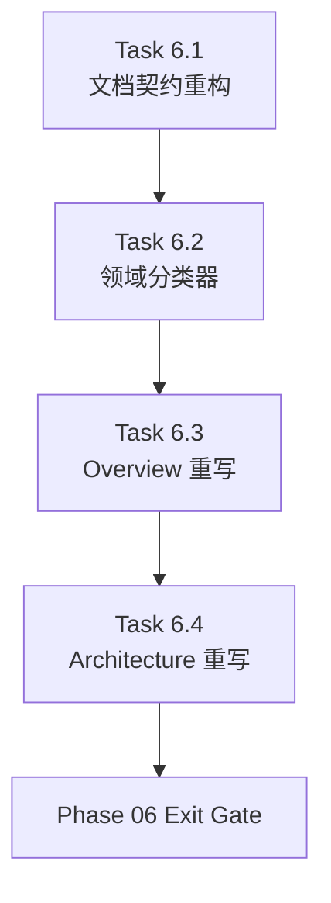

# Phase 06 - Information Architecture and Document Contract Recovery

文档属性：阶段文档  
阶段定位：Post-MVP Qoder 对齐第一阶段  
对应实施计划：`.apm/Implementation_Plan.md`  
对应 Task Assignment：`.apm/Task_Assignments/Phase_06_Information_Architecture_and_Document_Contract_Recovery.md`

## 阶段目标

本阶段不直接追求“把文档写多一点”，而是先修复 repo-wiki 的上层信息架构。当前系统已经具备扫描、索引、生成、适配和治理能力，但输出仍然偏向结构化导出器，缺少 qoder 风格的文档中心层。

Phase 06 的目标是先把文档输出契约、领域归类契约、总览页契约、架构页契约恢复到正确方向，给后续 Phase 07 的专题页和聚合页生成打基础。

## 当前问题与进入条件

进入本阶段前，仓库已经具备以下前提：

- Phase 01-05 的 Memory logs 全部存在，且 MVP 命令面已经闭环。
- `docs/qoder-repo-wiki-design-analysis.md` 已明确指出当前差距是信息架构问题，而不是单纯模板字数问题。
- `docs/repo-wiki-qoder-gap-task-plan.md` 已给出后续任务优先级，确认先修契约，再修文本与治理。

当前必须解决的问题：

- `docs/00-overview.md`、`docs/01-architecture.md` 缺少 prose-first 约束。
- 现有输出只有总览层和模块层，没有 section 层与 phase 层。
- `module-index` 还缺少业务域、服务族、运行角色等领域分组元数据。
- 架构页没有显式解释 `.repo-wiki`、`ai/source-of-truth`、`docs` 三层关系。

## 任务清单与依赖关系

### Task 6.1 - Document output contract refactor and document-center layer

- Agent：`Agent_DocGen`
- 目标：引入 `docs/sections/**` 与 `docs/phases/**`，明确总览层、专题层、模块层、阶段层的输出边界。
- 关键依赖：Task 3.1

### Task 6.2 - Business-domain classifier and module mapping contracts

- Agent：`Agent_Scanner`
- 目标：为模块补充 `domain`、`service_family`、`runtime_role` 等字段，建立领域聚合基础。
- 关键依赖：Task 6.1

### Task 6.3 - Prose-first overview contract and generation upgrade

- Agent：`Agent_DocGen`
- 目标：重写 `docs/00-overview.md` 合同和生成逻辑，固定输出介绍型章节。
- 关键依赖：Task 6.1、Task 6.2

### Task 6.4 - Architecture contract recovery and three-layer Mermaid design

- Agent：`Agent_DocGen`
- 目标：重写 `docs/01-architecture.md`，强制 Mermaid，并解释三层结构关系。
- 关键依赖：Task 6.1、Task 6.2、Task 6.3

## 产物目录与写域边界

本阶段允许写入的主要区域如下：

- `repo_wiki/generator/**`
- `repo_wiki/scanner/**`
- `templates/**`
- `docs/phases/**`
- `docs/00-overview.md`
- `docs/01-architecture.md`
- `ai/source-of-truth/module-index.yaml`

本阶段明确不处理：

- `verify --ci` 内容质量门禁
- `docs/03-module-map.md`、`docs/04-api-contracts.md`、`docs/05-data-model.md` 的聚合重写
- qoder 基线对比回归

## Mermaid 阶段流程图

## 阶段退出门禁

Phase 06 结束前必须满足：

- `docs/phases/` 与 `docs/sections/` 的输出契约已经落盘。
- `module-index` 契约已支持领域分组字段。
- `docs/00-overview.md` 至少具备固定章节和最小 prose 约束。
- `docs/01-architecture.md` 至少具备固定章节、Mermaid 架构图和三层关系说明。

## 风险与回退策略

- 风险：Task 6.1 如果直接重写 contract registry，可能破坏现有 MVP 输出路径。
  回退：采用 additive contract 方式，保留现有 `docs/00~05` 与 `docs/modules/**` 输出面。
- 风险：Task 6.2 的领域分类器信号不足时，容易产生不稳定分组。
  回退：保留确定性 fallback，将低置信度模块归入稳定支持域。
- 风险：Task 6.3 和 6.4 若只换模板不换约束，仍会回到“空文档 + 列表”的结果。
  回退：在 contract 层引入最小章节数和 prose 数校验。

## 对应 Memory / Task Assignment 路径

- Memory 目录：`.apm/Memory/Phase_06_Information_Architecture_and_Document_Contract_Recovery/`
- Task Assignment：`.apm/Task_Assignments/Phase_06_Information_Architecture_and_Document_Contract_Recovery.md`
- 相关分析文档：`docs/qoder-repo-wiki-design-analysis.md`
- 相关任务规划：`docs/repo-wiki-qoder-gap-task-plan.md`
