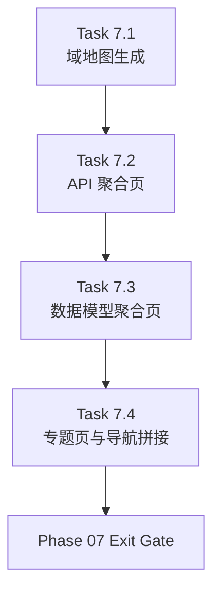

# Phase 07 - Domain-Centered Content Generation

文档属性：阶段文档  
阶段定位：Post-MVP Qoder 对齐第二阶段  
对应实施计划：`.apm/Implementation_Plan.md`  
对应 Task Assignment：`.apm/Task_Assignments/Phase_07_Domain_Centered_Content_Generation.md`

## 阶段目标

Phase 07 的目标是把 repo-wiki 的核心阅读页面从“平铺事实文件”升级为“按领域组织的文档中心内容层”。经过 Phase 06 后，系统已经具备新的 contract 和领域元数据，本阶段需要把这些契约真正落实到模块地图、API 总览、数据模型总览和 section 专题页上。

这里的关键不是“多生成一些 Markdown”，而是让读者获得稳定的阅读路径：先按领域理解系统，再按专题深入，再按模块下钻。

## 当前问题与进入条件

进入本阶段前应满足：

- `docs/sections/**` 与 `docs/phases/**` 契约已经建立。
- `module-index.yaml` 已包含领域元数据。
- `docs/00-overview.md` 和 `docs/01-architecture.md` 已成为 prose-first 页面。

本阶段要解决的具体问题：

- `docs/03-module-map.md` 仍然可能按目录或模块平铺。
- `docs/04-api-contracts.md` 仍可能退化为 endpoint dump。
- `docs/05-data-model.md` 仍可能被大量重复模型污染。
- `docs/sections/**` 还没有稳定生成，导航层缺失。

## 任务清单与依赖关系

### Task 7.1 - Domain-centered module map generation

- Agent：`Agent_DocGen`
- 目标：把 `03-module-map.md` 重写为领域地图。
- 关键依赖：Task 6.2、Task 6.4

### Task 7.2 - Aggregated API contracts generation

- Agent：`Agent_DocGen`
- 目标：把 `04-api-contracts.md` 重写为按服务族、主题域、调用约定聚合的 API 总览。
- 关键依赖：Task 6.2、Task 6.4

### Task 7.3 - Domain-aggregated data model generation

- Agent：`Agent_DocGen`
- 目标：把 `05-data-model.md` 重写为核心模型、服务模型、数据库策略三段式结构。
- 关键依赖：Task 6.2、Task 6.4

### Task 7.4 - Section page generation and navigation stitching

- Agent：`Agent_DocGen`
- 目标：生成 `docs/sections/**` 专题页并完成导航拼接。
- 关键依赖：Task 7.1、Task 7.2、Task 7.3

## 产物目录与写域边界

本阶段允许写入的主要区域如下：

- `repo_wiki/generator/**`
- `templates/docs/**`
- `docs/03-module-map.md`
- `docs/04-api-contracts.md`
- `docs/05-data-model.md`
- `docs/sections/**`

本阶段明确不处理：

- `verify --ci` 的内容质量升级
- qoder 基线对比脚本与差距报告
- `AI_API_Atlas` 的最终再生成验收

## Mermaid 阶段流程图

## 阶段退出门禁

Phase 07 结束前必须满足：

- `docs/03-module-map.md` 以领域组织，而不是按物理目录平铺。
- `docs/04-api-contracts.md` 包含 API 分组与调用约定，不是原始 endpoint 列表。
- `docs/05-data-model.md` 包含核心模型、服务模型、数据库/迁移策略三段。
- `docs/sections/**` 至少生成 `project`、`architecture`、`services`、`data-model`、`api`、`operations`、`development`、`security` 这些主题页。
- section 页之间与 overview/docs/modules 之间存在稳定导航链接。

## 风险与回退策略

- 风险：7.1-7.3 同时修改模板和导航约束，容易出现输出互相覆盖。
  回退：保持严格串行，不在本阶段内并行执行。
- 风险：API 与 Data Model 聚合如果阈值太激进，可能丢失关键入口。
  回退：总览页只做聚合，下层模块页和 source-of-truth 继续保留原始细节。
- 风险：section 页如果只做目录索引而没有文字说明，会重演当前质量问题。
  回退：section 页也引入最小 prose 要求。

## 对应 Memory / Task Assignment 路径

- Memory 目录：`.apm/Memory/Phase_07_Domain_Centered_Content_Generation/`
- Task Assignment：`.apm/Task_Assignments/Phase_07_Domain_Centered_Content_Generation.md`
- 相关契约来源：`docs/phases/Phase_06_Information_Architecture_and_Document_Contract_Recovery.md`
