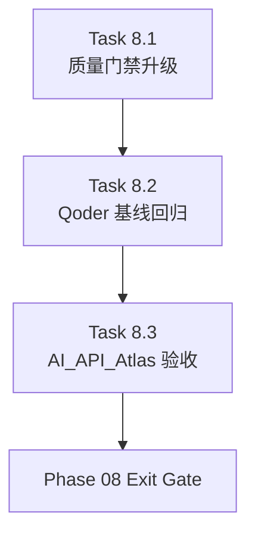

# Phase 08 - Quality Gates and Qoder Baseline Regression

文档属性：阶段文档  
阶段定位：Post-MVP Qoder 对齐第三阶段  
对应实施计划：`.apm/Implementation_Plan.md`  
对应 Task Assignment：`.apm/Task_Assignments/Phase_08_Quality_Gates_and_Qoder_Baseline_Regression.md`

## 阶段目标

Phase 08 的目标是把“文档质量”正式纳入治理闭环，并用 qoder 风格输出建立可回归、可解释的比较基线。前两个阶段解决的是结构和内容生成问题，本阶段解决的是如何证明这些改造真的有效，以及如何在目标仓库 `AI_API_Atlas` 上完成可复核验收。

## 当前问题与进入条件

进入本阶段前应满足：

- `docs/phases/**`、`docs/sections/**`、`docs/00~05` 的新契约已经落地。
- `03-module-map`、`04-api-contracts`、`05-data-model` 已完成领域聚合。
- 当前 `verify --ci` 还主要停留在存在性和路径完整性检查层。

本阶段要补上的问题：

- 空模板、纯列表页、缺 prose 页仍可能被放行。
- 系统无法稳定回答“比 qoder 少了什么”。
- 对 `AI_API_Atlas` 的验收还没有升级到 qoder 对齐视角。

## 任务清单与依赖关系

### Task 8.1 - Content-quality verify and CI gate upgrade

- Agent：`Agent_AdapterGovernance`
- 目标：把 `verify --ci` 从存在性校验升级为内容质量校验。
- 关键依赖：Task 6.1、Task 7.1、Task 7.2、Task 7.3、Task 7.4

### Task 8.2 - Qoder baseline regression harness and gap report

- Agent：`Agent_QualityRelease`
- 目标：建立 qoder 基线对比脚本、清单和差距报告格式。
- 关键依赖：Task 8.1

### Task 8.3 - AI_API_Atlas regeneration acceptance and readiness report

- Agent：`Agent_QualityRelease`
- 目标：在 `AI_API_Atlas` 上执行再生成、再校验、再对比，并产出 readiness report。
- 关键依赖：Task 8.1、Task 8.2

## 产物目录与写域边界

本阶段允许写入的主要区域如下：

- `repo_wiki/verifier/**`
- `tests/**`
- `scripts/**`
- `docs/operations/**`
- `docs/phases/**` 中必要的回链更新
- 目标仓库 `/Users/bingooyong/Code/01Code/github.com/bingooyong/AI_API_Atlas` 下的再生成产物

本阶段明确不处理：

- 新一轮生成模板重构
- 新的领域分类规则设计
- 新的 section 类型扩张

## Mermaid 阶段流程图

## 阶段退出门禁

Phase 08 结束前必须满足：

- `verify --ci` 能对空模板、纯列表页、缺 prose 页给出 `WARN` 或 `FAIL`。
- qoder 基线对比可输出目录层级、章节数量、导航完整性、聚合质量差距。
- `AI_API_Atlas` 再生成后能够产出新的 readiness report，并明确是否进入下一轮模板/模型优化。

## 风险与回退策略

- 风险：新增内容质量规则后，旧仓库样例可能大面积失败。
  回退：先将部分问题标记为 `WARN`，在下一轮提升为 `FAIL`。
- 风险：qoder 基线对比如果过度依赖单一仓库结构，会造成误判。
  回退：把基线拆成“硬性结构项”和“参考质量项”两层。
- 风险：目标仓库再生成可能暴露新的扫描或模板缺陷。
  回退：在 readiness report 中明确分离“治理规则问题”和“生成实现问题”。

## 对应 Memory / Task Assignment 路径

- Memory 目录：`.apm/Memory/Phase_08_Quality_Gates_and_Qoder_Baseline_Regression/`
- Task Assignment：`.apm/Task_Assignments/Phase_08_Quality_Gates_and_Qoder_Baseline_Regression.md`
- 目标验收仓库：`/Users/bingooyong/Code/01Code/github.com/bingooyong/AI_API_Atlas`
