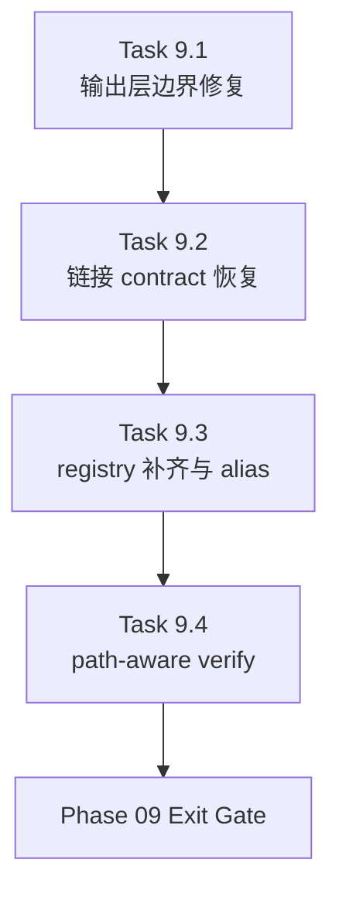

# Phase 09 - Output Contract and Navigation Hardening

文档属性：阶段文档  
阶段定位：Corrective Recovery 第一阶段  
对应实施计划：`.apm/Implementation_Plan.md`  
对应 Task Assignment：`.apm/Task_Assignments/Phase_09_Output_Contract_and_Navigation_Hardening.md`

## 阶段目标

本阶段先修 repo-wiki 的输出层边界和导航 contract，不直接追求“文档更好看”。当前最大的问题不是文档文件数量不够，而是治理层材料和目标仓库产物边界不清、链接 contract 不稳定、phase/section registry 覆盖不完整。

Phase 09 的目标是把这些结构问题先收敛到稳定状态，为 Phase 10 的 narrative/aggregation 提升打下可验证的基础。

## 当前问题与进入条件

进入本阶段前，已知事实如下：

- `docs/repo-wiki-phase-06-08-review.md` 已确认 Phase 06 仅为 `Conditional Pass`。
- `docs/00-overview.md`、`03-module-map.md`、`04-api-contracts.md` 中存在错误相对路径和 duplicated `docs/` 路径问题。
- `docs/phases/**` 目前作为 repo-agent 自身治理材料是合理的，但其是否应进入 target repository output 尚未明确。
- verify 当前对导航仍以字符串启发式为主，无法真实识别坏链接。

## 任务清单与依赖关系

### Task 9.1 - Target-output boundary and governance-layer separation

- Agent：`Agent_DocGen`
- 目标：明确 repo-agent 治理文档与 target repository knowledge outputs 的边界
- 关键依赖：Task 6.1、Task 8.3

### Task 9.2 - Unified link builder and path-contract recovery

- Agent：`Agent_DocGen`
- 目标：统一 overview / section / module / API / data-model 的路径 contract 与链接生成逻辑
- 关键依赖：Task 9.1

### Task 9.3 - Phase and section registry completion with alias support

- Agent：`Agent_DocGen`
- 目标：补齐 phase/section registry，并显式支持 canonical section 与 alias/overlay 机制
- 关键依赖：Task 9.1、Task 9.2

### Task 9.4 - Path-aware verify navigation checks

- Agent：`Agent_AdapterGovernance`
- 目标：把 verify 的导航检查升级为真实路径解析
- 关键依赖：Task 9.2、Task 9.3

## 产物目录与写域边界

本阶段允许写入的主要区域如下：

- `repo_wiki/generator/**`
- `repo_wiki/verifier/**`
- `templates/**`
- `docs/phases/**`
- `.apm/Task_Assignments/**`
- `.apm/Memory/**`

本阶段明确不处理：

- overview / architecture 的 prose 质量深度重写
- API / data-model 聚合摘要策略重构
- qoder baseline comparator 的评分模型
- SQLite 运行时扩展

## Mermaid 阶段流程图

## 阶段退出门禁

Phase 09 结束前必须满足：

- target repository output 与 repo-agent 自身治理材料有明确边界
- overview / section / module / API / data-model 页的导航链接可被稳定解析
- phase/section registry 完整覆盖当前执行计划，并支持 canonical section 与 alias/overlay
- `verify --ci` 能报告真实坏路径，而不是只检测 `../` 字符串

## 风险与回退策略

- 风险：9.1 如果直接移除现有 phase-layer 输出，可能破坏已存在的 reader-facing 视图  
  回退：先引入显式 output policy，再决定 target output 是否包含 phase-layer，而不是直接删除现有生成能力。
- 风险：9.2 如果只修模板文本而不收敛 link builder，未来仍会重新漂移  
  回退：将路径生成统一收敛到 shared helper，不允许模板继续自由拼接相对路径。
- 风险：9.3 的 alias 机制如果定义不清，会再次引入并行 section 体系  
  回退：保留 canonical section 为主，alias 仅作为兼容映射，不允许替代 canonical contract。

## 对应 Memory / Task Assignment 路径

- Memory 目录：`.apm/Memory/Phase_09_Output_Contract_and_Navigation_Hardening/`
- Task Assignment：`.apm/Task_Assignments/Phase_09_Output_Contract_and_Navigation_Hardening.md`
- 评审依据：`docs/repo-wiki-phase-06-08-review.md`
- 路线文档：`docs/repo-wiki-phase-09-12-roadmap.md`
