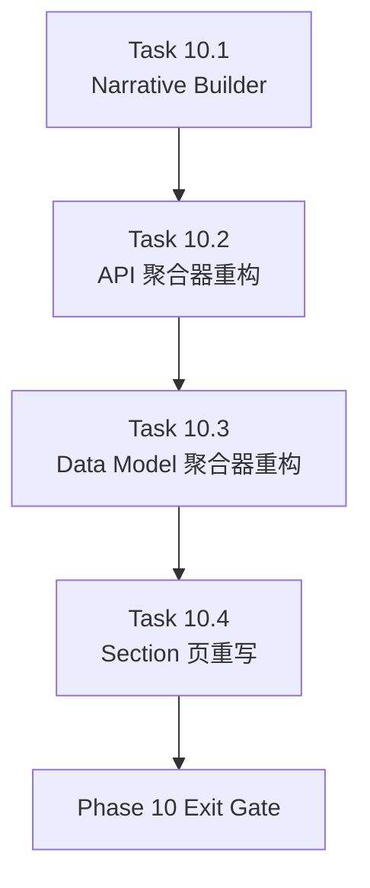

# Phase 10 - Narrative and Aggregation Intelligence

文档属性：阶段文档  
阶段定位：Corrective Recovery 第二阶段  
对应实施计划：`.apm/Implementation_Plan.md`  
对应 Task Assignment：`.apm/Task_Assignments/Phase_10_Narrative_and_Aggregation_Intelligence.md`

## 阶段目标

Phase 10 的目标是把 repo-wiki 的核心阅读页面从“模板化导出”升级为“真实聚合叙述页”。这不是单纯补 prose 字数，而是要求 overview、architecture、API、data-model、section 页都能真实反映仓库结构和阅读路径。

## 当前问题与进入条件

进入本阶段前应满足：

- Phase 09 已完成输出层边界和 path contract 修复
- canonical section layer 与 registry 已稳定
- verify 已能识别真实坏链接

本阶段要解决的具体问题：

- `00-overview.md` 和 `01-architecture.md` 仍存在过于通用的样板句
- `04-api-contracts.md` 仍可能退化为 endpoint dump 的变形版
- `05-data-model.md` 仍可能依赖硬编码 core model 名单
- section 页仍可能只是“专题索引”而非“专题文档”

## 任务清单与依赖关系

### Task 10.1 - Narrative builder for overview and architecture

- Agent：`Agent_DocGen`
- 目标：重写 overview / architecture 的 narrative builder，使 prose 来源于仓库事实
- 关键依赖：Task 9.1、Task 9.2、Task 9.3

### Task 10.2 - True API aggregation and entry-point summarization

- Agent：`Agent_DocGen`
- 目标：真正按 service family / auth / error convention / key entry API 聚合 API 总览
- 关键依赖：Task 10.1、Task 6.2

### Task 10.3 - Core-entity and migration-aware data model aggregation

- Agent：`Agent_DocGen`
- 目标：从核心实体、服务边界、数据库/迁移策略角度重构 data-model 文档
- 关键依赖：Task 10.1、Task 6.2

### Task 10.4 - Section page builder rewrite for document-center behavior

- Agent：`Agent_DocGen`
- 目标：把 section 页从“索引页”升级为“专题页”
- 关键依赖：Task 10.1、Task 10.2、Task 10.3

## 产物目录与写域边界

本阶段允许写入的主要区域如下：

- `repo_wiki/generator/**`
- `templates/docs/**`
- `docs/00-overview.md`
- `docs/01-architecture.md`
- `docs/04-api-contracts.md`
- `docs/05-data-model.md`
- `docs/sections/**`

本阶段明确不处理：

- verify / compare 的评分模型重构
- 多仓库 acceptance 执行
- SQLite schema 和运行时扩展

## Mermaid 阶段流程图

## 阶段退出门禁

Phase 10 结束前必须满足：

- `00-overview.md` 与 `01-architecture.md` 在真实仓库上不再主要依赖静态样板句
- `04-api-contracts.md` 的关键入口 API 是筛选结果，而不是 endpoint 再枚举
- `05-data-model.md` 的数据库/迁移摘要来自真实仓库信号
- section 页表现为专题文档而非目录索引

## 风险与回退策略

- 风险：10.1 若过度依赖自由文本生成，输出可能不稳定  
  回退：使用 repository-derived narrative builder，先结构化提炼，再渲染 prose。
- 风险：10.2 和 10.3 如果过度压缩，可能丢失关键入口和核心模型  
  回退：overview 层保持聚合，下层 module docs 和 source-of-truth 保留细节。
- 风险：10.4 若只加 prose 不改 section structure，仍会得到“更长的索引页”  
  回退：为不同 section 明确专题结构，不再使用完全通用的 section template 作为最终形态。

## 对应 Memory / Task Assignment 路径

- Memory 目录：`.apm/Memory/Phase_10_Narrative_and_Aggregation_Intelligence/`
- Task Assignment：`.apm/Task_Assignments/Phase_10_Narrative_and_Aggregation_Intelligence.md`
- 评审依据：`docs/repo-wiki-phase-06-08-review.md`
- 路线文档：`docs/repo-wiki-phase-09-12-roadmap.md`
