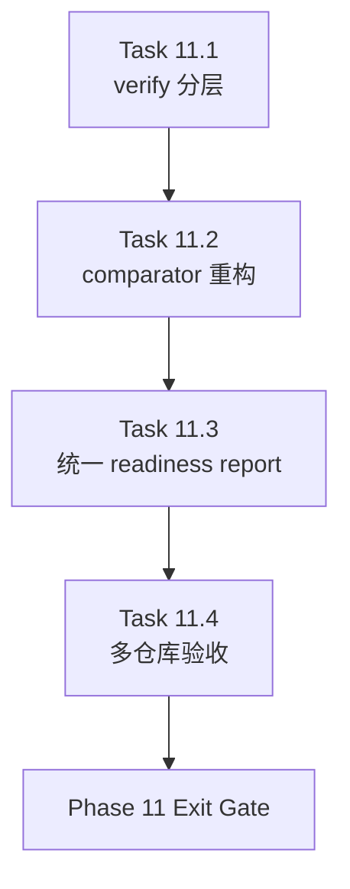

# Phase 11 - Acceptance and Baseline Governance Hardening

文档属性：阶段文档  
阶段定位：Corrective Recovery 第三阶段  
对应实施计划：`.apm/Implementation_Plan.md`  
对应 Task Assignment：`.apm/Task_Assignments/Phase_11_Acceptance_and_Baseline_Governance_Hardening.md`

## 阶段目标

Phase 11 的目标是让 `verify --ci` 与 baseline compare 从“有帮助的提示器”升级为“Manager 可以据此做 go/no-go 决策的治理面”。

## 当前问题与进入条件

进入本阶段前应满足：

- Phase 10 已让核心阅读页面达到新的聚合和 narrative 水平
- path-aware navigation verify 已落地
- section / phase registry 已稳定

当前必须解决的问题：

- verify 仍需要明确区分 hard gate 和 soft gate
- baseline comparator 仍存在目录评分、heading coverage、baseline 输入处理等问题
- readiness report 仍然需要 Manager 手工整合多份材料
- 当前 acceptance 仍然过度依赖 `AI_API_Atlas`

## 任务清单与依赖关系

### Task 11.1 - Hard-gate vs soft-gate verify redesign

- Agent：`Agent_AdapterGovernance`
- 目标：重构 verify 的评分与 reason family 体系
- 关键依赖：Task 9.4、Task 10.4

### Task 11.2 - Baseline comparator redesign and score integrity recovery

- Agent：`Agent_QualityRelease`
- 目标：修正 baseline compare 的目录评分、section 识别、heading coverage 和 baseline 输入模型
- 关键依赖：Task 11.1、Task 8.2

### Task 11.3 - Unified readiness-report schema and evidence bundle

- Agent：`Agent_QualityRelease`
- 目标：统一 verify 与 compare 的 readiness report contract
- 关键依赖：Task 11.1、Task 11.2

### Task 11.4 - Multi-repository regression acceptance

- Agent：`Agent_QualityRelease`
- 目标：在多个仓库样本上执行回归验收，而不是只看 `AI_API_Atlas`
- 关键依赖：Task 11.3

## 产物目录与写域边界

本阶段允许写入的主要区域如下：

- `repo_wiki/verifier/**`
- `scripts/**`
- `docs/operations/**`
- `tests/**`
- `docs/phases/**` 中必要的回链更新

本阶段明确不处理：

- 新一轮 narrative builder 重写
- 新的 section 类型扩展
- SQLite schema 与 runtime 迁移

## Mermaid 阶段流程图

## 阶段退出门禁

Phase 11 结束前必须满足：

- verify 明确区分结构失败与质量偏差
- comparator 不再因结构对象键名一致而误给高分
- readiness report 可直接支持 Manager 做 go/no-go 判断
- acceptance 不再只依赖单一目标仓库

## 风险与回退策略

- 风险：11.1 如果把过多问题一次性提升为 FAIL，可能导致所有样本仓库同时失效  
  回退：先将参考质量偏差保留为 WARN，把硬结构错误作为 FAIL。
- 风险：11.2 若 comparator 仍然绑定单一 baseline 仓库结构，会继续误判  
  回退：拆分为 hard structural baseline 与 reference quality baseline 两层。
- 风险：11.4 如果样本仓库选择过于接近，无法发现通用问题  
  回退：要求至少覆盖不同模块结构和不同 section 组织风格的仓库。

## 对应 Memory / Task Assignment 路径

- Memory 目录：`.apm/Memory/Phase_11_Acceptance_and_Baseline_Governance_Hardening/`
- Task Assignment：`.apm/Task_Assignments/Phase_11_Acceptance_and_Baseline_Governance_Hardening.md`
- 评审依据：`docs/repo-wiki-phase-06-08-review.md`
- readiness 基线：`docs/operations/AI_API_Atlas_Readiness_Report.md`
