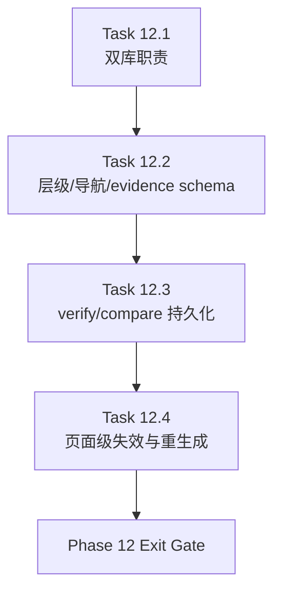

# Phase 12 - SQLite-First Local Knowledge Runtime

文档属性：阶段文档  
阶段定位：Corrective Recovery 第四阶段  
对应实施计划：`.apm/Implementation_Plan.md`  
对应 Task Assignment：`.apm/Task_Assignments/Phase_12_SQLite_First_Local_Knowledge_Runtime.md`

## 阶段目标

Phase 12 的目标是把 SQLite 从“隐藏在索引/缓存里的实现细节”提升为 repo-agent 的本地知识运行时核心，用于承载文档层级、导航图、质量证据和增量重生成。

## 当前问题与进入条件

进入本阶段前应满足：

- Phase 11 已把 verify / compare / readiness report 口径稳定下来
- target output contract 与 canonical section layer 已稳定
- narrative / aggregation 输出已达到新的质量基线

当前要解决的问题：

- SQLite 目前主要承担 state/cache/FTS 角色，尚未承载 docs hierarchy、navigation、readiness evidence
- verify 与 compare 仍主要输出单次结果，不利于趋势分析
- 增量更新仍无法基于页面级依赖精细失效和重生成

## 任务清单与依赖关系

### Task 12.1 - Dual-database runtime architecture for state and evidence

- Agent：`Agent_IndexGraph`
- 目标：规划并实现 state DB 与 generation/evidence DB 的双库职责
- 关键依赖：Task 11.4、Task 2.1

### Task 12.2 - SQLite schema for hierarchy, sections, navigation, and evidence

- Agent：`Agent_IndexGraph`
- 目标：为 docs hierarchy / sections / navigation / evidence 建立结构化 SQLite schema
- 关键依赖：Task 12.1、Task 9.3

### Task 12.3 - Verify and compare persistence with trend analysis

- Agent：`Agent_IndexGraph`
- 目标：把 verify / compare 结果落库并支持趋势分析
- 关键依赖：Task 12.2、Task 11.1、Task 11.2

### Task 12.4 - SQLite-driven page invalidation and incremental regeneration

- Agent：`Agent_IndexGraph`
- 目标：用 SQLite 驱动页面级失效和增量重生成
- 关键依赖：Task 12.3、Task 2.4

## 产物目录与写域边界

本阶段允许写入的主要区域如下：

- `repo_wiki/indexer/**`
- `repo_wiki/retrieval/**`
- `repo_wiki/generator/**`
- `.repo-wiki/**` schema / migration / metadata 相关实现
- `docs/operations/**`
- `tests/**`

本阶段明确不处理：

- 新的文档模板体系
- 新的 baseline compare 评分规则
- 新的 acceptance 样本规划

## Mermaid 阶段流程图

## 阶段退出门禁

Phase 12 结束前必须满足：

- SQLite schema 能表达文档层级、canonical section、导航图和 readiness evidence
- verify / compare 的结果支持多次运行对比和趋势分析
- 页面级增量失效与重生成由 SQLite 驱动，而不是继续依赖粗粒度全量重渲染
- 本地模式下 repo-agent 能稳定支撑生成、验证、比较、回归的完整闭环

## 风险与回退策略

- 风险：12.1 若双库职责不清，会重复存储并加剧 schema 漂移  
  回退：明确 state DB 与 evidence DB 的边界，避免同一事实在两边同时作为 canonical source。
- 风险：12.2 若把 markdown 输出也当作 canonical runtime source，会打乱 source-of-truth 责任边界  
  回退：SQLite 仅作为 runtime metadata 与 evidence backbone，不替代 markdown 或 source-of-truth artifacts。
- 风险：12.4 若过早追求极细粒度失效，可能使增量逻辑过度复杂  
  回退：先做到页面级，再决定是否继续向 section 内更细粒度扩展。

## 对应 Memory / Task Assignment 路径

- Memory 目录：`.apm/Memory/Phase_12_SQLite_First_Local_Knowledge_Runtime/`
- Task Assignment：`.apm/Task_Assignments/Phase_12_SQLite_First_Local_Knowledge_Runtime.md`
- SQLite 分析依据：`docs/qoder-repo-wiki-sqlite-analysis.md`
- 路线文档：`docs/repo-wiki-phase-09-12-roadmap.md`
