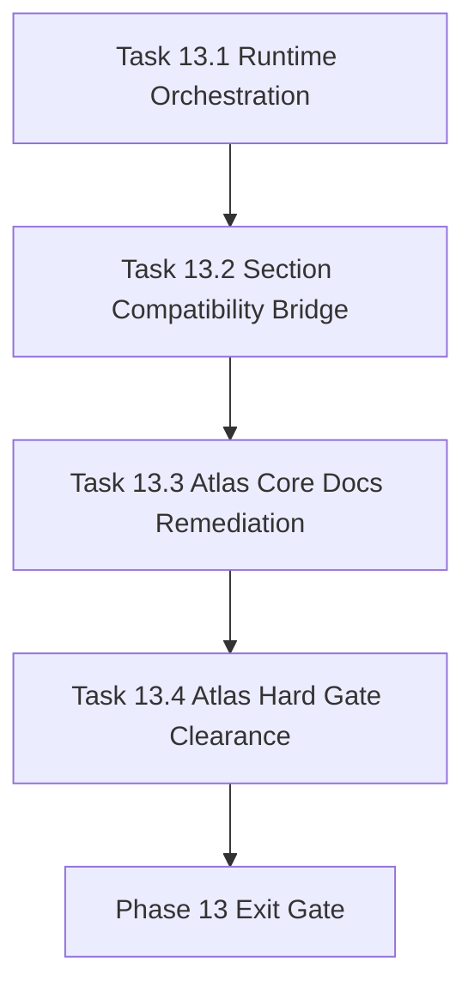

# Phase 13 - Atlas Cutover and Hard-Gate Clearance

文档属性：阶段文档  
阶段定位：Forward Replacement 第一阶段  
对应实施计划：`.apm/Implementation_Plan.md`  
对应 Task Assignment：`.apm/Task_Assignments/Phase_13_Atlas_Cutover_and_Hard_Gate_Clearance.md`

## 阶段目标

Phase 13 目标是把 Phase 09-12 的能力真正落到 `AI_API_Atlas` 的验收闭环中，优先清除 hard gate 阻塞项，并把 runtime、兼容映射、核心文档质量放在同一条验收链路上。

## 当前问题与进入条件

进入本阶段前应满足：

- Phase 09-12 关键能力已在 repo-agent 仓库实现
- `verify --ci` 和 compare 已有统一 readiness 口径
- SQLite runtime 具备基础 schema 与趋势存储能力

当前要解决的问题：

- Atlas 仍存在 hard gate 失败，尚未达到替代声明门槛
- Q*/S* section 结构与 canonical section 存在兼容冲突
- 核心 5 文档的 prose/聚合质量仍不稳定
- runtime 证据在目标仓库执行链路中未形成稳定闭环

## 任务清单与依赖关系

### Task 13.1 - Runtime-store orchestration integration across core commands

- Agent：`Agent_IndexGraph`
- 目标：将 runtime store 接入 `init/index/update/verify` 主流程
- 关键依赖：Task 12.4、Task 3.3

### Task 13.2 - Section compatibility bridge for Q*/S* formats

- Agent：`Agent_DocGen`
- 目标：建立 canonical section 与 Q*/S* 的 alias/overlay 兼容桥
- 关键依赖：Task 9.3、Task 13.1

### Task 13.3 - Atlas core-document narrative and aggregation remediation

- Agent：`Agent_DocGen`
- 目标：针对 Atlas 修复 `00/01/03/04/05` 文档的 prose 与聚合质量
- 关键依赖：Task 10.4、Task 13.2

### Task 13.4 - Atlas hard-gate clearance and blocker burn-down report

- Agent：`Agent_QualityRelease`
- 目标：执行 Atlas 全链路验收并输出 blocker burn-down 报告
- 关键依赖：Task 13.1、Task 13.2、Task 13.3

## 产物目录与写域边界

本阶段允许写入：

- `repo_wiki/orchestration/**`
- `repo_wiki/generator/**`
- `repo_wiki/verifier/**`
- `repo_wiki/indexer/**`
- `docs/operations/**`
- `.repo-agent-eval/**`（如启用隔离输出）
- `tests/**`

本阶段不处理：

- 外部 qoder snapshot 标定体系
- VS Code 插件或可视化前端交互层
- 最终发布门禁政策与 rollout 策略

## Mermaid 阶段流程图

## 阶段退出门禁

Phase 13 结束前必须满足：

- `AI_API_Atlas` 执行链路中 runtime evidence 稳定落盘
- section 兼容映射可通过 `sections-exist` 相关检查
- 核心 5 文档满足最小 prose/聚合/导航契约
- `verify --ci` 无 hard gate fail，剩余问题仅为可解释 soft gap

## 风险与回退策略

- 风险：兼容桥设计过宽导致 canonical 规则失真  
  回退：保持 canonical slug 为唯一生成主键，alias 仅用于兼容解析。
- 风险：Atlas 特化修复污染通用模板  
  回退：将仓库特定策略做成 profile/overlay，不改通用默认行为。
- 风险：runtime 接入引入命令链路不稳定  
  回退：提供 `runtime optional` fallback 模式并保留诊断输出。

## 对应 Memory / Task Assignment 路径

- Memory 目录：`.apm/Memory/Phase_13_Atlas_Cutover_and_Hard_Gate_Clearance/`
- Task Assignment：`.apm/Task_Assignments/Phase_13_Atlas_Cutover_and_Hard_Gate_Clearance.md`
- 审计依据：`docs/repo-wiki-phase-09-12-audit-atlas-comparison-and-phase-13-plan.md`
