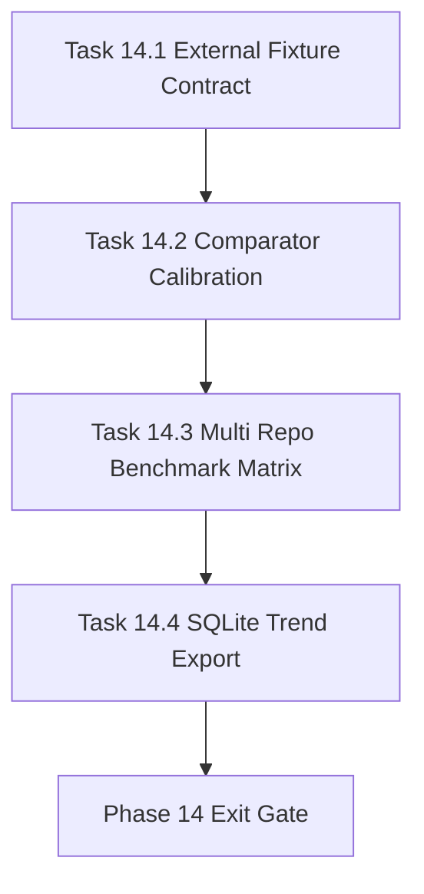

# Phase 14 - External Baseline Calibration and Benchmark Governance

文档属性：阶段文档  
阶段定位：Forward Replacement 第二阶段  
对应实施计划：`.apm/Implementation_Plan.md`  
对应 Task Assignment：`.apm/Task_Assignments/Phase_14_External_Baseline_Calibration_and_Benchmark_Governance.md`

## 阶段目标

Phase 14 目标是把 compare 从“内部自评工具”升级为“对外可审计的基线治理工具”，核心是引入外部 qoder 风格快照作为比较基线，并形成多仓库阈值治理。

## 当前问题与进入条件

进入本阶段前应满足：

- Phase 13 已清理 Atlas 的 hard gate 阻塞
- verify 与 compare 结果可统一写入 readiness 证据
- SQLite 趋势存储可支撑多次运行统计

当前要解决的问题：

- 现有 compare 仍存在 self-baseline 偏差风险
- 分数阈值缺少多仓库 profile 校准
- Manager 缺少稳定的跨仓库趋势可视化证据出口

## 任务清单与依赖关系

### Task 14.1 - External qoder snapshot fixture contract and ingestion

- Agent：`Agent_QualityRelease`
- 目标：定义并实现外部 qoder snapshot fixture 契约与导入
- 关键依赖：Task 11.2、Task 13.4

### Task 14.2 - Comparator calibration with external baseline and weighted rubric

- Agent：`Agent_QualityRelease`
- 目标：基于外部基线重标 compare 评分维度与权重
- 关键依赖：Task 14.1

### Task 14.3 - Cross-repository benchmark matrix and threshold profiles

- Agent：`Agent_QualityRelease`
- 目标：建立多仓库 benchmark 矩阵与分层阈值档位
- 关键依赖：Task 14.2、Task 11.4

### Task 14.4 - SQLite-backed governance dashboard export and trends

- Agent：`Agent_IndexGraph`
- 目标：输出可审计趋势报表，支持仓库级与横向对比
- 关键依赖：Task 12.3、Task 14.3

## 产物目录与写域边界

本阶段允许写入：

- `scripts/**`（baseline compare/ingest 工具）
- `repo_wiki/verifier/**`
- `repo_wiki/orchestration/**`
- `docs/operations/**`
- `.repo-agent-eval/**`
- `tests/**`

本阶段不处理：

- 文档内容生成模板重写
- UI/IDE 可视化体验层
- 发布 cutover policy 模板

## Mermaid 阶段流程图

## 阶段退出门禁

Phase 14 结束前必须满足：

- compare 支持外部 fixture 输入并具备完整性校验
- 评分结果可区分结构差距、质量差距、兼容 overlay
- 至少 3 个仓库形成 benchmark matrix 与 profile 阈值建议
- 趋势导出可追溯到 evidence bundle 且可复现

## 风险与回退策略

- 风险：外部 baseline 采样不一致导致评分漂移  
  回退：为 fixture 强制元数据与采集流程，拒绝不完整快照。
- 风险：阈值档位过度依赖单仓样本  
  回退：引入最低样本数门槛，低样本时只输出参考阈值。
- 风险：趋势导出格式频繁变化影响 CI  
  回退：冻结导出 schema 版本并维护迁移兼容层。

## 对应 Memory / Task Assignment 路径

- Memory 目录：`.apm/Memory/Phase_14_External_Baseline_Calibration_and_Benchmark_Governance/`
- Task Assignment：`.apm/Task_Assignments/Phase_14_External_Baseline_Calibration_and_Benchmark_Governance.md`
- 参考文档：`docs/qoder-repo-wiki-design-analysis.md`、`docs/qoder-repo-wiki-sqlite-analysis.md`
