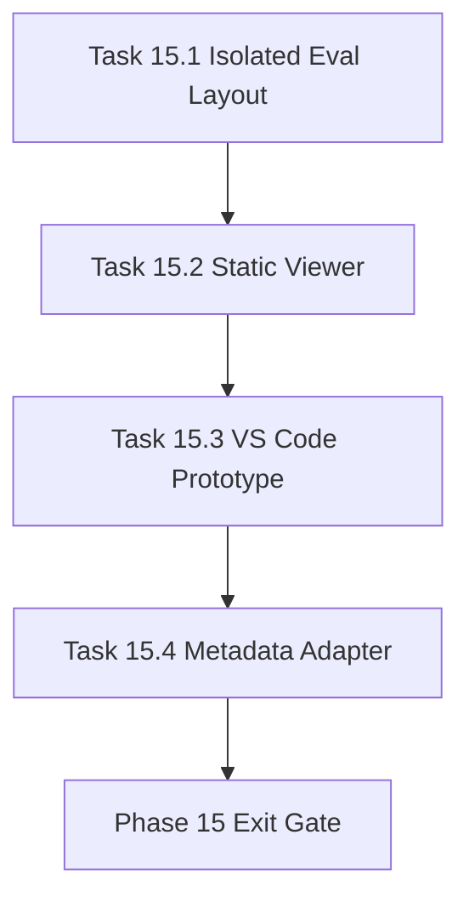

# Phase 15 - Visual Knowledge Experience and IDE Integration

文档属性：阶段文档  
阶段定位：Forward Replacement 第三阶段  
对应实施计划：`.apm/Implementation_Plan.md`  
对应 Task Assignment：`.apm/Task_Assignments/Phase_15_Visual_Knowledge_Experience_and_IDE_Integration.md`

## 阶段目标

Phase 15 目标是补齐“可读性与可操作性”短板，提供本地可视化阅读入口与 IDE 浏览能力，使 repo-agent 的产物从“文件集合”升级为“可验收的知识中心体验”。

## 当前问题与进入条件

进入本阶段前应满足：

- Phase 13 和 Phase 14 已使质量验收口径稳定
- 核心文档与 section 导航合同已可通过基础门禁
- 证据与趋势数据可以从 SQLite 导出

当前要解决的问题：

- 人工验收仍依赖手动打开大量 markdown 文件
- 缺少 qoder 风格侧边树和专题导航的可视化体验
- 目标仓库输出与评估输出目录边界仍需强约束

## 任务清单与依赖关系

### Task 15.1 - Isolated eval output layout and manifest for target repos

- Agent：`Agent_PlatformCore`
- 目标：统一 `.repo-agent-eval` 隔离输出契约，避免污染基线目录
- 关键依赖：Task 13.4、Task 9.1

### Task 15.2 - Static repo-wiki viewer with tree navigation and Mermaid rendering

- Agent：`Agent_PlatformCore`
- 目标：提供本地静态 viewer（目录树、锚点、Mermaid 渲染）
- 关键依赖：Task 15.1、Task 9.4

### Task 15.3 - VS Code extension prototype for repo-agent wiki browsing

- Agent：`Agent_PlatformCore`
- 目标：实现 VS Code 侧边树 + 页面预览原型
- 关键依赖：Task 15.2

### Task 15.4 - Qoder-style navigation metadata adapter and import bridge

- Agent：`Agent_AdapterGovernance`
- 目标：支持 qoder 风格导航元数据导入并做兼容校验
- 关键依赖：Task 15.3、Task 9.3

## 产物目录与写域边界

本阶段允许写入：

- `repo_wiki/viewer/**`（若新建）
- `repo_wiki/orchestration/**`
- `.repo-agent-eval/**`
- `docs/operations/**`
- `tools/**` 或 `extensions/**`（IDE 原型）
- `tests/**`

本阶段不处理：

- compare 评分规则再设计
- 运行时数据库 schema 扩展
- 最终替代发布策略决策

## Mermaid 阶段流程图

## 阶段退出门禁

Phase 15 结束前必须满足：

- `.repo-agent-eval` 目录契约清晰并默认隔离输出
- Viewer 能显示层级导航、目录树、Mermaid 与跨页链接
- VS Code 原型可浏览 repo-agent 输出并触发关键命令
- qoder 风格导航元数据可导入并给出兼容检查结论

## 风险与回退策略

- 风险：可视化层耦合生成逻辑导致维护复杂度上升  
  回退：viewer 仅消费 manifest 和 markdown，不直接依赖生成内部对象。
- 风险：IDE 原型与主流程耦合过深  
  回退：把 IDE 集成作为可选插件，不影响 CLI 主路径。
- 风险：导入 qoder 元数据后出现导航冲突  
  回退：保留 canonical 优先策略，对冲突仅做 overlay 警告。

## 对应 Memory / Task Assignment 路径

- Memory 目录：`.apm/Memory/Phase_15_Visual_Knowledge_Experience_and_IDE_Integration/`
- Task Assignment：`.apm/Task_Assignments/Phase_15_Visual_Knowledge_Experience_and_IDE_Integration.md`
- 参考：`docs/AI_API_Atlas_repo_wiki_gap_analysis.md`
