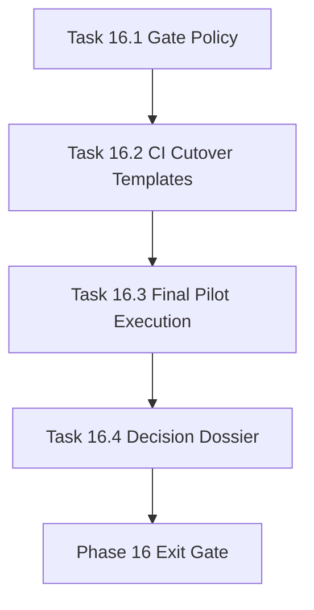

# Phase 16 - Qoder-Replacement Cutover and Release Gate

文档属性：阶段文档  
阶段定位：Forward Replacement 第四阶段  
对应实施计划：`.apm/Implementation_Plan.md`  
对应 Task Assignment：`.apm/Task_Assignments/Phase_16_Qoder_Replacement_Cutover_and_Release_Gate.md`

## 阶段目标

Phase 16 目标是把“能力可用”升级为“发布可控”，形成可执行替代策略、CI 门禁模板、试点回归与最终 go/no-go 决策包。

## 当前问题与进入条件

进入本阶段前应满足：

- Phase 14 已形成外部基线比较和阈值档位
- Phase 15 已提供可视化与 IDE 验收路径
- 关键仓库至少通过一次完整生成与治理回归

当前要解决的问题：

- 缺少正式替代策略与回滚预案
- CI 中尚未固化分层 gate 配置
- 缺少跨仓试点的最终决策资料包

## 任务清单与依赖关系

### Task 16.1 - Replacement gate policy and rollback playbook

- Agent：`Agent_QualityRelease`
- 目标：定义替代发布门禁与回滚流程
- 关键依赖：Task 14.4、Task 15.4

### Task 16.2 - CI cutover template pack and policy profiles

- Agent：`Agent_AdapterGovernance`
- 目标：把替代门禁打包为可复用 CI 模板和 profile
- 关键依赖：Task 16.1、Task 11.1

### Task 16.3 - Final pilot execution across Atlas and benchmark repositories

- Agent：`Agent_QualityRelease`
- 目标：在 Atlas + benchmark 仓库执行最终试点并输出结果
- 关键依赖：Task 16.2、Task 14.3

### Task 16.4 - Go/no-go decision dossier and handover package

- Agent：`Agent_QualityRelease`
- 目标：汇总全链路证据形成最终决策与运营交接包
- 关键依赖：Task 16.3

## 产物目录与写域边界

本阶段允许写入：

- `docs/operations/**`
- `docs/phases/**`
- `.apm/**`（计划、任务、Memory 汇总）
- `.github/workflows/**` 或 `ci/**`
- `.repo-agent-eval/**`
- `tests/**`

本阶段不处理：

- 新增生成模板能力
- 新增比较维度设计
- 新增运行时 schema 大改

## Mermaid 阶段流程图

## 阶段退出门禁

Phase 16 结束前必须满足：

- 替代门禁政策、回滚策略、CI 模板三者一致
- Atlas 与 benchmark 仓库试点完成并有可追溯证据
- go/no-go 决策文档明确、可审计、可复现
- 若 no-go，阻塞项与下一轮 backlog 已绑定责任与优先级

## 风险与回退策略

- 风险：门禁标准设置过宽导致误判可替代  
  回退：使用 strict profile 作为最终发布唯一依据。
- 风险：CI 模板难以迁移到不同仓库  
  回退：提供 transitional profile 与迁移脚本，逐仓切换。
- 风险：最终决策文档缺少证据闭环  
  回退：强制每个结论绑定 evidence bundle 链接。

## 对应 Memory / Task Assignment 路径

- Memory 目录：`.apm/Memory/Phase_16_Qoder_Replacement_Cutover_and_Release_Gate/`
- Task Assignment：`.apm/Task_Assignments/Phase_16_Qoder_Replacement_Cutover_and_Release_Gate.md`
- 参考：`docs/operations/AI_API_Atlas_Readiness_Report.md`
