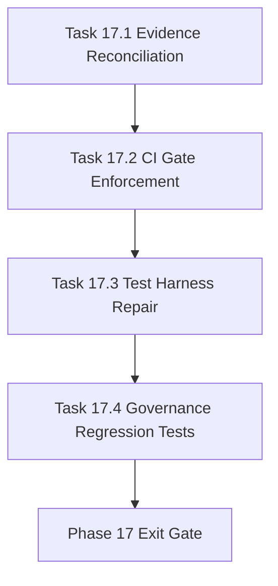

# Phase 17 - Evidence Integrity and CI Gate Repair

文档属性：阶段文档  
阶段定位：Evidence Repair 第一阶段  
对应实施计划：`.apm/Implementation_Plan.md`  
对应 Task Assignment：`.apm/Task_Assignments/Phase_17_Evidence_Integrity_and_CI_Gate_Repair.md`

## 阶段目标

Phase 17 的目标是修复 Phase 14-16 审查发现的治理可信度问题。当前重点不是新增功能，而是让证据、Memory、CI gate、测试环境能够给出一致且可复现的结论。

## 当前问题与进入条件

进入条件：

- Phase 14-16 已产生实现资产、CI 模板、viewer/extension 原型和决策证据
- `docs/repo-wiki-phase-14-16-review-and-phase-17-20-plan.md` 已记录审查结论

当前问题：

- Memory、evidence summary、decision dossier 对 Phase 状态和 go/no-go 结论存在冲突
- CI workflow 使用 Python 执行 bash 脚本，并用 `|| true` 吞掉关键 gate 失败
- `uv run pytest` 受 package discovery 问题阻塞
- comparator config export 存在已验证 bug

## 任务清单与依赖关系

### Task 17.1 - Decision evidence reconciliation and dossier canonicalization

- Agent：`Agent_QualityRelease`
- 目标：统一 Memory、证据包、dossier 的决策状态与路径
- 关键依赖：Task 16.4

### Task 17.2 - CI decision gate enforcement and workflow correctness

- Agent：`Agent_AdapterGovernance`
- 目标：修复 CI gate 执行方式和失败传播语义
- 关键依赖：Task 16.2、Task 17.1

### Task 17.3 - Python packaging and reproducible test harness repair

- Agent：`Agent_PlatformCore`
- 目标：修复 Python 包发现和可复现测试入口
- 关键依赖：Task 17.2

### Task 17.4 - Governance regression tests for known review failures

- Agent：`Agent_QualityRelease`
- 目标：把本次审查发现的问题加入回归测试
- 关键依赖：Task 17.1、Task 17.2、Task 17.3

## 产物目录与写域边界

允许写入：

- `.apm/Memory/**`
- `docs/operations/**`
- `.repo-agent-eval/**`
- `.github/workflows/**`
- `ci/**`
- `pyproject.toml`
- `tests/**`
- `scripts/qoder_baseline_comparison.py`

不处理：

- 文档内容质量生成策略
- viewer/extension UI 改造
- 新的 compare 维度设计

## Mermaid 阶段流程图

## 阶段退出门禁

- Memory Root、Phase logs、evidence summary、decision dossier 对 Phase 14-16 状态一致
- strict/transitional CI gate 能在 rejected 状态下失败
- `uv run pytest` 可运行 Phase 14-16 目标测试子集
- 已验证问题都有回归测试覆盖

## 风险与回退策略

- 风险：历史 Memory 与 evidence 结论冲突  
  回退：保留历史原文，在新 evidence reconciliation 文档中给出 Manager judgment。
- 风险：修复 CI 后暴露大量失败  
  回退：按 profile 分层处理，strict/transitional 阻塞，pilot 可继续收集证据。
- 风险：package discovery 修复影响发布包  
  回退：仅显式包含 `repo_wiki` 包，其他目录作为数据/工具独立处理。

## 对应 Memory / Task Assignment 路径

- Memory 目录：`.apm/Memory/Phase_17_Evidence_Integrity_and_CI_Gate_Repair/`
- Task Assignment：`.apm/Task_Assignments/Phase_17_Evidence_Integrity_and_CI_Gate_Repair.md`
- 审查依据：`docs/repo-wiki-phase-14-16-review-and-phase-17-20-plan.md`
