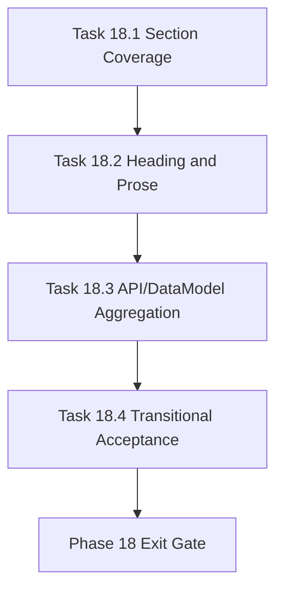

# Phase 18 - Transitional Quality Uplift

文档属性：阶段文档  
阶段定位：Evidence Repair 第二阶段  
对应实施计划：`.apm/Implementation_Plan.md`  
对应 Task Assignment：`.apm/Task_Assignments/Phase_18_Transitional_Quality_Uplift.md`

## 阶段目标

Phase 18 目标是把输出质量从 pilot 可用提升到 transitional 阈值。核心指标是 section coverage、heading coverage、prose density、API/DataModel aggregation，并以 compare overall >= 0.70 作为阶段目标。

## 当前问题与进入条件

进入条件：

- Phase 17 已修复证据一致性、CI gate 和测试入口
- 现有 compare 分数约为 50.2%，尚未达到 transitional 70%

当前问题：

- section coverage 约 40%，缺少 troubleshooting 等必需 section
- heading coverage 约 30%
- prose density 约 46%，列表比例偏高
- API/DataModel aggregation 仍偏 partial

## 任务清单与依赖关系

### Task 18.1 - Section coverage completion and navigation contract repair

- Agent：`Agent_DocGen`
- 目标：补齐必需 section 和跨页导航
- 关键依赖：Task 17.4、Task 15.4

### Task 18.2 - Heading coverage and prose-density generation upgrade

- Agent：`Agent_DocGen`
- 目标：提升 heading coverage 与 prose-first 质量
- 关键依赖：Task 18.1、Task 10.1

### Task 18.3 - API and data-model aggregation depth refinement

- Agent：`Agent_DocGen`
- 目标：强化 API/DataModel 聚合深度，减少 dump 式输出
- 关键依赖：Task 18.2、Task 10.2、Task 10.3

### Task 18.4 - Transitional acceptance rerun and quality burn-down

- Agent：`Agent_QualityRelease`
- 目标：重新执行 verify/compare 并产出质量 burn-down
- 关键依赖：Task 18.1、Task 18.2、Task 18.3

## 产物目录与写域边界

允许写入：

- `repo_wiki/generator/**`
- `repo_wiki/verifier/**`
- `docs/operations/**`
- `.repo-agent-eval/**`
- `tests/**`

不处理：

- CI gate 语义修复
- viewer/extension runtime 修复
- strict 85% 阈值最终发布策略

## Mermaid 阶段流程图

## 阶段退出门禁

- required section coverage 达到 transitional 阈值
- core docs 具备必需 heading 和足够 prose
- API/DataModel 不再以 raw dump 作为主要阅读层
- compare overall >= 0.70 或输出明确未达标 burn-down

## 风险与回退策略

- 风险：为冲分生成泛化文本  
  回退：prose 必须绑定 source-of-truth、模块、API、数据模型事实。
- 风险：section 补齐后导航复杂度上升  
  回退：统一走 link builder 和 verifier，不允许模板手写路径。
- 风险：API/DataModel 过度聚合丢失细节  
  回退：overview 层聚合，detail 层保留索引和 drilldown。

## 对应 Memory / Task Assignment 路径

- Memory 目录：`.apm/Memory/Phase_18_Transitional_Quality_Uplift/`
- Task Assignment：`.apm/Task_Assignments/Phase_18_Transitional_Quality_Uplift.md`
- 审查依据：`docs/repo-wiki-phase-14-16-review-and-phase-17-20-plan.md`
