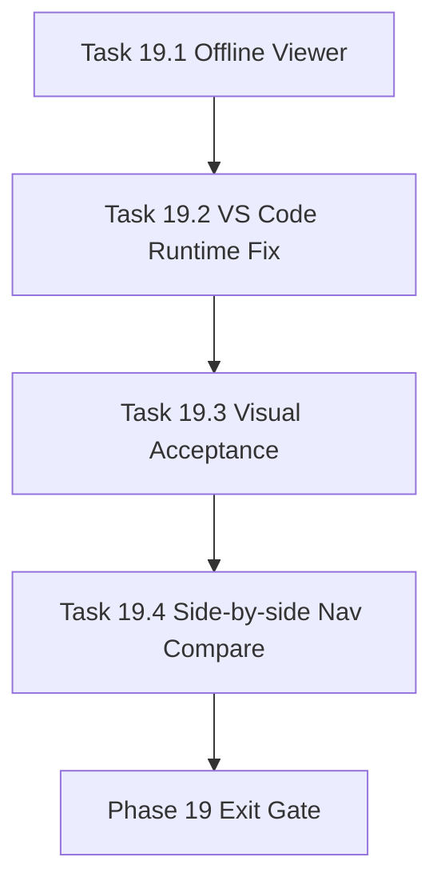

# Phase 19 - Viewer and IDE Hardening

文档属性：阶段文档  
阶段定位：Evidence Repair 第三阶段  
对应实施计划：`.apm/Implementation_Plan.md`  
对应 Task Assignment：`.apm/Task_Assignments/Phase_19_Viewer_and_IDE_Hardening.md`

## 阶段目标

Phase 19 目标是把 Phase 15 的 viewer 和 VS Code extension 原型变成可靠的人工验收工具。重点是离线可用、路径正确、manifest 发现稳定、可视化证据可回归。

## 当前问题与进入条件

进入条件：

- Phase 18 已产出更高质量的 eval artifacts
- Phase 17 已修复证据与测试入口

当前问题：

- static viewer 使用 CDN Mermaid，不符合 local-first 预期
- VS Code extension 用相对路径打开文件，可能打开错误目标
- extension 只查找 `.repo-agent-eval/manifest.json`，不支持 run 子目录
- viewer/extension 未经过截图或 extension host 级别验收

## 任务清单与依赖关系

### Task 19.1 - Static viewer offline asset and safety hardening

- Agent：`Agent_PlatformCore`
- 目标：移除 CDN-only 依赖并加固 markdown/Mermaid 渲染
- 关键依赖：Task 18.4、Task 15.2

### Task 19.2 - VS Code extension runtime path and manifest discovery repair

- Agent：`Agent_PlatformCore`
- 目标：修复 workspace path、run manifest discovery、命令调用
- 关键依赖：Task 19.1、Task 15.3

### Task 19.3 - Visual acceptance snapshots and navigation regression suite

- Agent：`Agent_QualityRelease`
- 目标：建立 viewer/extension 验收截图和导航回归证据
- 关键依赖：Task 19.1、Task 19.2

### Task 19.4 - Qoder side-by-side navigation comparison hardening

- Agent：`Agent_AdapterGovernance`
- 目标：强化 qoder 导航导入和 canonical side-by-side 对比
- 关键依赖：Task 19.3、Task 15.4

## 产物目录与写域边界

允许写入：

- `repo_wiki/viewer/**`
- `extensions/repo-wiki-browser/**`
- `repo_wiki/adapter/qoder_adapter/**`
- `.repo-agent-eval/**`
- `tests/**`
- `docs/operations/**`

不处理：

- 新增生成内容策略
- compare scoring 重设计
- release policy 重写

## Mermaid 阶段流程图

## 阶段退出门禁

- viewer 可在离线模式渲染 Mermaid 和 markdown
- VS Code extension 可正确打开 eval run 中的目标文件
- viewer/extension 有可复现的视觉或 runtime 验收证据
- qoder metadata import 只能作为 read-only overlay，不改变 canonical contract

## 风险与回退策略

- 风险：viewer 变成第二套生成系统  
  回退：viewer 只消费 manifest 和 markdown。
- 风险：extension 绑定某个 IDE 私有行为  
  回退：保持 VS Code-compatible 最小原型，不把它作为 CLI 依赖。
- 风险：可视化测试维护成本过高  
  回退：优先覆盖导航树、页面渲染、Mermaid 存在性和关键断链。

## 对应 Memory / Task Assignment 路径

- Memory 目录：`.apm/Memory/Phase_19_Viewer_and_IDE_Hardening/`
- Task Assignment：`.apm/Task_Assignments/Phase_19_Viewer_and_IDE_Hardening.md`
- 审查依据：`docs/repo-wiki-phase-14-16-review-and-phase-17-20-plan.md`
