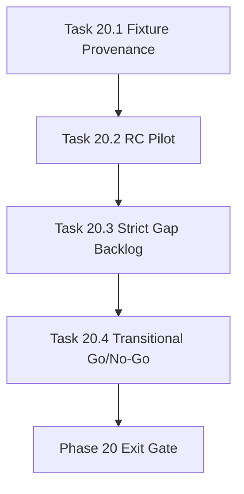

# Phase 20 - Transitional Release Candidate and Strict Gap Plan

文档属性：阶段文档  
阶段定位：Evidence Repair 第四阶段  
对应实施计划：`.apm/Implementation_Plan.md`  
对应 Task Assignment：`.apm/Task_Assignments/Phase_20_Transitional_Release_Candidate_and_Strict_Gap_Plan.md`

## 阶段目标

Phase 20 目标是在证据、内容质量、可视化验收都修复后，重新执行 release candidate 级别试点，并明确 repo-agent 是否可以在 transitional/pilot 场景替换 qoder repo-wiki。

## 当前问题与进入条件

进入条件：

- Phase 17 修复证据和 CI gate
- Phase 18 达到或明确接近 transitional 质量阈值
- Phase 19 完成 viewer/extension 人工验收工具加固

当前问题：

- 外部 qoder baseline fixture 需要 provenance 和 freshness 约束
- release candidate 试点需要重新跑，而不能沿用 Phase 16 的不可信 gate
- strict 85% 仍需要独立 backlog，不应混入 transitional 决策

## 任务清单与依赖关系

### Task 20.1 - External fixture provenance and benchmark refresh policy

- Agent：`Agent_QualityRelease`
- 目标：规范外部 qoder fixture 来源、刷新和可信度
- 关键依赖：Task 14.1、Task 18.4

### Task 20.2 - Release-candidate pilot across benchmark repositories

- Agent：`Agent_QualityRelease`
- 目标：执行修复后 RC 级跨仓试点
- 关键依赖：Task 19.4、Task 20.1

### Task 20.3 - Strict threshold gap backlog and ownership plan

- Agent：`Agent_QualityRelease`
- 目标：把 strict 85% 差距拆成可执行 backlog
- 关键依赖：Task 20.2

### Task 20.4 - Transitional go/no-go dossier and manager handover

- Agent：`Agent_QualityRelease`
- 目标：输出 transitional go/no-go 结论和 Manager handover
- 关键依赖：Task 20.2、Task 20.3

## 产物目录与写域边界

允许写入：

- `docs/operations/**`
- `.repo-agent-eval/**`
- `.apm/Memory/**`
- `scripts/**`
- `tests/**`

不处理：

- 新的 viewer/extension 功能
- 大型模板重写
- strict release 的实际执行

## Mermaid 阶段流程图

## 阶段退出门禁

- 外部 baseline fixture provenance 可审计
- release candidate 试点使用修复后的 CI gate 和 evidence contract
- transitional go/no-go 结论可复现
- strict 85% 差距有明确 owner、指标和后续阶段建议

## 风险与回退策略

- 风险：transitional 与 strict 决策混淆  
  回退：dossier 分别给出 transitional verdict 和 strict gap backlog。
- 风险：外部 fixture 无法稳定复现  
  回退：标注 confidence，不允许低可信 fixture 做 release gate。
- 风险：RC 结果仍低于 70%  
  回退：输出 no-go，并把 Phase 21 限定为质量差距修复，不新增功能面。

## 对应 Memory / Task Assignment 路径

- Memory 目录：`.apm/Memory/Phase_20_Transitional_Release_Candidate_and_Strict_Gap_Plan/`
- Task Assignment：`.apm/Task_Assignments/Phase_20_Transitional_Release_Candidate_and_Strict_Gap_Plan.md`
- 审查依据：`docs/repo-wiki-phase-14-16-review-and-phase-17-20-plan.md`
