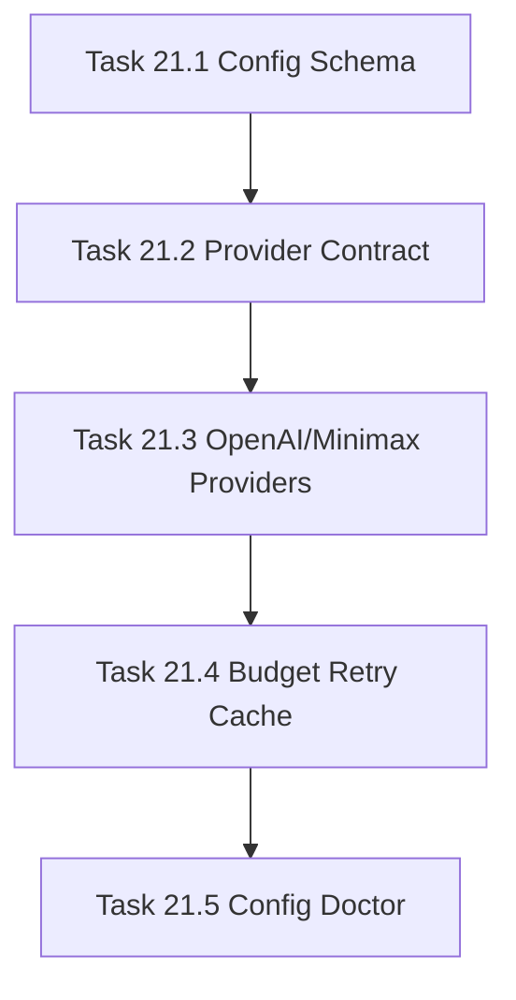

# Phase 21 - LLM Provider Abstraction and Secure Configuration

## 阶段目标
建立安全、可插拔的 LLM Provider 层，让 repo-agent 可以通过 Minimax、OpenAI-compatible、Anthropic-compatible 或本地模型生成 Qoder-like Repo Wiki，同时保证 CI 依赖 mock provider 而不依赖真实 API Key。

## 当前问题与进入条件
进入条件是 Phase 20 已给出 strict production replacement 仍阻塞的结论。当前最大缺口是生成器缺少真实 LLM 编排能力、配置诊断能力和 secret 安全边界。

## 任务清单与依赖关系
- `Task 21.1` LLM config schema and environment resolution
- `Task 21.2` Provider interface and request/response contract，依赖 `21.1`
- `Task 21.3` OpenAI-compatible and Minimax provider implementation，依赖 `21.2`
- `Task 21.4` Token budgeting, retry, and cache policy，依赖 `21.3`
- `Task 21.5` CLI configuration validation and diagnostics，依赖 `21.4`

## 产物目录与写域边界
- 允许写入：`repo_wiki/**`、`tests/**`、`docs/**` 中与 LLM 配置和诊断相关的文件。
- 禁止写入：目标仓库 `.qoder/**`、`.repo-wiki/**`、真实 `.env` secret。
- 测试必须默认使用 mock provider。

## Mermaid 阶段流程图

## 阶段退出门禁
- 任意 provider 配置可被诊断并输出 reason code。
- mock provider 成功、超时、限流、无 key 测试通过。
- CLI diagnostics 不泄露明文 key。

## 风险与回退策略
- 风险：真实 provider 行为差异导致 CI 不稳定。回退：CI 仅跑 mock，真实 provider smoke 由环境变量显式启用。
- 风险：secret 泄露到日志。回退：所有诊断输出统一走 redaction helper。

## 对应 Memory / Task Assignment 路径
- Task Assignment: `.apm/Task_Assignments/Phase_21_LLM_Provider_Abstraction_and_Secure_Configuration.md`
- Memory: `.apm/Memory/Phase_21_LLM_Provider_Abstraction_and_Secure_Configuration/`

