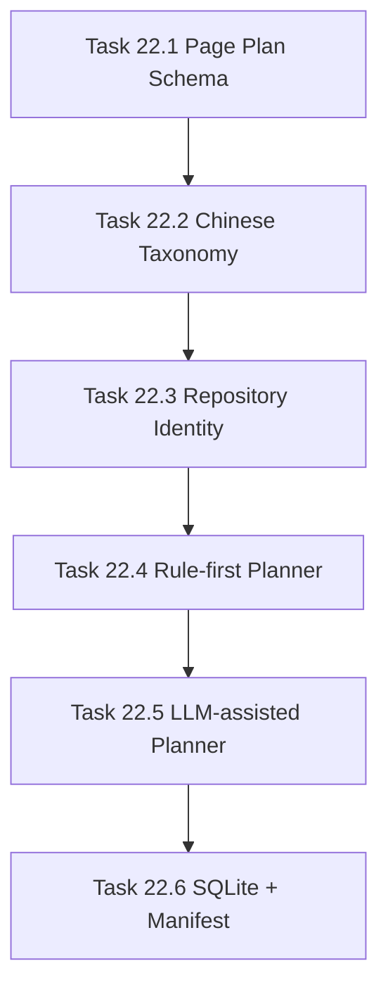

# Phase 22 - Qoder-like Wiki Planner and Chinese Information Architecture

## 阶段目标
先生成 Wiki 页面计划和中文导航树，再进入页面生成。目标是替代固定 `00-05 + sections + modules` 的目录模式，向 Qoder 的中文知识库结构靠拢。

## 当前问题与进入条件
进入条件是 Phase 21 完成 provider 和 config 基础。当前 repo-agent 输出更像 docs 索引，不具备 Qoder 的 100+ 页面树、中文栏目和项目身份识别。

## 任务清单与依赖关系
- `Task 22.1` Wiki page-plan schema and navigation tree contract
- `Task 22.2` Chinese taxonomy baseline for Qoder-like output，依赖 `22.1`
- `Task 22.3` Repository identity resolver，依赖 `22.2`
- `Task 22.4` Rule-first page planner，依赖 `22.3`
- `Task 22.5` LLM-assisted page planner，依赖 `22.4`
- `Task 22.6` Planner persistence into SQLite and manifest，依赖 `22.5`

## 产物目录与写域边界
- 允许写入：planner schema、taxonomy、identity resolver、SQLite plan persistence、manifest writer、测试。
- 输出目标：`.repo-agent-eval/<run>/manifest.json` 与 SQLite runtime。
- 不得写入目标仓库 `.qoder/**` 或 Qoder `.repo-wiki/**`。

## Mermaid 阶段流程图

## 阶段退出门禁
- AI_API_Atlas 规则模式不少于 80 个计划页。
- LLM 模式目标不少于 120 个计划页。
- manifest 包含插件可读取的中文导航树。

## 风险与回退策略
- 风险：LLM 规划不稳定。回退：以 rule-first planner 为稳定基线，LLM 只做扩展和标题优化。
- 风险：项目身份误识别。回退：README/build metadata 优先于目录名。

## 对应 Memory / Task Assignment 路径
- Task Assignment: `.apm/Task_Assignments/Phase_22_Qoder_like_Wiki_Planner_and_Chinese_Information_Architecture.md`
- Memory: `.apm/Memory/Phase_22_Qoder_like_Wiki_Planner_and_Chinese_Information_Architecture/`

