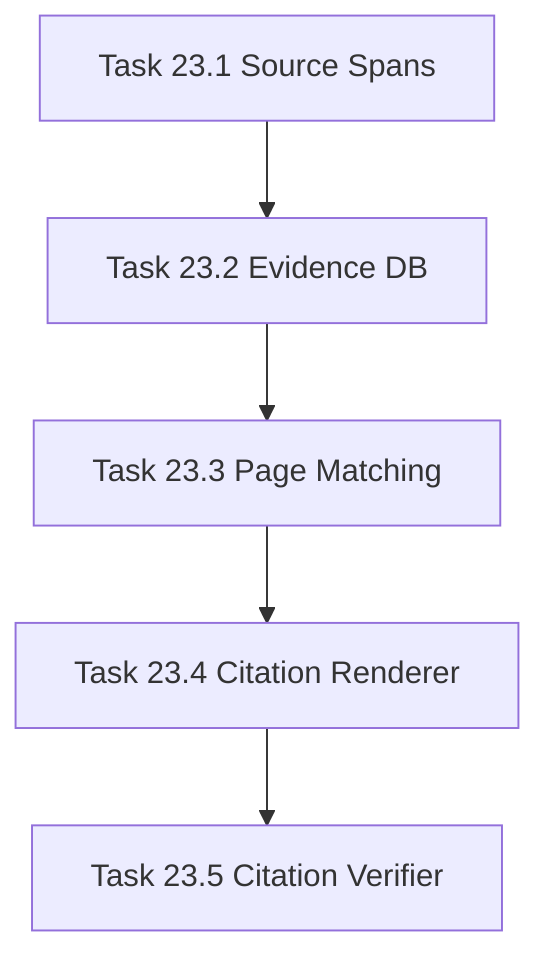

# Phase 23 - Evidence Builder with File and Line Citations

## 阶段目标
为每篇 Wiki 页面建立源码证据候选、文件行号引用和引用校验能力，使 LLM 输出可追溯，而不是无依据的概述。

## 当前问题与进入条件
进入条件是 Phase 22 已形成 page plan。当前差距是 repo-agent 生成内容缺少 Qoder-like 的源码引用、章节来源和图表来源。

## 任务清单与依赖关系
- `Task 23.1` Source span extractor for Java Python TypeScript SQL YAML Markdown
- `Task 23.2` Evidence SQLite schema，依赖 `23.1`
- `Task 23.3` Evidence ranking and page matching，依赖 `23.2`
- `Task 23.4` Citation block renderer，依赖 `23.3`
- `Task 23.5` Citation verifier，依赖 `23.4`

## 产物目录与写域边界
- 允许写入：scanner span extractor、runtime SQLite schema、citation renderer、verify checks、fixtures。
- Citation 必须使用可解析相对路径和行号，不泄露本地 secret。
- 不得修改 Qoder baseline 目录。

## Mermaid 阶段流程图

## 阶段退出门禁
- 多语言 fixture 行号准确。
- 每个可证据化计划页至少绑定 5 个候选证据。
- verify 可发现缺引用、坏路径、坏行号。

## 风险与回退策略
- 风险：语言解析过深导致实现膨胀。回退：先用 robust line-span heuristics，逐步替换为语言解析器。
- 风险：引用路径在插件中打不开。回退：manifest 中记录 workspace-relative canonical path。

## 对应 Memory / Task Assignment 路径
- Task Assignment: `.apm/Task_Assignments/Phase_23_Evidence_Builder_with_File_and_Line_Citations.md`
- Memory: `.apm/Memory/Phase_23_Evidence_Builder_with_File_and_Line_Citations/`

