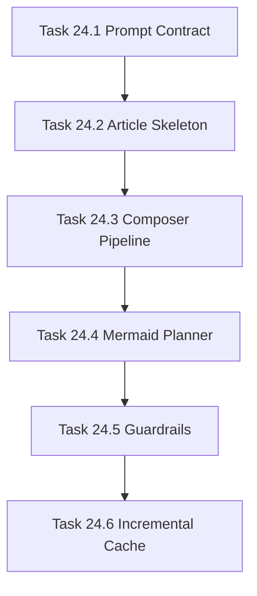

# Phase 24 - LLM Page Composer and Qoder-style Markdown Articles

## 阶段目标
将页面生成从模板索引升级为基于 page plan、evidence、retrieval context 和 LLM 的可读 Markdown 文章，并加入 TOC、cite、Mermaid 和反幻觉 guardrails。

## 当前问题与进入条件
进入条件是 Phase 23 已有证据层。当前 repo-agent 页面仍偏向目录索引和事实列表，缺少 Qoder 页面那种面向读者的长文结构。

## 任务清单与依赖关系
- `Task 24.1` Page prompt contract and prompt fragments
- `Task 24.2` Qoder-style article skeleton，依赖 `24.1`
- `Task 24.3` LLM page composer pipeline，依赖 `24.2`
- `Task 24.4` Mermaid diagram planner and renderer，依赖 `24.3`
- `Task 24.5` Quality guardrails for hallucination and generic prose，依赖 `24.4`
- `Task 24.6` Page composer incremental cache，依赖 `24.5`

## 产物目录与写域边界
- 允许写入：prompt templates、composer pipeline、diagram planner、quality checks、page cache。
- 测试必须使用 mock LLM。
- 输出仍隔离到 `.repo-agent-eval/<run>`。

## Mermaid 阶段流程图

## 阶段退出门禁
- 页面有 TOC、稳定 heading、citation、基础 Mermaid 能力。
- mock LLM composer 测试通过。
- 未变更页面不重复调用 LLM。

## 风险与回退策略
- 风险：LLM 输出泛化套话。回退：guardrails 拒绝低证据和低 prose density 页面。
- 风险：Mermaid 语法不稳定。回退：写入前校验，失败时降级为文字说明并记录 warning。

## 对应 Memory / Task Assignment 路径
- Task Assignment: `.apm/Task_Assignments/Phase_24_LLM_Page_Composer_and_Qoder_style_Markdown_Articles.md`
- Memory: `.apm/Memory/Phase_24_LLM_Page_Composer_and_Qoder_style_Markdown_Articles/`

