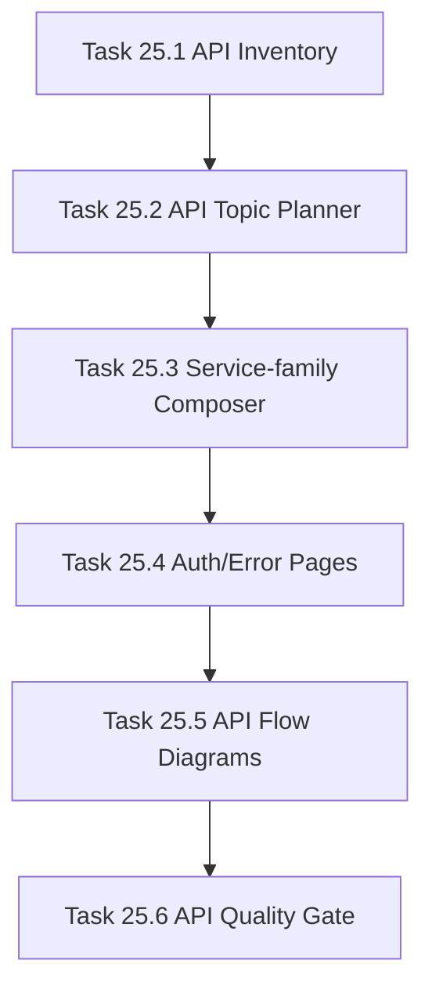

# Phase 25 - API Reference Specialization

## 阶段目标
把 API 文档从 endpoint dump 改成服务族、认证授权、错误约定、核心调用流和 API 专题页。

## 当前问题与进入条件
进入条件是 Phase 24 已有 LLM article composer。当前 API 页面质量差距主要是列表过多、主题聚合不足、调用链解释不足。

## 任务清单与依赖关系
- `Task 25.1` API inventory enrichment
- `Task 25.2` API topic planner，依赖 `25.1`
- `Task 25.3` Service-family API composer，依赖 `25.2`
- `Task 25.4` Auth and error convention generator，依赖 `25.3`
- `Task 25.5` API flow diagram generation，依赖 `25.4`
- `Task 25.6` API quality verifier，依赖 `25.5`

## 产物目录与写域边界
- 允许写入：API extractor、API topic planner、API composer、auth/error generators、API quality gates。
- 不允许以全量 endpoint 表替代正文。
- 必须保留源码引用和关键 handler 位置。

## Mermaid 阶段流程图

## 阶段退出门禁
- AI_API_Atlas 至少生成 15 个 API 计划页。
- API 页面以服务族和调用约定为主体。
- endpoint dump 回归样例被 strict verifier 拒绝。

## 风险与回退策略
- 风险：auth/error 证据不足。回退：输出“未发现明确证据”并引用扫描范围，而不是编造。
- 风险：API 数量过多。回退：长尾 endpoint 进入附录或 drilldown 页面。

## 对应 Memory / Task Assignment 路径
- Task Assignment: `.apm/Task_Assignments/Phase_25_API_Reference_Specialization.md`
- Memory: `.apm/Memory/Phase_25_API_Reference_Specialization/`

