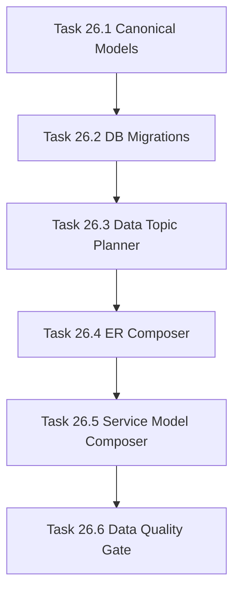

# Phase 26 - Data Model and Database Architecture Specialization

## 阶段目标
把数据模型文档从模型堆叠升级为核心实体、服务数据模型、数据库架构、迁移策略和实体关系专题页。

## 当前问题与进入条件
进入条件是 Phase 24 composer 可用。当前 data model 最大缺陷是 DTO/Entity/Type 重复堆叠，缺少实体去重、ER 关系和迁移上下文。

## 任务清单与依赖关系
- `Task 26.1` Entity deduplication and canonical model resolver
- `Task 26.2` Database migration and table extractor，依赖 `26.1`
- `Task 26.3` Data-model topic planner，依赖 `26.2`
- `Task 26.4` Entity relationship composer，依赖 `26.3`
- `Task 26.5` Service data-model composer，依赖 `26.4`
- `Task 26.6` Data-model quality verifier，依赖 `26.5`

## 产物目录与写域边界
- 允许写入：model resolver、migration extractor、data-model planner/composer、ER renderer、quality gate。
- 必须避免把全部模型原样 dump 到单页。
- 必须引用 entity、migration、service 使用位置。

## Mermaid 阶段流程图

## 阶段退出门禁
- AI_API_Atlas 至少生成 30 个数据模型计划页。
- 核心实体页包含 ER 图、字段解释和源码引用。
- 当前 `05-data-model.md` 类 dump 被 strict gate 标记失败。

## 风险与回退策略
- 风险：实体关系推断不完整。回退：只输出有证据的关系，并将弱推断标为 warning。
- 风险：模型数量过大。回退：核心实体优先，低价值 DTO 进入附录。

## 对应 Memory / Task Assignment 路径
- Task Assignment: `.apm/Task_Assignments/Phase_26_Data_Model_and_Database_Architecture_Specialization.md`
- Memory: `.apm/Memory/Phase_26_Data_Model_and_Database_Architecture_Specialization/`

