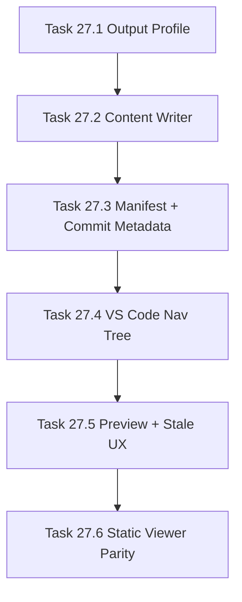

# Phase 27 - Qoder-compatible Output Layout and IDE Runtime

## 阶段目标
让输出形态和 IDE 展示接近 Qoder：隔离目录、中文 `content/**`、manifest navigation tree、commit freshness、左侧 Repo Wiki 树和 Markdown Preview。

## 当前问题与进入条件
进入条件是 Phase 24-26 已能生成专业化页面。当前插件和静态 viewer 仍依赖不稳定路径猜测，输出布局也没有完全对齐 Qoder-like 使用方式。

## 任务清单与依赖关系
- `Task 27.1` Qoder-like output profile
- `Task 27.2` Content layout writer，依赖 `27.1`
- `Task 27.3` Manifest navigation tree and commit metadata，依赖 `27.2`
- `Task 27.4` VS Code extension nav-tree integration，依赖 `27.3`
- `Task 27.5` Markdown preview and stale wiki UX，依赖 `27.4`
- `Task 27.6` Static viewer parity pass，依赖 `27.5`

## 产物目录与写域边界
- 默认输出：`.repo-agent-eval/<run>/content/**`。
- 插件读取 manifest，不直接猜目录。
- 禁止修改 `.qoder/**` 和 `.repo-wiki/**`。

## Mermaid 阶段流程图

## 阶段退出门禁
- `repo-wiki generate --profile qoder-like --output .repo-agent-eval` 可用。
- 插件左侧显示中文 Qoder-like 目录。
- 当前 git id 与 manifest id 不一致时可提示更新。

## 风险与回退策略
- 风险：插件和 viewer 导航不一致。回退：两者只消费同一个 manifest navigation_tree。
- 风险：误写 Qoder 目录。回退：profile 默认隔离输出并加入防写保护测试。

## 对应 Memory / Task Assignment 路径
- Task Assignment: `.apm/Task_Assignments/Phase_27_Qoder_compatible_Output_Layout_and_IDE_Runtime.md`
- Memory: `.apm/Memory/Phase_27_Qoder_compatible_Output_Layout_and_IDE_Runtime/`

