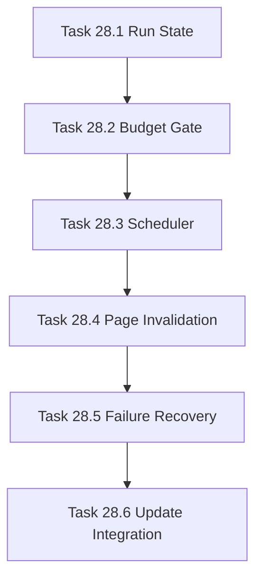

# Phase 28 - Generation Orchestration, Cost Control, and Incremental Update

## 阶段目标
将全量生成升级为可恢复、可限流、可预算控制、可增量更新的本地知识生成运行时。

## 当前问题与进入条件
进入条件是 Phase 27 已有 qoder-like 输出和展示闭环。当前大仓库生成会面临中断恢复、API 成本、provider 限速和增量更新问题。

## 任务清单与依赖关系
- `Task 28.1` Generation run state machine
- `Task 28.2` LLM cost estimator and budget gate，依赖 `28.1`
- `Task 28.3` Concurrent generation scheduler，依赖 `28.2`
- `Task 28.4` Page-level invalidation from git diff and hash fallback，依赖 `28.3`
- `Task 28.5` Failure recovery and partial evidence bundle，依赖 `28.4`
- `Task 28.6` update integration for qoder-like profile，依赖 `28.5`

## 产物目录与写域边界
- 允许写入：generation runtime、SQLite state、scheduler、cost estimator、update command、quality evidence bundle。
- 不允许失败页破坏已成功页面。
- 输出仍隔离在 `.repo-agent-eval/<run>`。

## Mermaid 阶段流程图

## 阶段退出门禁
- 中断后可恢复，不重复生成已完成页面。
- 预算超限会阻止执行或要求 override。
- 改一个服务只重生成相关页面。

## 风险与回退策略
- 风险：并发写 SQLite 造成状态不一致。回退：集中状态写入队列或事务锁。
- 风险：增量关联不准。回退：hash fallback 扩大影响范围但不全量误删。

## 对应 Memory / Task Assignment 路径
- Task Assignment: `.apm/Task_Assignments/Phase_28_Generation_Orchestration_Cost_Control_and_Incremental_Update.md`
- Memory: `.apm/Memory/Phase_28_Generation_Orchestration_Cost_Control_and_Incremental_Update/`

