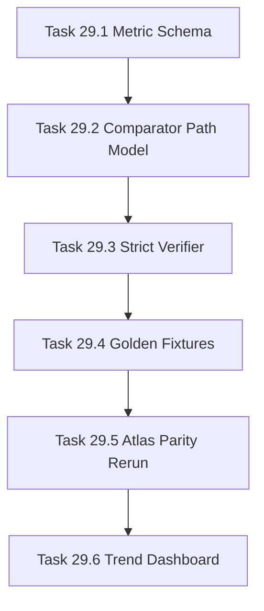

# Phase 29 - Quality Governance and Qoder Parity Benchmark

## 阶段目标
建立可信的 Qoder parity 指标、strict verifier、golden fixture 和 AI_API_Atlas 对比报告，用证据判断差距，而不是只看文件数量。

## 当前问题与进入条件
进入条件是 Phase 28 已具备可控生成。当前 comparator 和 verify 仍需要针对 qoder-like `content/**`、citation、TOC、Mermaid、prose/list 和专业化质量做严格治理。

## 任务清单与依赖关系
- `Task 29.1` Qoder parity metric schema
- `Task 29.2` Comparator path-model repair，依赖 `29.1`
- `Task 29.3` Strict verifier for qoder-like profile，依赖 `29.2`
- `Task 29.4` Golden fixture suite，依赖 `29.3`
- `Task 29.5` AI_API_Atlas qoder parity rerun，依赖 `29.4`
- `Task 29.6` Regression dashboard and trend persistence，依赖 `29.5`

## 产物目录与写域边界
- 允许写入：metric schema、comparator、verifier、fixtures、dashboard export。
- AI_API_Atlas 只写 `.repo-agent-eval/<run>`。
- Qoder baseline 只读：`.qoder/repowiki/zh`。

## Mermaid 阶段流程图

## 阶段退出门禁
- comparator 不再误判 `docs/sections` 或 `docs/docs`。
- strict verifier 可拒绝无 cite、无 TOC、dump 页面、坏 file 引用。
- AI_API_Atlas 输出差距矩阵可信。

## 风险与回退策略
- 风险：Qoder 私有实现不可见。回退：只比较可观察产物，不推断内部算法。
- 风险：真实 LLM 输出导致指标波动。回退：golden fixture 使用 mock 输出稳定 CI。

## 对应 Memory / Task Assignment 路径
- Task Assignment: `.apm/Task_Assignments/Phase_29_Quality_Governance_and_Qoder_Parity_Benchmark.md`
- Memory: `.apm/Memory/Phase_29_Quality_Governance_and_Qoder_Parity_Benchmark/`

