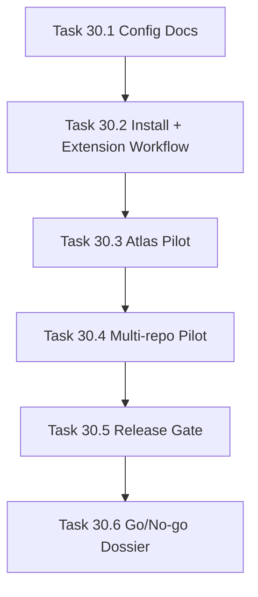

# Phase 30 - Replacement Candidate Release and Documentation

## 阶段目标
形成可配置任意 LLM API Key 的 Qoder 替代候选版本，并通过 AI_API_Atlas 与多仓库 pilot 给出明确 go/no-go。

## 当前问题与进入条件
进入条件是 Phase 29 已能给出可信 parity 指标。当前不能声称替代 Qoder，必须通过完整配置文档、安装流程、插件流程、多仓库证据和发布门禁。

## 任务清单与依赖关系
- `Task 30.1` End-user configuration documentation
- `Task 30.2` Installation and VS Code extension workflow，依赖 `30.1`
- `Task 30.3` AI_API_Atlas full replacement pilot，依赖 `30.2`
- `Task 30.4` Multi-repository replacement pilot，依赖 `30.3`
- `Task 30.5` Release gate and rollback plan，依赖 `30.4`
- `Task 30.6` Final go/no-go dossier，依赖 `30.5`

## 产物目录与写域边界
- 允许写入：用户文档、pilot reports、release gate、rollback plan、final dossier。
- AI_API_Atlas 生成物必须在 `.repo-agent-eval/<run>`。
- 不允许污染 `.qoder/**` 或 `.repo-wiki/**`。

## Mermaid 阶段流程图

## 阶段退出门禁
- 用户只配置 env/yaml 即可运行 qoder-like profile。
- VSIX 安装、生成、查看、更新流程可复现。
- final dossier 明确说明能否替代 Qoder Repo Wiki。

## 风险与回退策略
- 风险：单仓库效果好但泛化不足。回退：多仓库 pilot 必须分语言/规模记录差距。
- 风险：过早宣称替代。回退：未达 strict gate 时只允许称为 pilot/候选。

## 对应 Memory / Task Assignment 路径
- Task Assignment: `.apm/Task_Assignments/Phase_30_Replacement_Candidate_Release_and_Documentation.md`
- Memory: `.apm/Memory/Phase_30_Replacement_Candidate_Release_and_Documentation/`

