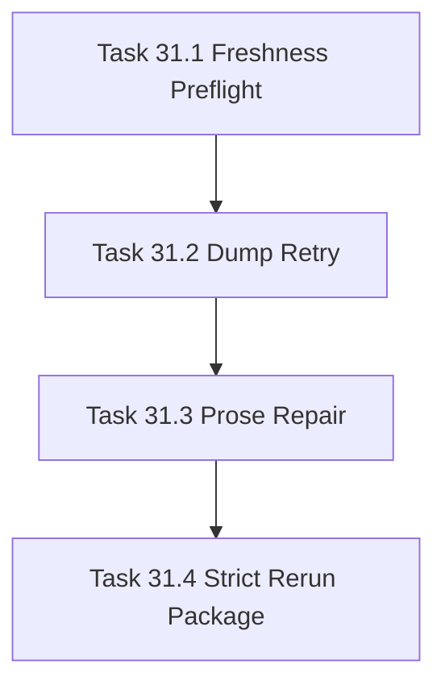

# Phase 31 - Strict Gate Closure and Freshness Reliability

## 阶段目标
让最新 AI_API_Atlas Minimax run 先稳定通过 qoder-like strict gate，不继续扩大功能面。

## 当前问题与进入条件
最新评估结论为 `NOT_READY`，strict gate 失败码包含 `QODER_PAGE_DUMP`、`QODER_PROSE_TOO_LOW`、`QODER_STALE_GIT_COMMIT`。本阶段进入条件是 Phase 30 已完成替代候选评估，但不能宣称替代 Qoder。

## 任务清单与依赖关系
- `Task 31.1` Commit freshness preflight
- `Task 31.2` Dump page retry policy，依赖 `31.1`
- `Task 31.3` Prose density repair，依赖 `31.2`
- `Task 31.4` Strict gate rerun package，依赖 `31.3`

## 产物目录与写域边界
- 允许写入：manifest freshness metadata、strict report、comparison report、manual review index。
- AI_API_Atlas 生成物必须在 `/Users/bingooyong/Code/01Code/github.com/bingooyong/AI_API_Atlas/.repo-agent-eval/<run>`。
- `.qoder/**` 只读，不允许修改。

## Mermaid 阶段流程图

## 阶段退出门禁
- `repo-wiki verify --profile qoder-like --ci` 必须 PASS。
- stale commit、dump page、low prose 三类 strict reason code 清零。
- dirty target repo 只能产生 `NOT_READY`，不能标记 READY。

## 风险与回退策略
- 风险：dirty target repo 让替代结论不可复现。回退：strict 模式默认要求 clean tree。
- 风险：repair 失败页被静默接受。回退：失败页必须输出 reason 和 retry command。

## 对应 Memory / Task Assignment 路径
- Task Assignment: `.apm/Task_Assignments/Phase_31_Strict_Gate_Closure_and_Freshness_Reliability.md`
- Memory: `.apm/Memory/Phase_31_Strict_Gate_Closure_and_Freshness_Reliability/`

