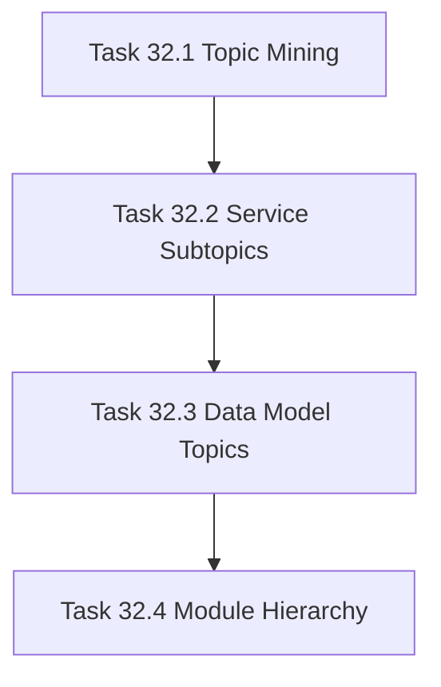

# Phase 32 - Qoder-style Information Architecture Deepening

## 阶段目标
补齐 Qoder 的深层专题目录能力，让 repo-agent 不再只按服务生成单页或聚合页。

## 当前问题与进入条件
repo-agent 当前页面数接近 Qoder，但目录深度和专题拆分不足。进入条件是 Phase 31 已清理 strict gate 的基础质量问题。

## 任务清单与依赖关系
- `Task 32.1` Qoder baseline topic mining
- `Task 32.2` Service subtopic planner，依赖 `32.1`
- `Task 32.3` Data-model entity topic planner，依赖 `32.2`
- `Task 32.4` Project overview module hierarchy，依赖 `32.3`

## 产物目录与写域边界
- 允许写入：topic taxonomy、planner contracts、navigation manifest、comparison evidence。
- AI_API_Atlas 生成物必须在 `.repo-agent-eval/<run>`。
- `.qoder/repowiki/zh/content` 只作为只读 baseline，不复制内容。

## Mermaid 阶段流程图

## 阶段退出门禁
- 与 Qoder 的 path common count 从当前约 `36` 提升到至少 `80`。
- repo-agent 页面数保持在 Qoder 的 `90%-120%`。
- 目录深度达到 `4`，且不存在空洞目录。
- 无重复 data model 页面。

## 风险与回退策略
- 风险：为了追目录深度生成空页面。回退：每个新增层级必须有非空、有证据的主题页。
- 风险：过拟合 AI_API_Atlas 的 Qoder 目录。回退：只提取泛化 taxonomy，不复制 Qoder 内容。

## 对应 Memory / Task Assignment 路径
- Task Assignment: `.apm/Task_Assignments/Phase_32_Qoder_style_Information_Architecture_Deepening.md`
- Memory: `.apm/Memory/Phase_32_Qoder_style_Information_Architecture_Deepening/`

