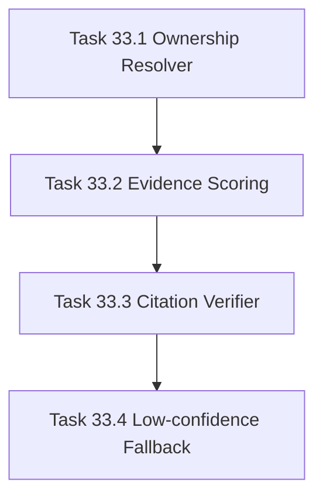

# Phase 33 - Evidence Ranking and Hallucination Control

## 阶段目标
修复页面主题与源码证据错配问题，降低无证据推断和幻觉风险。

## 当前问题与进入条件
现有 run 中出现 GitLab、Jenkins、MCP 等页面绑定无关 `ai-service` 证据的问题。进入条件是 Phase 32 已明确更细粒度的信息架构和页面主题。

## 任务清单与依赖关系
- `Task 33.1` Service ownership resolver
- `Task 33.2` Page evidence scoring，依赖 `33.1`
- `Task 33.3` Citation relevance verifier，依赖 `33.2`
- `Task 33.4` Low-confidence fallback，依赖 `33.3`

## 产物目录与写域边界
- 允许写入：service ownership resolver、evidence scores、citation relevance gates、low-confidence composer behavior。
- strict verify 必须能消费 citation relevance 结果。
- 证据不足时必须显式标记，不允许编造实现细节。

## Mermaid 阶段流程图

## 阶段退出门禁
- 抽样 20 页，服务页 citation 与服务目录一致率达到 `>= 90%`。
- 关键页面不再以“证据未显示但推测”作为主体内容。
- hallucination/relevance gate 纳入 strict verify。

## 风险与回退策略
- 风险：shared infrastructure 证据被误判。回退：shared citation 可 WARN，但必须说明原因。
- 风险：证据不足页面质量下降。回退：使用 `待确认` section 表达缺口，保留已验证内容。

## 对应 Memory / Task Assignment 路径
- Task Assignment: `.apm/Task_Assignments/Phase_33_Evidence_Ranking_and_Hallucination_Control.md`
- Memory: `.apm/Memory/Phase_33_Evidence_Ranking_and_Hallucination_Control/`

