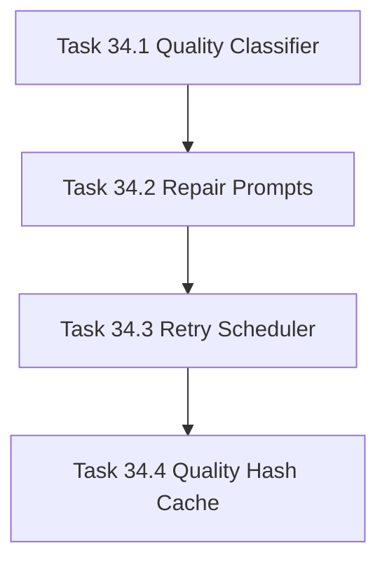

# Phase 34 - LLM Composer Quality Loop

## 阶段目标
把一次性页面生成改为可验证、可重试、可修订、可缓存失效的生成闭环。

## 当前问题与进入条件
当前 LLM 输出存在 fallback、dump page、低 prose、旧缓存复用等问题。进入条件是 Phase 33 已能判断证据相关性和低置信度内容。

## 任务清单与依赖关系
- `Task 34.1` Page quality classifier
- `Task 34.2` Targeted repair prompts，依赖 `34.1`
- `Task 34.3` Cost-aware retry scheduler，依赖 `34.2`
- `Task 34.4` Cache validity by quality hash，依赖 `34.3`

## 产物目录与写域边界
- 允许写入：quality classifier、repair prompts、retry scheduler、cache metadata、manifest repair summary。
- repair 只重写失败页，并保留有效 citation。
- CLI 必须输出可观察进度，避免长时间无反馈。

## Mermaid 阶段流程图

## 阶段退出门禁
- Minimax 全量 run 中 fallback 页 `<= 5%`。
- repair 后 strict gate PASS。
- 旧低质量缓存不会因普通 input hash 命中而继续复用。
- CLI 进度包含 planned、llm_done、repairing、fallback、failed。

## 风险与回退策略
- 风险：repair 无限消耗 token。回退：限制最大 repair 次数和预算。
- 风险：缓存遮蔽质量规则变化。回退：cache key 加入 quality profile hash。

## 对应 Memory / Task Assignment 路径
- Task Assignment: `.apm/Task_Assignments/Phase_34_LLM_Composer_Quality_Loop.md`
- Memory: `.apm/Memory/Phase_34_LLM_Composer_Quality_Loop/`

