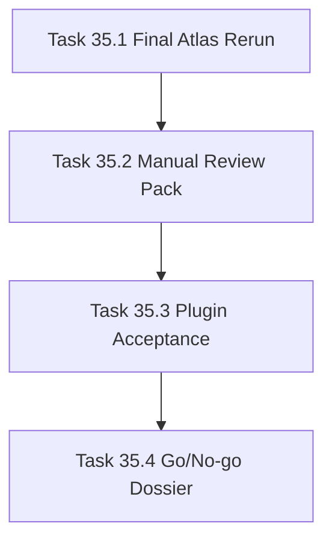

# Phase 35 - Replacement Candidate Acceptance

## 阶段目标
给出 repo-agent 是否可以替代 Qoder Repo Wiki 的证据化最终结论。

## 当前问题与进入条件
当前状态不能声明替代 Qoder。进入条件是 Phase 31-34 已完成 strict gate、信息架构、证据、repair loop 的闭环。

## 任务清单与依赖关系
- `Task 35.1` AI_API_Atlas full pilot rerun
- `Task 35.2` Manual review pack，依赖 `35.1`
- `Task 35.3` Plugin acceptance pass，依赖 `35.2`
- `Task 35.4` Go/no-go dossier，依赖 `35.3`

## 产物目录与写域边界
- 允许写入：final pilot run、strict report、qoder comparison report、manual review matrix、plugin acceptance evidence、go/no-go dossier。
- AI_API_Atlas run 必须隔离在 `.repo-agent-eval/<run>`。
- `.qoder/**` 只读，不允许修改。

## Mermaid 阶段流程图

## 阶段退出门禁
- strict verify PASS。
- qoder compare READY。
- `.qoder/**` read-only verified。
- 人工抽检 30 页中至少 24 页达到“可替代 Qoder”。
- 若未达标，CLI 必须返回非零或明确 `NOT_READY`。

## 风险与回退策略
- 风险：AI_API_Atlas 达标被误解为所有仓库通用达标。回退：dossier 必须分离 AI_API_Atlas readiness 与 general readiness。
- 风险：插件展示 NOT_READY run。回退：插件默认展示 latest READY run，NOT_READY 显式标识。

## 对应 Memory / Task Assignment 路径
- Task Assignment: `.apm/Task_Assignments/Phase_35_Replacement_Candidate_Acceptance.md`
- Memory: `.apm/Memory/Phase_35_Replacement_Candidate_Acceptance/`

