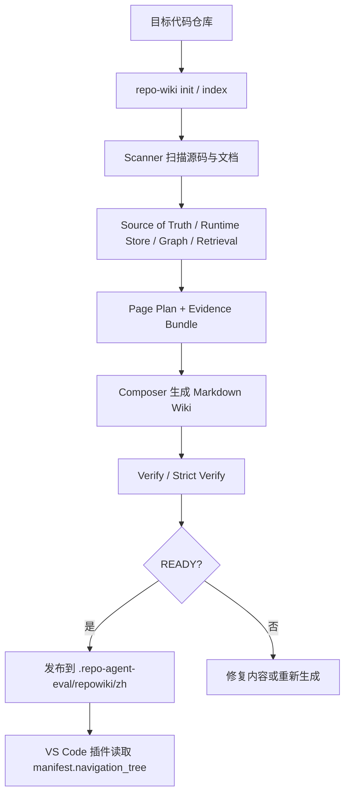
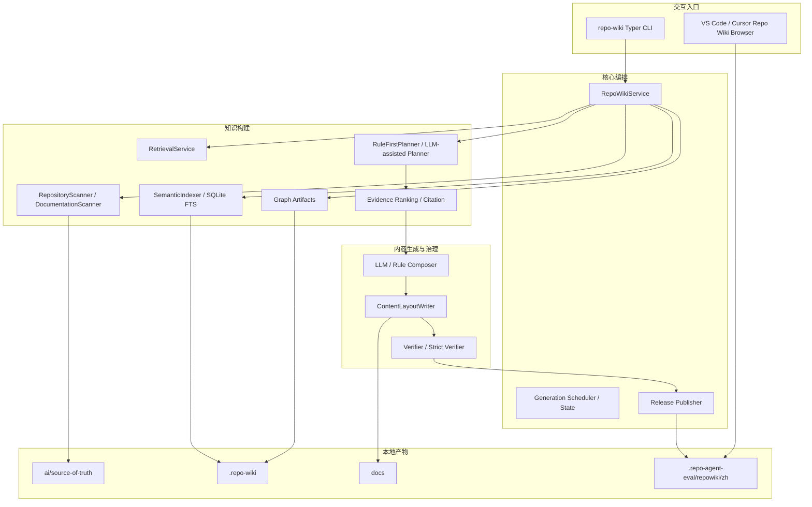

# repo-agent / repo-wiki 项目分析文档

**生成日期：** 2026-07-08
**范围：** 当前仓库 `<repo-root>`
**目的：** 先对“根据代码生成项目 Wiki 的智能体，并支持 VS Code 插件”这一项目形态做事实分析，为后续补齐产品文档、架构文档、插件文档和路线图提供基线。

---

## 1. 结论摘要

### 1.1 项目定位

repo-agent 仓库的可发布主体是 **`repo-wiki` 本地优先仓库 Wiki 生成器**。它以 Python CLI 为核心入口，扫描目标仓库代码与文档，沉淀结构化事实、索引、证据、页面计划与 Markdown Wiki；同时提供一个 VS Code / Cursor 插件 `Repo Wiki Browser` 用于在 IDE 中浏览发布后的 Wiki，并触发更新、同步、校验命令。

### 1.2 当前实现形态

| 层级 | 当前实现 | 证据 |
|---|---|---|
| CLI / 包入口 | Python 包 `repo-wiki`，命令入口为 `repo_wiki.cli:app` | `pyproject.toml:5-31` |
| 核心流水线 | `RepoWikiService` 串联扫描、Source of Truth、索引、图谱、检索、生成、同步、运行时存储 | `repo_wiki/orchestration/service.py:46-113` |
| 标准生成 | 直接写入 `docs/`、`ai/source-of-truth/`、`.repo-wiki/` | `repo_wiki/core/config.py:58-63` |
| qoder-like 隔离生成 | 写入 `.repo-agent-eval`，不修改目标 docs/runtime 目录 | `repo_wiki/orchestration/service.py:372-551` |
| Wiki 规划 | rule-first 生成中文信息架构、页面 ID、导航树、页面证据需求 | `repo_wiki/planner/rule_first.py:40-105`，`repo_wiki/planner/schema.py:33-120` |
| LLM 适配 | 支持 OpenAI-compatible Provider、Mock Provider 与可诊断配置 | `repo_wiki/llm/adapters.py:22-139`，`repo_wiki/llm/providers.py:27-100` |
| 质量门禁 | 标准 Verify 与 qoder-like strict verifier，区分 HARD / SOFT gate | `repo_wiki/verifier/service.py:17-27`，`repo_wiki/verifier/service.py:216-255` |
| 发布接口 | READY run 原子发布到 `.repo-agent-eval/repowiki/zh` | `repo_wiki/orchestration/release_publisher.py:164-235` |
| VS Code 插件 | `extensions/repo-wiki-browser` 提供侧栏、命令、release manifest 浏览 | `extensions/repo-wiki-browser/package.json:1-83`，`extensions/repo-wiki-browser/src/extension.ts:77-173` |

### 1.3 重要风险

1. **Source of Truth 已按当前实现校准。** 当前事实基线以 Python Typer CLI、TypeScript VS Code/Cursor 插件和 READY release 读取契约为准；API、数据模型和任务清单只保留产品事实，剔除测试、依赖目录和解析器示例产生的伪事实。
2. **插件只读 READY release manifest。** 插件当前不回退扫描 `docs/` 或 run 目录；如果用户未先发布到 `.repo-agent-eval/repowiki/zh/manifest.json`，侧栏会提示未检测到 READY Wiki。
3. **qoder-like 与 standard 输出语义不同。** README 仍写 qoder-like 输出到 `.repo-agent-eval/<run>/content/`，但当前发布接口已经强化为 `.repo-agent-eval/repowiki/zh/{content,meta,manifest.json}` 的稳定 release 形态，需要在后续文档中统一术语。

---

## 2. 事实基线

### 2.1 项目名称与包入口

- `pyproject.toml` 定义项目名为 `repo-wiki`，版本为 `0.1.0`，描述为 “Local-first repository wiki generator MVP”。
- Python 运行时要求是 `>=3.11`。
- 命令行入口 `repo-wiki = repo_wiki.cli:app`，说明安装后主命令不是 `repo-agent`，而是 `repo-wiki`。
- 依赖包含 `pydantic`、`PyYAML`、`rich`、`typer`、`pathspec`、`httpx`、`python-dotenv` 等，符合“本地扫描 + CLI + YAML 配置 + HTTP LLM Provider”的工具形态。

证据：`pyproject.toml:5-31`。

### 2.2 README 对外能力描述

README 明确把项目描述为 “Local-first repository wiki generator”，并列出以下能力：

- Qoder 替代；
- Local-first；
- qoder-like 隔离输出；
- 增量更新；
- Strict Verify。

CLI 命令包括 `init`、`index`、`generate`、`update`、`verify`、`search`、`graph`、`cost-estimate`。README 还说明技术栈包括 Python、SQLite/FTS5、ChromaDB、OpenAI-compatible / Minimax LLM。

证据：`README.md:1-19`、`README.md:43-55`、`README.md:120-125`。

### 2.3 当前 Source of Truth 状态

当前 `ai/source-of-truth/repo-map.yaml` 记录的主语言为 Python，框架为 `typer-cli`，入口包含 `repo_wiki/cli.py`、`repo_wiki/orchestration/service.py` 和 `extensions/repo-wiki-browser/src/extension.ts`。`api-index.yaml` 在当前仓库为空，符合“CLI + IDE 插件”形态；`data-models.yaml` 保留 Python 配置/合同/规划模型和插件 manifest/navigation 接口；`task-catalog.generated.json` 对齐 CLI 命令、qoder-like 生成/校验/发布链路和插件默认更新命令。

生成与校验应继续以源码、包配置、CLI 注册命令、插件 `package.json` 和 release schema 为事实基线，避免把测试夹具、依赖目录或解析器实现中的示例文本写入产品事实。

证据：`ai/source-of-truth/repo-map.yaml:1-38`，`ai/source-of-truth/api-index.yaml:1-3`，`ai/source-of-truth/data-models.yaml:1-80`，`ai/source-of-truth/task-catalog.generated.json:1-120`，`pyproject.toml:5-31`，`repo_wiki/cli.py:23-80`。

---

## 3. 产品能力分析

### 3.1 面向用户

| 用户 | 主要诉求 | 当前支持情况 |
|---|---|---|
| 项目开发者 | 快速生成可读项目 Wiki，降低理解和维护成本 | CLI `generate`、`update`、`verify` 已覆盖 |
| 技术负责人 / 架构师 | 看到模块、API、数据模型、依赖关系和证据引用 | Scanner、Source of Truth、Planner、Evidence、Verifier 已覆盖 |
| 文档维护者 | 对已有 docs 做分类、检测陈旧引用和冲突 | `DocumentationScanner` 支持文档分类、权威性、freshness 和冲突诊断 |
| IDE 用户 | 在 VS Code / Cursor 中浏览 Wiki、更新 Wiki、查看 stale 状态 | `Repo Wiki Browser` 插件已覆盖 release manifest 浏览和终端命令触发 |
| CI / 发布负责人 | 确认 Wiki 是否满足质量门禁后发布 | `verify`、qoder-like strict verifier、release publisher 已覆盖 |

### 3.2 用户主路径

### 3.3 输出形态

| 输出 | 用途 | 生成/消费方 |
|---|---|---|
| `docs/` | standard 模式下的可读 Markdown 文档 | Generator / 人类读者 |
| `ai/source-of-truth/` | 模块、API、数据模型、任务等结构化事实 | Scanner / Generator / Verifier |
| `.repo-wiki/` | 索引、图谱、运行时状态、本地缓存 | Indexer / Retrieval / Runtime Store |
| `.repo-agent-eval/<run>/...` | qoder-like 隔离运行输出 | CLI generate / improve |
| `.repo-agent-eval/repowiki/zh/` | READY release，插件稳定读取接口 | Release Publisher / VS Code 插件 |

---

## 4. 系统架构分析

### 4.1 分层架构

### 4.2 CLI 层

`repo_wiki/cli.py` 使用 Typer 暴露命令：

- 基础命令：`init`、`index`、`update`、`sync`；
- 查询命令：`search`、`graph`；
- 生成命令：`generate`、`improve`、`improve-status`；
- 发布与诊断：`release-publish`、`eval-layout-report`、`verify`、`compare`、`cost-estimate`、`config`。

`generate` 支持 `--profile`、`--output`、`--run-id`、`--ci`，其中 `--profile qoder-like` 会进入隔离输出路径。`improve` 命令通过环境变量限制 LLM 调用次数、超时、并发、最大页面数和 token，适合批量渐进改善页面质量。

证据：`repo_wiki/cli.py:23-80`，`repo_wiki/cli.py:109-197`，`repo_wiki/cli.py:277-505`。

### 4.3 编排层

`RepoWikiService` 是核心编排门面：

- `init()`：bootstrap → scan → source_of_truth → index → graph → retrieval → generate → adapter sync → runtime sync；
- `index()`：scan、source_of_truth、index、graph、retrieval、runtime_sync；
- `update()`：先做 incremental impact，再决定 full 或 incremental generation；
- `generate()`：根据 eval profile 决定 standard 生成或 qoder-like isolated 生成；
- `_generate_isolated_eval()`：qoder-like 路径，包含 scan、plan、evidence、compose、content、manifest 六段。

证据：`repo_wiki/orchestration/service.py:46-113`，`repo_wiki/orchestration/service.py:115-245`，`repo_wiki/orchestration/service.py:251-370`，`repo_wiki/orchestration/service.py:372-551`。

### 4.4 扫描层

`RepositoryScanner` 的职责是从目标仓库收集文件、识别模块、API 端点、数据模型并生成 `RepositorySnapshot`。它具备：

- 代码后缀识别：`.py`、`.ts`、`.tsx`、`.js`、`.jsx`、`.go`、`.java`、`.kt`；
- 模型文件线索：`model`、`schema`、`entity`、`dto`、`migration`、`alembic`；
- 域分类信号：core-platform、ai-services、api-gateway、data-pipeline、frontend、persistence、tooling、testing、operations；
- 服务族识别：python-backend、typescript-frontend、golang-service、jvm-service；
- 运行时角色识别：api-server、worker、data-pipeline、data-store、tooling、test-harness；
- 安全扫描约束：跳过二进制、大文件、deny dirs、gitignore、生成目录等。

证据：`repo_wiki/scanner/repository_scanner.py:33-104`，`repo_wiki/scanner/repository_scanner.py:120-143`，`repo_wiki/scanner/repository_scanner.py:145-253`。

`DocumentationScanner` 负责已有文档的权威性、freshness、specificity 和冲突检测，支持 markdown/rst/asciidoc/txt，能把 README、architecture、api、operations、planning、governance、user guide 等分类，并与 source inventory 的服务名、路径名做交叉核对。

证据：`repo_wiki/scanner/docs_scanner.py:1-9`，`repo_wiki/scanner/docs_scanner.py:71-101`，`repo_wiki/scanner/docs_scanner.py:117-130`，`repo_wiki/scanner/docs_scanner.py:165-220`。

### 4.5 数据模型与事实结构

核心合同在 `repo_wiki/core/contracts.py`：

- `RepositoryInfo`：仓库名称、根目录、语言、框架、包管理器、入口点、关键目录；
- `Module`：名称、路径、职责、导出、依赖、接口、数据模型、领域、服务族、运行时角色、置信度；
- `Endpoint`：HTTP 方法、路径、模块、handler、文件路径、鉴权、request/response、错误码、代码行号；
- `DataModel`：名称、类型、模块、文件路径；
- `RepositorySnapshot`：repository、modules、endpoints、data_models、commands、stats 的聚合。

证据：`repo_wiki/core/contracts.py:9-102`。

### 4.6 Wiki 规划与信息架构

Planner 采用 rule-first 策略，目标是稳定、可复现地生成中文 Qoder-like 页面计划，不依赖 LLM 做服务边界发现。默认分类包括：项目概述、架构设计、核心服务、Python 服务、前端应用、数据模型、API 参考、部署运维、开发指南、安全合规、故障排除。

每个 `WikiPagePlan` 包含 page id、标题、分类、父节点、输出路径、证据需求、生成模式、排序和标签；`WikiPlanManifest` 聚合 pages 和 navigation tree，供后续 composer、writer 和插件消费。

证据：`repo_wiki/planner/rule_first.py:1-7`，`repo_wiki/planner/rule_first.py:40-105`，`repo_wiki/planner/schema.py:33-120`。

### 4.7 生成与 LLM 适配

生成层包括传统模板 / narrative builder、qoder-like composer、缓存、Mermaid planner、API / 数据模型专项 composer 等。LLM Provider 层支持 OpenAI-compatible HTTP 接口，并显式处理 401、403、429、5xx、timeout、network error；Mock Provider 用于 CI 和可重复测试。

证据：`repo_wiki/generator/engine.py:1-40`，`repo_wiki/generator/engine.py:67-105`，`repo_wiki/llm/adapters.py:22-139`，`repo_wiki/llm/providers.py:27-100`。

### 4.8 质量验证与发布

Verifier 区分 HARD 和 SOFT gate：HARD 表示结构性失败，SOFT 表示质量问题。标准 verifier 检查必需文件、模块文档覆盖、API / 数据模型引用、stale docs、adapter paths、overview / architecture prose、sections、聚合质量、导航链接、citation 覆盖与有效性。qoder-like strict verifier 在此基础上提供更严格门禁。

Release Publisher 要求 candidate run：

- manifest 为 READY；
- target 不 dirty；
- git fresh；
- strict verify PASS 报告存在；
- candidate content/meta 目录存在；
- meta sidecar JSON 校验通过。

满足条件后原子发布到 `.repo-agent-eval/repowiki/zh`，写入 `manifest.json`、`meta/release.json`，并维护 release history。

证据：`repo_wiki/verifier/service.py:17-27`，`repo_wiki/verifier/service.py:216-255`，`repo_wiki/orchestration/release_publisher.py:164-235`。

---

## 5. VS Code / Cursor 插件分析

### 5.1 插件定位

插件名称为 `Repo Wiki Browser`，主要功能是浏览 repo-agent wiki outputs，并通过集成终端执行更新命令。插件说明明确：不打包 Python `repo-wiki` CLI，本地终端环境必须能解析 `uv` 和 `repo-wiki`。

证据：`extensions/repo-wiki-browser/package.json:1-8`，`extensions/repo-wiki-browser/package.json:74-83`。

### 5.2 插件贡献点

插件贡献：

- Activity Bar 容器：`repo-wiki-browser`，标题 `Repo Wiki`；
- Webview View：`repoWikiBrowser.sidebar`；
- 命令：Open Wiki Viewer、Refresh Wiki Tree、Run Verification、Update Wiki、Sync Wiki；
- 配置项：`repoWikiBrowser.generateCommand`，默认 `uv run repo-wiki generate --profile qoder-like`。

证据：`extensions/repo-wiki-browser/package.json:17-83`。

### 5.3 插件运行机制

插件激活后注册 webview provider 与命令；侧栏刷新时：

1. 读取当前 workspace root；
2. 查找 release manifest；
3. 加载 `navigation_tree`；
4. 读取 git 状态和 LLM 配置摘要；
5. 渲染侧栏树、状态提示、更新按钮。

插件发现 Wiki 的条件较严格：只读取 `.repo-agent-eval/repowiki/zh/manifest.json`，且 manifest 必须包含非空 `navigation_tree` 并处于 READY 状态。它不回退扫描普通 `docs/` 或历史 run 目录。

证据：`extensions/repo-wiki-browser/src/extension.ts:77-173`，`extensions/repo-wiki-browser/src/extension.ts:201-217`，`extensions/repo-wiki-browser/src/extension.ts:411-456`，`extensions/repo-wiki-browser/src/extension.ts:468-502`。

### 5.4 IDE 体验边界

当前插件更像“发布 Wiki 浏览器 + 终端命令触发器”，不是完整的图形化生成器：

- 更新 Wiki 本质是向集成终端发送配置命令；
- Verify / Sync 也通过终端命令执行；
- Markdown 页面打开方式是 VS Code 内置 Markdown Preview；
- LLM 配置只展示摘要，不管理密钥或 Provider；
- READY release 是插件的单一读取接口。

证据：`extensions/repo-wiki-browser/src/extension.ts:391-405`，`extensions/repo-wiki-browser/src/extension.ts:684-697`。

---

## 6. 当前文档状态分析

### 6.1 已有文档丰富，但权威性不均

`docs/` 下已存在 overview、architecture、module map、API contracts、data model、delivery 文档、operations 文档、phase 文档和多份历史计划 / gap analysis。它适合作为历史背景与后续文档素材，但不应全部当作“当前实现事实”。

### 6.2 已发现的事实偏差

| 文档/产物 | 偏差 | 影响 |
|---|---|---|
| README qoder-like 输出表 | 仍强调 `.repo-agent-eval/<run>/content/`，而插件稳定读取 release manifest | CLI 运行输出、发布输出、插件读取接口容易混淆 |
| 旧生成产物 | 部分历史页面仍可能保留早期模板判断 | 后续重生成前需要优先使用当前 Source of Truth 和源码事实 |
| 测试/依赖扫描结果 | 测试夹具、依赖目录、解析器示例可能被宽松扫描规则识别为 API 或数据模型 | 会污染 API 合同、数据模型页和任务清单 |

证据：`README.md:80-85`，`ai/source-of-truth/api-index.yaml:1-3`，`ai/source-of-truth/data-models.yaml:1-80`，`ai/source-of-truth/task-catalog.generated.json:1-120`。

### 6.3 文档优先级建议

后续文档重建时建议按以下权威顺序取证：

1. 源码与配置：`pyproject.toml`、`repo_wiki/**/*.py`、`extensions/repo-wiki-browser/package.json`、`extensions/repo-wiki-browser/src/extension.ts`；
2. 当前 README / installation 文档；
3. release manifest schema、verifier、publisher；
4. `docs/operations/*` 中仍被源码支持的部分；
5. phase / planning / gap analysis 作为历史背景；
6. 现有 `ai/source-of-truth` 仅作为生成结果样例，冲突时需重新扫描或降级引用。

---

## 7. 模块责任图

| 模块目录 | 责任 | 关键文件 |
|---|---|---|
| `repo_wiki/core` | 配置、运行时 bootstrap、错误、日志、数据合同、安全规则 | `config.py`、`contracts.py`、`runtime.py`、`security.py` |
| `repo_wiki/scanner` | 代码扫描、文档扫描、多运行时识别、知识模型、source spans | `repository_scanner.py`、`docs_scanner.py`、`knowledge_model_v3.py` |
| `repo_wiki/indexer` | chunking、hashing、索引、向量存储、状态存储 | `indexing.py`、`vector_store.py`、`state_store.py` |
| `repo_wiki/retrieval` | 搜索、候选上下文、增量影响分析 | `service.py` |
| `repo_wiki/graph` | 依赖图、导航图、影响图构建 | `service.py` |
| `repo_wiki/planner` | 页面计划、信息架构、LLM plan enhancement、持久化 | `rule_first.py`、`schema.py`、`llm_planner.py` |
| `repo_wiki/evidence` | 证据排序、引用渲染、页面证据评分、服务归属 | `ranking.py`、`citation_renderer.py` |
| `repo_wiki/generator` | 文档生成、模板、composer、Mermaid、API / 数据模型专项内容 | `engine.py`、`composer.py`、`service_family_api_composer.py` |
| `repo_wiki/orchestration` | 端到端流程、eval layout、发布、状态机、调度、成本估算 | `service.py`、`release_publisher.py`、`eval_layout.py` |
| `repo_wiki/verifier` | 标准验证、qoder-like strict 验证、质量 guardrails、baseline 比较 | `service.py`、`qoder_strict_verifier.py` |
| `repo_wiki/llm` | Provider 配置、OpenAI-compatible / Minimax / mock、预算、缓存、重试 | `adapters.py`、`providers.py`、`budget.py` |
| `repo_wiki/viewer` | 静态 HTML viewer、导航树、Mermaid 和目录渲染 | `static_viewer.py` |
| `extensions/repo-wiki-browser` | VS Code / Cursor 插件 | `package.json`、`src/extension.ts` |

---

## 8. 风险与改进方向

### 8.1 P0：持续防止事实源污染

**问题：** 宽松扫描规则仍可能从测试夹具、依赖目录、解析器示例中抽取非产品事实。
**影响：** 后续生成 Wiki 可能把伪 API、伪数据模型或过期任务写入读者文档。
**建议：** 保持 Source of Truth 输出过滤，API/data-model/task 产物只保留当前 Python CLI、TypeScript 插件和 READY release 链路相关事实；新增扫描规则时同步补充合同测试。

### 8.2 P1：统一 qoder-like run 与 release 术语

**问题：** CLI 生成 run、strict verify、release publish、插件读取 release manifest 是不同阶段，但 README 与部分文档仍混用“输出目录”。
**建议：** 后续补充一页 `docs/release-and-plugin-contract.md`，明确：

- run：生成过程产物；
- strict verify：候选质量判定；
- release：READY 且可被插件读取的稳定接口；
- plugin：只读 `.repo-agent-eval/repowiki/zh/manifest.json`。

### 8.3 P1：完善 IDE 插件端到端说明

**问题：** 插件依赖本地 CLI 环境，且只读 READY release；如果用户只运行 `generate --profile qoder-like` 而未 publish，可能看不到内容。
**建议：** 在用户手册中把命令链写完整：`generate → verify --profile qoder-like --ci → release-publish → 插件刷新`。

### 8.4 P2：补齐现状型架构文档

**问题：** 现有架构文档存在模板痕迹和变量残留，例如 `${incremental_governance}`。
**建议：** 以本分析文档为基线，重写 `docs/00-overview.md` 与 `docs/01-architecture.md`，把旧 planning 内容迁移到历史/roadmap 区。

---

## 9. 建议的后续文档产出顺序

1. `docs/00-overview.md`：重写为 Python CLI + VS Code 插件的真实项目概览；
2. `docs/01-architecture.md`：重写当前端到端架构、qoder-like 隔离生成、release publish、插件消费链路；
3. `docs/release-and-plugin-contract.md`：新增 release manifest 与插件读取契约；
4. `docs/cli-workflows.md`：新增标准模式、qoder-like 模式、improve、verify、publish 的操作手册；
5. `docs/source-of-truth-and-evidence.md`：说明 Source of Truth、evidence、citation、freshness、conflict policy；
6. `docs/vscode-extension.md`：从用户视角说明安装、配置、浏览、更新、故障排除。

---

## 10. 证据索引

- `pyproject.toml:5-31` — Python 包元信息、依赖和 `repo-wiki` CLI 入口。
- `README.md:1-19` — Local-first Wiki generator 与核心能力。
- `README.md:43-55` — README 中列出的 CLI 命令。
- `README.md:80-85` — README 中的输出模式说明。
- `README.md:120-125` — README 中的技术栈说明。
- `repo_wiki/cli.py:23-80` — Typer app 与基础 CLI 命令。
- `repo_wiki/cli.py:109-197` — qoder-like improve 命令与 LLM 成本/并发控制。
- `repo_wiki/orchestration/service.py:46-113` — `init()` 端到端流程。
- `repo_wiki/orchestration/service.py:168-245` — `update()` 增量影响与生成模式选择。
- `repo_wiki/orchestration/service.py:372-551` — qoder-like 隔离生成流程。
- `repo_wiki/scanner/repository_scanner.py:33-104` — 扫描信号、领域、服务族和运行角色规则。
- `repo_wiki/scanner/docs_scanner.py:1-9` — 文档扫描器职责。
- `repo_wiki/core/contracts.py:9-102` — 核心数据合同。
- `repo_wiki/planner/rule_first.py:40-105` — rule-first 页面规划器。
- `repo_wiki/planner/schema.py:33-120` — Wiki taxonomy、page plan、manifest schema。
- `repo_wiki/llm/adapters.py:22-139` — OpenAI-compatible Provider 行为。
- `repo_wiki/verifier/service.py:17-27` — HARD / SOFT gate 定义。
- `repo_wiki/verifier/service.py:216-255` — 标准 verifier 检查和 grade 决策。
- `repo_wiki/orchestration/release_publisher.py:164-235` — READY run 发布条件和 release 写入。
- `extensions/repo-wiki-browser/package.json:17-83` — 插件 activation、命令、视图和配置。
- `extensions/repo-wiki-browser/src/extension.ts:77-173` — 插件激活、侧栏刷新与渲染流程。
- `extensions/repo-wiki-browser/src/extension.ts:411-456` — 插件发现 READY release manifest 的逻辑。
- `extensions/repo-wiki-browser/src/extension.ts:684-697` — Markdown Preview 与终端命令触发。
- `ai/source-of-truth/repo-map.yaml:1-38` — 当前 source-of-truth 中的语言、入口、命令和 release 契约。
