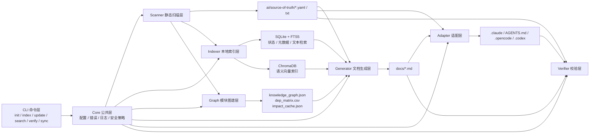
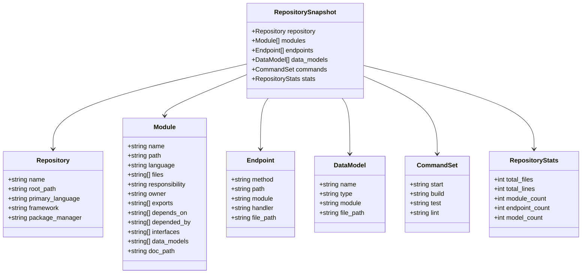
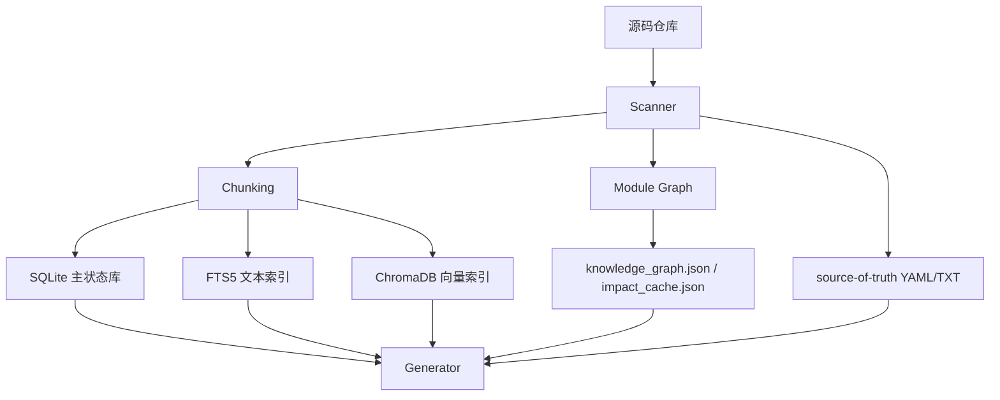
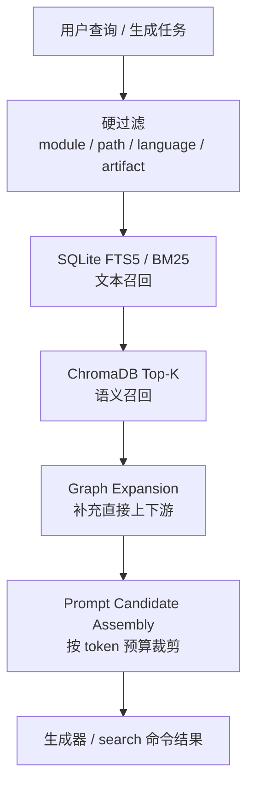
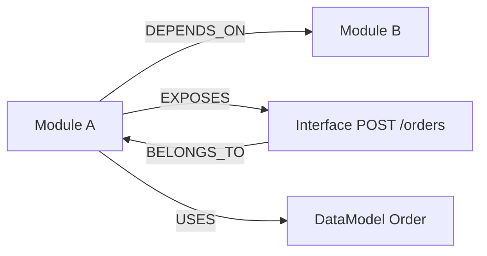
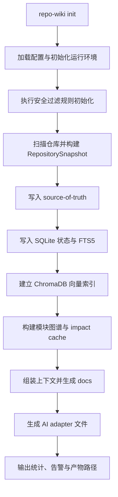
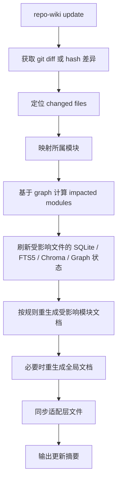
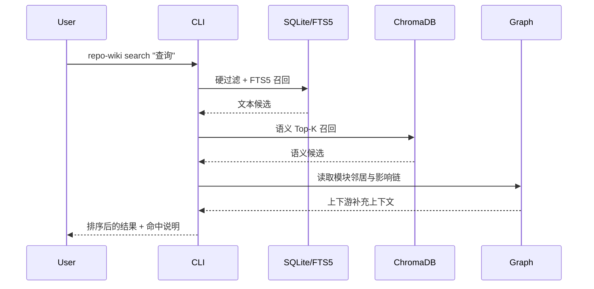
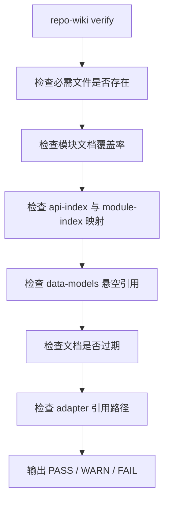

# Repo-Wiki 详细设计说明书

文档属性：详细设计说明书  
适用阶段：MVP 第一阶段  
设计基线：`docs/mvp.md`、`docs/repo-wiki-generator-plan-v2.md`、`.apm/Implementation_Plan.md`

## 1. 文档目标

本文档用于将需求基线和实施计划收敛为可落地的工程设计。重点回答以下问题：

- 系统由哪些模块组成，以及模块之间如何协作
- 关键数据如何在扫描、索引、图谱、生成、适配和校验之间流转
- 本地 SQLite、FTS5、ChromaDB 和模块图谱如何分层协作
- `init`、`update`、`search`、`verify` 等核心命令如何执行
- 哪些设计属于 MVP，哪些明确后置

本文档面向研发实现，不再重复产品立项内容。凡与需求文档冲突之处，以 `docs/mvp.md` 的范围冻结和 `.apm/Implementation_Plan.md` 的执行顺序为准。

## 2. 设计范围

### 2.1 纳入范围

- Python 3.11+ CLI 工具
- TS/JS、Python、Go 三类后端仓库扫描
- `source-of-truth` 文件生成
- SQLite 本地状态库与 FTS5 文本检索
- ChromaDB 本地向量索引
- 模块级知识图谱与影响链缓存
- LLM 驱动的文档生成
- Claude Code、OpenCode、Codex 基础适配层生成
- 基于 Git Diff 的模块级增量更新
- `verify --ci` 基础治理能力

### 2.2 不纳入范围

- GraphML 导出
- Qdrant、FAISS、Lance 等多向量后端
- `repo-wiki serve`
- 函数级全局调用图
- 文档 section patch 更新
- 动态技能自动生成
- 超出 MVP 的额外文档集合

## 3. 总体设计

### 3.1 分层架构

### 3.2 设计原则

1. 静态分析优先。扫描器先产生结构化事实，LLM 只负责组织、总结和润色。
2. 先保证工件合法，再做增强。`module-index.yaml` 在扫描结束后必须已经满足 schema。
3. 安全能力前置。任何索引写入和 LLM 上下文组装之前，都必须先经过过滤和脱敏。
4. 本地知识分层。SQLite 负责状态和词法检索，ChromaDB 负责语义召回，图谱负责依赖和影响链。
5. 增量更新只做到文件检测、模块重生成，不做 section patch。

## 4. 核心模块设计

### 4.1 CLI 层

CLI 层负责命令注册、参数解析、配置加载、流程编排和控制台输出。MVP 支持以下命令：

- `repo-wiki init`
- `repo-wiki index`
- `repo-wiki update`
- `repo-wiki verify`
- `repo-wiki sync`
- `repo-wiki search <query>`
- `repo-wiki graph <module>`
- `repo-wiki cost-estimate`

CLI 不承载业务逻辑，只负责：

- 解析配置和命令参数
- 调用各模块服务
- 输出阶段进度、统计和错误摘要
- 为 `--ci` 模式返回稳定退出码和机器可读结果

### 4.2 Core 公共层

Core 负责全局通用能力：

- 配置模型与默认值
- 文件路径与输出目录管理
- 统一日志接口
- 错误分类与异常包装
- 安全过滤和脱敏入口
- Token 估算与公共工具方法

该层不依赖具体命令，供 Scanner、Indexer、Graph、Generator、Adapter、Verifier 共用。

### 4.3 Scanner 扫描层

Scanner 负责生成统一中间模型 `RepositorySnapshot`，其职责包括：

- 文件遍历与 `.gitignore` 过滤
- 语言、框架、包管理器识别
- 模块发现
- 模块依赖抽取
- REST 接口抽取
- 数据模型抽取
- 常用工程命令抽取
- owner 与第一版 responsibility 推断

Scanner 输出是后续阶段的唯一事实基线。所有后续派生产物都基于 `RepositorySnapshot` 和 `source-of-truth`。

### 4.4 Indexer 索引层

Indexer 拆成两类存储：

- SQLite + FTS5：本地状态库、文本检索库、缓存元数据
- ChromaDB：语义向量索引

其职责包括：

- 代码切块
- chunk 元数据写入
- FTS5 索引写入
- embedding 生成
- 向量 upsert/delete
- 文件 hash 管理
- `symbols.json`、`file-hash.json`、`meta.json` 导出

### 4.5 Graph 图谱层

Graph 只做模块级知识图谱，不做函数级调用图。其职责包括：

- 构建 `Module`、`Interface`、`DataModel` 节点
- 构建 `DEPENDS_ON`、`EXPOSES`、`USES`、`BELONGS_TO` 边
- 生成依赖矩阵
- 预计算 impact cache

### 4.6 Generator 生成层

Generator 负责基于静态工件和检索结果组装 LLM 上下文并生成文档：

- 组装上下文
- 选择生成策略 A/B/C
- 应用模板
- 调用 LLM
- 使用 SQLite + diskcache 做缓存
- 输出 `docs/` 和补充的 `source-of-truth` 文本片段

### 4.7 Adapter 适配层

Adapter 负责为不同 AI 工具生成统一入口文件：

- `.claude/CLAUDE.md`
- `.claude/settings.json`
- `.claude/skills/*`
- `AGENTS.md`
- `.opencode/opencode.json`
- `.agents/skills/*`
- `.codex/config.toml`
- `.codex/hooks.json`

适配层只做导航、规则和引用，不复制大段知识内容。

### 4.8 Verifier 校验层

Verifier 负责对知识库的最基本可用性进行检查：

- 必需文件是否存在
- 模块文档是否覆盖
- API 索引与模块索引是否能互相映射
- 数据模型索引是否存在悬空引用
- 文档是否过期
- 适配层引用路径是否正确

## 5. 数据模型设计

### 5.1 统一中间模型

统一中间模型命名为 `RepositorySnapshot`，由以下部分组成：

- `repository`
- `modules`
- `endpoints`
- `data_models`
- `commands`
- `stats`

### 5.2 RepositorySnapshot 结构

### 5.3 Source-of-truth 文件

MVP 固定输出以下结构化工件：

- `ai/source-of-truth/repo-map.yaml`
- `ai/source-of-truth/module-index.yaml`
- `ai/source-of-truth/api-index.yaml`
- `ai/source-of-truth/data-models.yaml`
- `ai/source-of-truth/task-catalog.yaml`
- `ai/source-of-truth/prompt-fragments/overview.txt`
- `ai/source-of-truth/prompt-fragments/architecture.txt`

其中：

- `repo-map.yaml`、`api-index.yaml`、`data-models.yaml` 以静态生成优先
- `module-index.yaml` 必须在扫描结束后合法，后续允许 LLM 优化描述
- `task-catalog.yaml` 和 prompt fragments 可由 LLM 生成内容，但其文件结构必须稳定

## 6. 本地存储设计

### 6.1 存储分层

### 6.2 SQLite 设计

SQLite 是本地知识底座的状态层，不取代外部 YAML/JSON 文件。其设计目标是：

- 保存索引运行状态
- 保存 chunk 元数据
- 提供 FTS5 全文检索
- 保存生成缓存元数据
- 保存 verify 和运行记录

建议核心表如下：

| 表名 | 作用 | 关键字段 |
|------|------|----------|
| `schema_version` | 数据库版本管理 | `version`, `applied_at` |
| `files` | 文件级状态 | `path`, `module_name`, `language`, `xxhash`, `updated_at` |
| `chunks` | chunk 元数据 | `chunk_id`, `file_path`, `module_name`, `chunk_type`, `symbol_name`, `line_start`, `line_end` |
| `chunks_fts` | FTS5 虚表 | `chunk_id`, `text` |
| `symbols` | 符号映射 | `symbol_name`, `file_path`, `module_name`, `kind` |
| `generation_cache` | 文档生成缓存 | `cache_key`, `doc_type`, `input_hash`, `created_at` |
| `verify_runs` | 校验结果历史 | `run_id`, `status`, `summary`, `created_at` |

建议运行参数：

- 开启 WAL 模式
- 采用单写多读模型
- 所有 schema 变更必须通过 migration 管理

### 6.3 ChromaDB 设计

ChromaDB 负责语义向量索引，MVP 中仅支持本地持久化。索引单元为 chunk，元数据至少包括：

- `chunk_id`
- `file_path`
- `module_name`
- `language`
- `chunk_type`
- `symbol_name`
- `line_start`
- `line_end`
- `dependencies`

embedding 模型固定为本地 `BAAI/bge-m3`。

### 6.4 图谱存储设计

图谱输出为：

- `.repo-wiki/graph/knowledge_graph.json`
- `.repo-wiki/graph/dep_matrix.csv`
- `.repo-wiki/graph/impact_cache.json`

图谱层只承载模块级结构关系，不负责语义检索。

## 7. 检索与 RAG 设计

### 7.1 检索分层目标

本系统不采用“把整个仓库塞进模型”的做法，而采用逐层收缩上下文的设计。目标是：

- 先减少无关范围
- 再做低成本文本召回
- 然后做高价值语义召回
- 最后补齐上下游依赖背景

### 7.2 检索链路

### 7.3 三段式上下文策略

生成器采用三段式上下文策略：

- 策略 A：小模块，直接注入完整代码摘要
- 策略 B：中等模块，注入模块元数据、接口、模型和 Top-K 检索结果
- 策略 C：大模块，只注入模块摘要、图谱邻居、Top-K chunk 和关键配置摘要

该策略用于 `docs/modules/<name>.md`、`01-architecture.md`、`04-api-contracts.md` 等文档生成。

## 8. 图谱与影响链设计

### 8.1 图谱结构

### 8.2 impact cache 设计

对每个模块预计算以下信息：

- `upstream`
- `downstream`
- `depth2`
- `interfaces`
- `models`

该缓存用于：

- `repo-wiki update` 受影响模块计算
- `repo-wiki graph <module>` 命令展示
- 文档生成时注入直接上下游上下文

## 9. 核心流程设计

### 9.1 init 流程

### 9.2 update 流程

### 9.3 search 流程

### 9.4 verify 流程

## 10. 安全设计

### 10.1 文件级过滤

以下内容默认不进入扫描与索引流程：

- `.env*`
- `node_modules/`
- `dist/`
- `build/`
- `coverage/`
- 二进制文件
- 编译生成物
- 大日志文件
- 超过阈值的超大文件

### 10.2 内容级过滤

在 chunk 入库和 LLM 上下文组装之前，执行轻量级敏感信息扫描。至少检测：

- API Key
- Access Token
- 私钥内容
- 数据库连接串
- 生产域名或 IP 模式

发现敏感信息后：

- 不写入原文
- 使用 `[REDACTED]` 代替
- 记录告警，不记录原始值

## 11. 文档生成设计

### 11.1 输出文档范围

MVP 固定输出：

- `docs/00-overview.md`
- `docs/01-architecture.md`
- `docs/03-module-map.md`
- `docs/04-api-contracts.md`
- `docs/05-data-model.md`
- `docs/modules/<name>.md`

### 11.2 模块文档结构

每个模块文档遵循固定结构：

1. 职责
2. 模块边界
3. 对外接口
4. 核心数据模型
5. 依赖关系
6. 关键处理流程
7. 风险点与注意事项
8. 常用验证命令

### 11.3 缓存设计

生成缓存使用 SQLite + diskcache：

- 缓存键基于标准化输入哈希
- 输入不变时直接跳过生成
- 输入变化时整篇重生成
- 不做 section patch

## 12. 适配层设计

### 12.1 适配目标

适配层目标是为不同 AI 工具提供统一入口，而不是复制知识底座内容。

### 12.2 文件职责

| 文件 | 目标工具 | 职责 |
|------|----------|------|
| `.claude/CLAUDE.md` | Claude Code | 声明知识入口、工作规则、验证命令 |
| `AGENTS.md` | OpenCode / Codex | 声明读取顺序、变更前检查项、DoD |
| `.opencode/opencode.json` | OpenCode | 通过 `instructions` 指向知识文件 |
| `.codex/config.toml` | Codex | 基础配置 |
| `.codex/hooks.json` | Codex | 生命周期 hook 配置 |

适配层内容原则：

- 不复制大段业务知识
- 只做导航、约束和引用
- 所有关键知识都指向 `docs/` 和 `ai/source-of-truth/`

## 13. 配置设计

主配置文件为 `repo-wiki.config.yaml`，MVP 配置分为六段：

- `project`
- `scan`
- `index`
- `llm`
- `output`
- `security`

其中关键字段包括：

- `index.vector_backend = chromadb`
- `index.embedding_model = local`
- `llm.model_init`
- `llm.model_update`
- `llm.model_verify`
- `security.redact_secrets`
- `security.skip_binary_files`
- `security.max_file_size_kb`

## 14. 错误处理与可观测性

### 14.1 错误分层

建议将错误分为以下类别：

- 配置错误
- 扫描错误
- 索引错误
- 图谱错误
- 生成错误
- 适配错误
- 校验错误

### 14.2 日志要求

日志应至少覆盖：

- 命令级开始和结束
- 阶段耗时
- 处理文件数和模块数
- 过滤和脱敏告警数
- 文档生成命中缓存比例
- verify 的 PASS/WARN/FAIL 统计

## 15. 测试与验收设计

### 15.1 测试分层

- 单元测试：配置、安全过滤、解析器、图谱构造、缓存键
- 夹具测试：接口抽取、模型抽取、owner 推断、增量变更
- 集成测试：`init`、`update`、`search`、`graph`、`verify`
- 试点验收：对照 MVP 指标执行完整场景

### 15.2 验收指标映射

| 指标 | 设计支撑 |
|------|----------|
| 模块识别准确率 ≥ 85% | 模块发现规则 + fixture 测试 |
| REST 抽取准确率 ≥ 90% | 框架特定解析器 + fixture 测试 |
| 模块文档覆盖率 ≥ 80% | 固定输出范围 + verify 覆盖检查 |
| Top-3 检索命中率 ≥ 70% | FTS5 + 向量召回 + 图谱补充 |
| 影响链合理性 | 模块图谱 + impact cache |
| init 成功率 100% | 分阶段编排 + fail-fast 校验 |

## 16. 后续扩展点

以下能力预留为后续扩展点，不进入本次 MVP 实现：

- GraphML 导出与可视化导入
- 多向量后端切换
- 更复杂的 ownership 体系
- 函数级调用图
- 事件流、消息流建模
- Web UI 和可视化控制台

## 17. 结论

本设计将 `repo-wiki` MVP 收敛为一条清晰的本地知识底座流水线：

- Scanner 负责抽取事实
- SQLite + FTS5 负责状态与文本检索
- ChromaDB 负责语义召回
- Graph 负责依赖关系和影响链
- Generator 负责文档生成
- Adapter 负责多工具入口
- Verifier 负责最小治理闭环

该设计满足 MVP 对单仓、本地优先、可解释、模块级闭环和可增量更新的要求，并为后续扩展留出明确边界。
