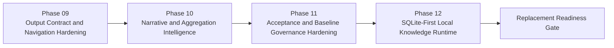

# Repo-Wiki Phase 09-12 Roadmap

文档属性：后续阶段规划  
规划目标：把 repo-agent 从“可生成 repo-wiki 底座”推进到“可替代 qoder repo-wiki 的本地优先产品能力”

## 规划原则

后续阶段不再围绕“多生成几个文档文件”展开，而是围绕四个关键目标展开：

1. 修正输出 contract 和导航边界。
2. 提升 prose-first 与聚合摘要的真实性。
3. 建立可信的验收和对比体系。
4. 把 SQLite 提升为本地知识运行时，而不是隐藏实现细节。

## 路线图总览

## Phase 09 - Output Contract and Navigation Hardening

### 目标

把当前“文档类型已经存在，但边界不稳定”的状态，修到“输出层 contract 清晰、链接可靠、内部治理与目标产物分层”。

### 为什么先做这个阶段

如果路径 contract 和文档边界不稳定，后面的 prose 生成和质量评分都会持续误判。  
这是一轮“先修信息平面，再修内容质量”的工程整理。

### 建议任务

| Task | 目标 | 主要产物 |
|------|------|------|
| 9.1 | 分离 repo-agent 内部治理文档与目标仓库生成文档 | 文档输出 manifest、layer policy、target-only contracts |
| 9.2 | 修正所有 overview/section/module/API/data-model 的相对路径与导航规则 | 链接解析器、统一 link builder、路径测试 |
| 9.3 | 补齐并重构 phase/section contract registry | 完整 contract registry、section alias 机制、contract schema tests |
| 9.4 | 将 verify 的导航检查从“字符串存在”升级为“真实路径可解析” | path-aware navigation verifier、fixture tests |

### 阶段退出门禁

- 目标仓库不再默认生成 repo-agent 内部治理 phase 文档。
- 所有 overview 和 section 页导航链接可被真实解析。
- `verify --ci` 能识别坏路径，而不是只检查 `../` 字符串。
- section contract 支持 canonical section 与 alias/overlay 的显式映射。

## Phase 10 - Narrative and Aggregation Intelligence

### 目标

把 `00-overview.md`、`01-architecture.md`、`04-api-contracts.md`、`05-data-model.md` 从模板式说明页升级成真正可读、可用、可导航的知识中心页面。

### 设计重点

- prose-first 不再只是最小字数门禁，而是基于仓库事实生成“为什么如此设计”的解释。
- API/Data Model 不再按所有 endpoint/model 全量转抄，而是先做主题聚合，再提供细节下钻入口。
- section 页从“索引页”升级成“专题页”。

### 建议任务

| Task | 目标 | 主要产物 |
|------|------|------|
| 10.1 | 重写 overview/architecture 的 narrative builder | repo summary synthesizer、architecture explainer、Mermaid context generator |
| 10.2 | 重构 API 聚合器 | service family summarizer、auth/error convention extractor、entry API selector |
| 10.3 | 重构 Data Model 聚合器 | entity deduper、schema summarizer、migration detector |
| 10.4 | 重写 section page builder | section-specific templates、reader journey stitching、section-to-module drilldown |

### 阶段退出门禁

- `00-overview.md` 和 `01-architecture.md` 在真实仓库上具备稳定 prose，不再主要依赖静态样板句。
- `04-api-contracts.md` 的“关键入口 API”是筛选结果，不是全量 endpoint 再列一次。
- `05-data-model.md` 的数据库/迁移摘要来自真实仓库信号，而不是固定模板。
- section 页至少在 2 个真实仓库上表现为“专题页”而不是“目录页”。

## Phase 11 - Acceptance and Baseline Governance Hardening

### 目标

把 Phase 08 的质量门禁和 qoder baseline compare 从“可用初版”升级成“可作为 Manager 决策依据”的治理工具。

### 设计重点

- 分离“硬性结构失败”和“参考质量偏差”。
- 让 baseline compare 比较真实结构和真实内容，不再用固定字符串代替 baseline。
- 支持多个样例仓库，而不是只看 `AI_API_Atlas`。

### 建议任务

| Task | 目标 | 主要产物 |
|------|------|------|
| 11.1 | 重构 baseline comparator 评分模型 | dimension rubric、hard/soft gate split、score explainer |
| 11.2 | 建立真实 baseline fixture 仓库集 | qoder snapshot fixtures、golden outputs、acceptance matrix |
| 11.3 | 将 verify 与 compare 联合输出统一 readiness report | readiness schema、evidence bundle、reason family taxonomy |
| 11.4 | 在 2-3 个目标仓库完成验收回归 | multi-repo acceptance report、blocking gap registry |

### 阶段退出门禁

- compare 工具不再因为结构对象键名相同而给目录结构满分。
- heading/section/prose 评分可明确区分“真实差距”和“baseline 特例”。
- `AI_API_Atlas` 不再是唯一验收样本。
- Manager 可以基于 readiness report 直接做 go/no-go 决策。

## Phase 12 - SQLite-First Local Knowledge Runtime

### 目标

正式把 SQLite 规划为 repo-agent 的本地知识运行时核心，用来支撑增量生成、导航质量、验收证据和本地检索，而不是只停留在 state/cache 实现层。

### 为什么这个阶段放在后面

先修输出和评测口径，再把 SQLite 做深，才不会把错误的 contract 和评分逻辑固化进存储层。

### 建议任务

| Task | 目标 | 主要产物 |
|------|------|------|
| 12.1 | 规划双库职责：state DB 与 generation/evidence DB | SQLite architecture spec、migration plan |
| 12.2 | 为 docs/sections/navigation/acceptance 建立结构化表 | section registry、nav graph、readiness evidence tables |
| 12.3 | 把 verify/compare 结果落到 SQLite 并支持趋势分析 | verify_runs、compare_runs、quality trends |
| 12.4 | 用 SQLite 驱动增量文档更新和页面缓存失效 | dependency-aware regeneration cache、page invalidation engine |

### 阶段退出门禁

- SQLite schema 能表达文件状态、文档层级、导航图、quality evidence 四类核心信息。
- `verify` 和 `compare` 的结果支持多次运行对比，而不是只产出单次报告。
- 文档页面的增量失效与重生成基于 SQLite 状态，而不是全量模板重渲染。
- 本地模式下 repo-agent 能稳定支撑“生成 -> 验证 -> 比较 -> 回归”的完整循环。

## 推荐执行顺序

| 优先级 | Phase | 原因 |
|------|------|------|
| P0 | Phase 09 | 不先修 contract、路径和层级边界，后续所有质量提升都会继续漂移 |
| P0 | Phase 10 | 替代 qoder 的核心差距在内容中心层，而不是底座层 |
| P1 | Phase 11 | 没有可信验收体系，就无法判断“是否真的达到替代标准” |
| P1 | Phase 12 | SQLite 是长期护城河，但应建立在正确输出模型和治理模型之上 |

## 替代 qoder 的阶段性判断标准

只有在满足以下条件后，才建议把 repo-agent 对外定位为 qoder repo-wiki 替代方案：

1. 在至少两个真实仓库上，`00-overview`、`01-architecture`、`04-api-contracts`、`05-data-model` 都达到 prose-first 且非清单式输出。
2. canonical section 层稳定，导航真实可解析。
3. verify 与 baseline compare 的分数和 reason codes 可以被 Manager 信任。
4. 本地 SQLite 运行时支持增量更新、证据留存和质量回归。

在此之前，repo-agent 更准确的定位是：

- 一个已经具备 qoder repo-wiki 底座能力的本地优先实现；
- 但尚未完全达到 qoder 文档中心体验和验收稳定度的替代品。
