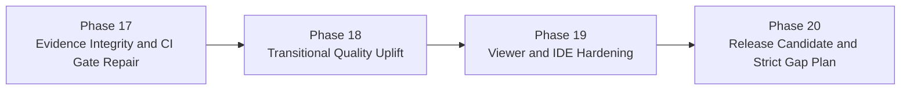

# Repo-Agent Phase 14-16 Review and Phase 17-20 Plan

文档属性：APM Manager 审查与后续阶段规划  
审查日期：2026-04-26  
审查范围：Phase 14、Phase 15、Phase 16 计划文档、Memory logs、实现文件、CI/workflow、evidence bundle

## Part 0: Evidence Basis

### Files directly inspected

| Area | Files |
|---|---|
| APM plan | `.apm/Implementation_Plan.md`, `.apm/Memory/Memory_Root.md` |
| Phase docs | `docs/phases/Phase_14_External_Baseline_Calibration_and_Benchmark_Governance.md`, `docs/phases/Phase_15_Visual_Knowledge_Experience_and_IDE_Integration.md`, `docs/phases/Phase_16_Qoder_Replacement_Cutover_and_Release_Gate.md` |
| Memory logs | `.apm/Memory/Phase_14_*/*.md`, `.apm/Memory/Phase_15_*/*.md`, `.apm/Memory/Phase_16_*/*.md` |
| Phase 14 code | `scripts/qoder_fixture_ingestion.py`, `scripts/qoder_baseline_comparison.py`, `scripts/qoder_benchmark_matrix.py`, `scripts/qoder_governance_dashboard.py` |
| Phase 15 code | `repo_wiki/orchestration/eval_layout.py`, `repo_wiki/viewer/static_viewer.py`, `repo_wiki/adapter/qoder_adapter/__init__.py`, `extensions/repo-wiki-browser/src/extension.ts` |
| Phase 16 artifacts | `docs/operations/replacement-gate-policy.md`, `docs/operations/ci-cutover-template-pack.md`, `.github/workflows/repo-wiki-*.yml`, `ci/scripts/decision.sh`, `.repo-agent-eval/Final_Pilot_Execution_Report.md`, `.repo-agent-eval/go-no-go-decision/Decision_Dossier.md` |

### Tests / execution artifacts directly checked

| Check | Result |
|---|---|
| `BaselineComparatorConfig().to_dict()` | Fails with `NameError: name 'cls' is not defined` |
| `python ci/scripts/decision.sh ...` | Fails with `SyntaxError`; workflow calls the bash script through Python |
| `uv run pytest tests/test_fixture_ingestion.py ...` | Fails before tests because package discovery includes `ai`, `templates`, `repo_wiki`, `extensions` |
| `npm --prefix extensions/repo-wiki-browser run compile -- --pretty false` | Passes TypeScript compile |

### Verified from artifacts

- Phase 14 has real code for fixture ingestion, weighted compare, benchmark matrix, and SQLite governance export.
- Phase 15 has real code for isolated eval manifests, static viewer, VS Code extension prototype, and qoder navigation adapter.
- Phase 16 has real policy docs, CI workflow templates, decision script, and pilot evidence.
- Current CI cutover workflows are not trustworthy as gate enforcers because they run `decision.sh` with Python and also allow failures with `|| true`.
- The final evidence is internally inconsistent: Memory logs and `Memory_Root.md` mark Phase 14-16 complete, while `.repo-agent-eval/go-no-go-decision/evidence-summary.yaml` marks Task 14.1, Task 14.3, and Task 15.4 as partial.
- The final decision is inconsistent: Task 16.4 memory says `CONDITIONAL NO-GO`; `.repo-agent-eval/go-no-go-decision/Decision_Dossier.md` says `CONDITIONAL GO`.
- The claimed `docs/operations/Go_No_Go_Decision_Dossier.md`, `docs/operations/Handover_Package.md`, and `docs/operations/Improvement_Roadmap.md` do not exist; the actual dossier exists under `.repo-agent-eval/go-no-go-decision/Decision_Dossier.md`.

### Still inferred from docs / logs

- The reported 50.2% compare score was not reproduced in this review because the Python package cannot be installed through `uv run` until packaging discovery is fixed.
- Atlas-specific regeneration quality was not re-run in this review.
- Viewer runtime usability was not verified through browser screenshots or VS Code extension host tests; TypeScript compile alone passed.

## Part A: Overall Verdict

**Verdict: Phase 14-16 are useful but not release-ready.**  
They should be treated as an implemented exploratory baseline with real assets, not as a trustworthy qoder replacement gate.

The biggest risk is false confidence: the governance path can say GO while CI would not actually enforce the decision, and evidence files disagree about phase status.

The best design point to preserve is the staged product shape: external fixture compare, isolated eval output, visual viewer, policy profiles, and CI gate are the right product areas. The next work should harden those areas instead of introducing another broad capability layer.

## Part B: P0 Verdict

The next P0 is not more feature surface. The next P0 is **release evidence integrity and CI gate repair**.

P0 is converged if it does four things:

- fixes contradictory decision/evidence outputs
- makes CI decision scripts actually fail when policy fails
- fixes packaging so the Python test suite runs under the documented toolchain
- adds regression tests for the exact failures found in this review

P0 should not include new viewer UI, new compare dimensions, or another publishing policy layer. Those belong after the current gate can be trusted.

## Part C: Data Model Change Audit

### New models already implied

| Model | Current state | Gap |
|---|---|---|
| External fixture manifest | Implemented in `scripts/qoder_fixture_ingestion.py` | Needs promoted schema docs and canonical fixture sample |
| Weighted compare config | Implemented in `scripts/qoder_baseline_comparison.py` | `to_dict()` bug means config export contract is broken |
| Benchmark matrix | Implemented in `scripts/qoder_benchmark_matrix.py` | Needs evidence provenance fields and sample-count confidence |
| Governance metrics DB | Implemented in `scripts/qoder_governance_dashboard.py` | Needs schema version/export compatibility tests tied to CI |
| Eval manifest | Implemented in `repo_wiki/orchestration/eval_layout.py` | Needs stable run discovery and viewer consumption contract |
| Decision dossier | Exists in `.repo-agent-eval` | Needs canonical `docs/operations` location or explicit generated-only rule |

### Before/after tables required

- Phase 17 must add before/after evidence paths for decision dossier and handover package.
- Phase 18 must add before/after quality metrics for section coverage, heading coverage, prose density, and aggregation quality.
- Phase 19 must add before/after viewer behavior for local static HTML, offline Mermaid, and VS Code path opening.

## Part D: API And Frontend-Backend Consistency Audit

There is no traditional backend/frontend API, but there are equivalent tool contracts:

| Interface | Current issue | Required fix |
|---|---|---|
| `ci/scripts/decision.sh` | Workflow invokes it as `python ci/scripts/decision.sh`; strict/transitional workflows also append `|| true` | CI must call `bash`, and strict/transitional must fail the job on rejected gates |
| `scripts/qoder_baseline_comparison.py` config export | `BaselineComparatorConfig().to_dict()` raises `NameError` | Add unit test and fix config serialization |
| VS Code extension node opening | `vscode.Uri.file(element.path)` uses a relative path | Resolve against workspace root before opening |
| Static viewer Mermaid | Pulls Mermaid from CDN | Needs offline/bundled option for local-first and CI artifact review |
| Evidence bundle | Dossier path differs from Memory log claim | Canonicalize evidence location and sync Memory/operations docs |

## Part E: Page And Existing Style Consistency Audit

Phase 15 correctly avoids replacing the CLI path with UI, but the viewer/extension work is still prototype-grade:

- Static viewer should remain a read-only consumer of manifest and markdown.
- VS Code extension should not become a separate generation system.
- Viewer should reuse the canonical manifest and not scan `docs/` as an equal fallback without an explicit degraded-mode warning.
- UI acceptance should be snapshot-based, not judged only by TypeScript compile.

## Part F: Dependency / Init Audit

The dependency boundary is not yet clean enough for release:

- Package install fails under `uv run` because setuptools discovers multiple top-level packages.
- CI workflows assume `qoder-style/` exists but do not define how the external baseline fixture is provided.
- `decision.sh` depends on `bc`; workflows do not install it explicitly.
- Rollback docs refer to `.repo-wiki/backups/`, but the backup lifecycle is not verified as a governed artifact.

## Part G: Staged Recommendations

### P0 Must Add

| Issue | Reason | Recommended addition | Recommended section/location | Risk if not added |
|---|---|---|---|---|
| CI gates do not enforce failures | Replacement policy is meaningless if failing gates pass | Phase 17 task to fix workflow command, remove `|| true`, and add CI simulation tests | `.github/workflows/**`, `ci/scripts/**`, `tests/**` | False GO |
| Evidence status contradictions | Manager cannot trust go/no-go output | Phase 17 task to reconcile Memory Root, evidence summary, dossier location, and decision wording | `docs/operations/**`, `.repo-agent-eval/**`, `.apm/Memory/**` | Incorrect release decision |
| Python packaging blocks test execution | Quality checks cannot be reproduced | Phase 17 task to fix setuptools package discovery and documented test command | `pyproject.toml`, tests | Non-reproducible acceptance |
| Comparator config export bug | Report schema can break consumers | Phase 17 task to add regression test and fix config serialization | `scripts/qoder_baseline_comparison.py`, tests | Broken compare reporting |

### P1 Should Add

| Issue | Reason | Recommended addition | Recommended section/location | Risk if not added |
|---|---|---|---|---|
| Score remains 50.2% | Not enough for transitional replacement | Phase 18 content quality uplift to >=70% transitional target | generator/templates/sections | Cannot replace qoder |
| Viewer depends on CDN | Local-first promise is weakened | Phase 19 offline Mermaid and static asset policy | `repo_wiki/viewer/**` | Broken offline review |
| VS Code extension path opening is relative | Clicking nodes may open wrong path | Phase 19 workspace-root path fix and extension host tests | `extensions/repo-wiki-browser/**` | Poor manual validation |

### P2 Later Enhancements

| Issue | Reason | Recommended addition | Recommended section/location | Risk if not added |
|---|---|---|---|---|
| Strict 85% threshold remains far away | Needs broader quality investment | Phase 20 strict backlog and release-candidate dossier | `docs/operations/**` | Product remains pilot-only |
| External qoder snapshots need provenance | Paid/proprietary baseline must be handled carefully | Phase 20 fixture provenance and refresh policy | `scripts/**`, `docs/operations/**` | Unstable comparisons |

## Phase 17-20 Roadmap

## Replacement Judgment

Current status remains **not ready to replace qoder repo-wiki**.

The product can continue as a pilot tool, but replacement claims should wait until:

- CI gates are enforceable and tested
- evidence bundle and Memory status agree
- transitional compare score reaches at least 70%
- viewer/extension manual acceptance is verified with real artifacts
