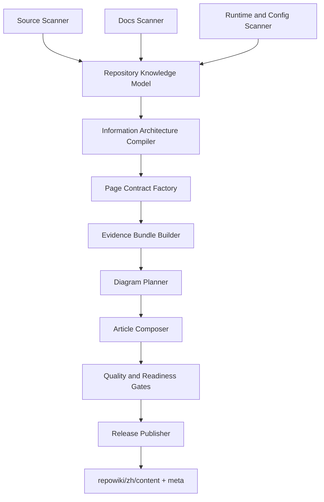
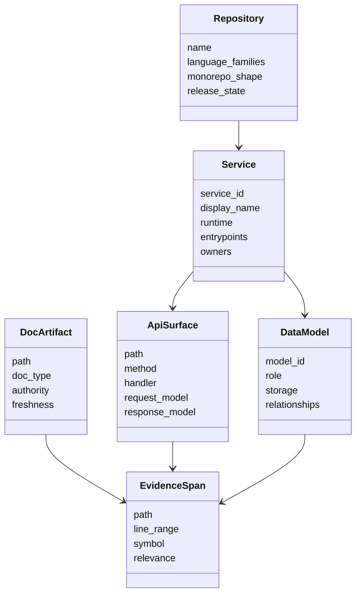

# Repo Wiki Source and Docs Intelligence Plan

**Status:** Draft  
**Updated:** 2026-05-03  
**Scope:** repo-agent 通用 repo-wiki 生成体系  
**Reference Fixture:** AI_API_Atlas `.qoder/repowiki/zh` 只作为目录接口和质量参照，不作为硬编码模板。

## 1. Product Position

repo-agent 应该把代码仓库和已有文档编译成可验证的项目 Wiki。它不是简单扫描文件后让 LLM 写 Markdown，也不是复制 Qoder 目录；它应提供一个稳定的“知识编译流水线”：



核心原则：

1. 源码负责事实，已有 docs 负责意图和背景。
2. LLM 只在结构化事实和证据包上表达，不负责发现服务边界。
3. 页面先有合同，再有证据，再有图，最后才写正文。
4. run 是过程，release 是产品。插件只读 release。

## 2. Qoder Directory Interface Lessons

AI_API_Atlas 的 Qoder 发布目录是：

```text
.qoder/repowiki/zh/
├── content/
│   ├── 项目概述/
│   ├── 架构设计/
│   ├── 核心服务/
│   ├── Python服务/
│   ├── API参考/
│   ├── 数据模型/
│   ├── 开发指南/
│   ├── 快速开始.md
│   ├── 前端应用.md
│   ├── 安全合规.md
│   ├── 部署运维.md
│   └── 故障排除与维护.md
└── meta/
    └── repowiki-metadata.json
```

Qoder 值得保留的接口特征：

| 特征 | 产品含义 |
|---|---|
| 固定 `repowiki/zh/content` | 发布目录稳定，插件无需猜 run |
| 固定 `repowiki/zh/meta` | 页面、代码片段、导航、质量结果可以机器读取 |
| 顶层目录语义稳定 | 用户能形成可迁移阅读习惯 |
| 服务/API/数据分层 | 不把 API、模型、运维塞进一个服务页 |
| 页面有 cite block | 读者能先看到证据范围 |
| 页面有目录和章节来源 | 文章可审计、可追溯 |
| API/架构页有 Mermaid | 读者能理解关系和流程 |

repo-agent 应该兼容这个发布接口，但 meta 需要更产品化：

```text
.repo-agent-eval/repowiki/zh/
├── manifest.json
├── content/
└── meta/
    ├── repowiki-metadata.json
    ├── navigation.json
    ├── page-registry.json
    ├── source-inventory.json
    ├── docs-inventory.json
    ├── service-registry.json
    ├── api-inventory.json
    ├── data-model-inventory.json
    ├── evidence-index.json
    ├── diagram-index.json
    ├── quality-report.json
    └── release.json
```

## 3. Source Scanning Strategy

源码扫描必须分层进行，不能只按文件后缀粗扫。

### 3.1 Repository Shape Scan

识别仓库根、monorepo、子模块、package manager、workspace、build graph、部署目录和测试目录。

典型输入：

- `pom.xml`、`build.gradle`、`settings.gradle`
- `package.json`、`pnpm-workspace.yaml`、`turbo.json`
- `pyproject.toml`、`requirements.txt`
- `go.mod`、`Cargo.toml`
- `Dockerfile`、`docker-compose.yml`、Helm、Kubernetes manifests
- `.github/workflows`、`.gitlab-ci.yml`

输出到 `source-inventory.json`。

### 3.2 Runtime and Service Scan

每个 runnable service 必须进入 `service-registry.json`。服务识别信号包括：

| 信号 | 示例 |
|---|---|
| build module | Maven module、npm workspace、Python service directory |
| entrypoint | Spring Boot main、FastAPI app、Express server、CLI command |
| config | port、context path、datasource、queue、external base URL |
| deployment | Docker service、compose service、helm chart |
| API surface | Controller、router、OpenAPI、GraphQL、MCP tools |
| data ownership | entity、schema、migration、repository |

没有 service registry 的页面不能声明服务责任。

### 3.3 API Surface Scan

API 扫描必须产生 `api-inventory.json`，至少包含：

- service owner；
- route path；
- method；
- handler symbol；
- request DTO / schema；
- response DTO / schema；
- auth requirement；
- error behavior；
- frontend callers；
- downstream dependencies；
- evidence spans。

API 文档的目录由 API inventory 生成，不由 LLM 猜测。

### 3.4 Data Model Scan

数据模型扫描输出 `data-model-inventory.json`，区分：

- persistent entity；
- DTO / request / response；
- migration / table；
- repository / DAO；
- enum / state；
- relationship；
- index / constraint。

页面必须说明模型角色，而不是罗列字段。

### 3.5 Frontend and Consumer Scan

前端扫描要找到：

- route；
- page/component；
- API client；
- hooks/store；
- form schema；
- table/list/detail flows；
- feature ownership。

这决定“谁调用 API”和“用户流程是什么”，也是 API 文档的重要证据。

## 4. Docs Scanning Strategy

已有 docs 不能被忽略，也不能无条件相信。它们应作为“意图证据”和“历史决策证据”进入 `docs-inventory.json`。

### 4.1 Docs Classification

repo-agent 应分类已有文档：

| 类型 | 示例 | 用途 |
|---|---|---|
| Overview | README、overview | 项目目标、能力范围 |
| Architecture | 架构设计、ADR | 系统结构、设计意图 |
| API | OpenAPI、接口文档 | API 语义补充 |
| Operations | 部署手册、Runbook | 运行和排障 |
| Planning | Phase plan、roadmap | 仅作为背景，不直接当现状事实 |
| Governance | APM、review、audit | 质量和决策证据 |
| User Guide | 使用手册 | 用户流程说明 |

### 4.2 Authority and Freshness

每份 doc 需要评分：

- authority：README、官方架构文档、OpenAPI 高于临时笔记；
- freshness：mtime、git commit、引用路径是否仍存在；
- specificity：具体到服务/API/类的文档高于泛泛规划；
- conflict：与源码冲突时降级为 stale 或 historical。

### 4.3 Source-Docs Conflict Policy

冲突处理规则：

1. 源码、配置、OpenAPI 优先于旧规划文档。
2. docs 可解释“为什么”，源码确认“现在是什么”。
3. 已失效 docs 可进入“历史背景”或“待确认”，不能进入主事实。
4. 生成页面时必须区分 source citation 和 docs citation。

## 5. Knowledge Model

repo-agent 的核心产物不是 Markdown，而是 Repository Knowledge Model。



该模型必须可持久化、可 diff、可被 verifier 检查。

## 6. Information Architecture Compiler

目录规划应从 knowledge model 编译出来。

默认中文目录：

```text
content/
├── 项目概述/
├── 架构设计/
├── 服务与模块/
├── 核心服务/
├── Python服务/
├── API参考/
├── 数据模型/
├── 前端应用/
├── 开发指南/
├── 运行与部署/
├── 安全与合规/
├── 测试与质量/
└── 故障排除与维护/
```

目录生成规则：

1. 有对应事实才生成目录。
2. 多服务仓库按 runtime、domain、service family 分组。
3. API 页面按 service owner 和 API surface 分组。
4. 数据模型页按持久化模型、服务模型、DTO/契约模型分组。
5. 规划类 docs 不能直接决定目录，只能影响背景说明。
6. 与 Qoder baseline 对齐的是“目录接口和读者体验”，不是逐字复制。

## 7. Page Contract System

每类页面必须有合同。

### 7.1 API Page Contract

API 页面至少包含：

1. 简介。
2. 项目结构。
3. 核心组件。
4. 架构总览。
5. 详细组件分析。
6. 依赖关系分析。
7. 性能考量。
8. 故障排查指南。
9. 结论。
10. 附录。

强制证据：

- controller/router；
- DTO/schema；
- service/use case；
- repository/client；
- frontend caller 或 external consumer；
- config/auth/error evidence。

强制图：

- endpoint lifecycle sequence；
- component flowchart；
- ER 或 model relationship diagram，当有关系证据时。

### 7.2 Architecture Page Contract

架构页必须说明：

- system context；
- container/service topology；
- data flow；
- deployment view；
- runtime dependencies；
- known risks。

### 7.3 Service Page Contract

服务页必须说明：

- service responsibility；
- owned APIs；
- owned data；
- upstream/downstream；
- runtime config；
- operational signals；
- troubleshooting。

## 8. Evidence and Diagram Model

每篇页面必须绑定 evidence bundle：

```text
page_id
├── primary_source_evidence
├── supporting_docs_evidence
├── rejected_evidence
├── diagram_plan
├── citation_block
└── quality_result
```

Mermaid 不是装饰，必须来自 diagram plan：

- `flowchart` 用于组件关系；
- `sequenceDiagram` 用于 API 调用流程；
- `erDiagram` 用于实体关系；
- `stateDiagram` 用于生命周期和状态机。

缺少证据时，页面必须进入 `REPAIRABLE` 或 `NOT_READY`，不能编图。

## 9. Release and Plugin Contract

发布目录是唯一产品接口：

```text
.repo-agent-eval/repowiki/zh/
├── manifest.json
├── content/
└── meta/
```

候选目录是过程接口：

```text
.repo-agent-eval/runs/<run>/repowiki/zh/
├── content/
└── meta/
```

发布条件：

1. source scan 完成；
2. docs scan 完成；
3. knowledge model 无硬失败；
4. page contracts 满足；
5. citations 可解析；
6. required Mermaid 可渲染；
7. manual review 或 automated rubric 达标；
8. release manifest `release_status=READY`。

插件读取：

```text
<workspace>/.repo-agent-eval/repowiki/zh/manifest.json
```

插件不扫描 run，不猜最新目录，不在 release 缺失时 fallback。

## 10. Phase 41-45 Direction

Phase 41-45 应把上述体系产品化：

| Phase | Focus | Outcome |
|---|---|---|
| 41 | Qoder-compatible release interface | 固定发布目录、meta schema、插件契约 |
| 42 | Source and docs discovery compiler | 多语言源码扫描、docs 分类、冲突判定 |
| 43 | Knowledge-model-driven IA | 目录、页面、路径、合同由模型生成 |
| 44 | Evidence-backed composition | cite、Mermaid、章节来源、修复闭环 |
| 45 | Release QA and product acceptance | 多仓库验收、发布门禁、最终 dossier |

成功标准是：面对任意复杂仓库，repo-agent 先产出可审计知识模型，再产出固定 release Wiki；页面质量至少达到 Qoder 的结构可读性，并在证据、服务归属、插件发布契约上强于 Qoder。
