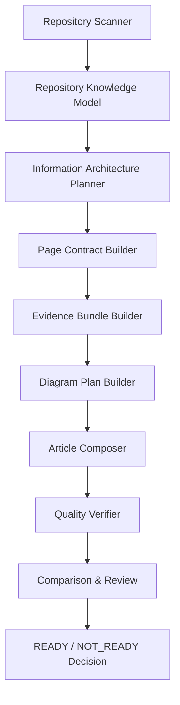
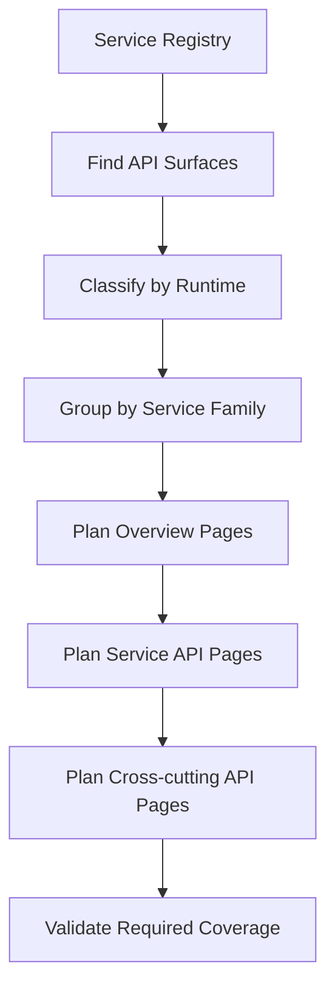

# Repo AI Agent Wiki 系统化构建产品规划

**状态:** Draft  
**适用范围:** repo AI agent 的通用 Wiki 生成能力，不绑定任何单一示例仓库  
**示例夹具:** AI_API_Atlas 仅用于验证复杂多服务仓库场景  
**Source/Docs Plan:** `docs/wiki-source-code-and-docs-intelligence-plan.md` 定义 Phase 41-45 的源码与文档双路扫描、知识模型、发布接口和质量闭环。  
**更新时间:** 2026-05-03  
**产品目标:** 自动生成比 Qoder 更准确、更结构化、更可验证的代码仓库 Wiki。

## 1. 产品定位

repo AI agent 不是 Markdown 生成器，也不是 Qoder 目录的模仿器。它应该是一个“仓库知识编译器”：先把代码仓库编译成结构化知识模型，再从模型生成面向不同读者的 Wiki。

产品必须解决四个问题：

1. **看清仓库:** 自动识别服务、技术栈、API、数据模型、依赖、前端调用、运行方式和质量风险。
2. **规划目录:** 根据仓库事实生成稳定的信息架构，而不是照搬某个 baseline。
3. **生成文章:** 每篇文章都必须有页面合同、证据包、图计划和质量门禁。
4. **证明质量:** 通过自动校验、baseline compare、manual review 和 READY/NOT_READY 决策证明可替代。

Qoder 可以作为 baseline，但不能成为天花板。repo AI agent 的目标是 Qoder-plus：更准的服务归属、更强的源码引用、更好的图、更清晰的阅读路径。

## 2. 总体架构



核心原则：LLM 只能在结构化事实之上表达，不能负责发现事实、决定目录或补足证据。

## 3. Repository Knowledge Model

生成 Wiki 前必须先构建统一的知识模型。该模型是所有目录、页面、引用和质量门禁的源头。

### 3.1 核心实体

| 实体 | 说明 | 典型来源 |
|---|---|---|
| `Repository` | 仓库名称、语言、规模、包管理、运行方式 | README、manifest、git |
| `Service` | 可运行服务、库、前端应用、worker、MCP、CLI | `pom.xml`、`package.json`、`pyproject.toml`、Dockerfile |
| `Runtime` | 技术栈和运行框架 | Spring Boot、FastAPI、Express、React、Go、Rust |
| `ApiSurface` | REST、GraphQL、RPC、CLI、event、MCP 工具 | Controller、router、OpenAPI、protobuf、commands |
| `DataModel` | Entity、DTO、schema、migration、table、index | ORM、SQL、Pydantic、Prisma、JPA |
| `Flow` | 业务流程、调用链、状态机、异步任务 | service calls、frontend callers、queues、jobs |
| `Dependency` | 服务依赖、库依赖、外部系统 | imports、clients、config、Docker compose |
| `Operation` | 部署、配置、健康检查、日志、监控、排障 | Dockerfile、helm、scripts、README |
| `Security` | 鉴权、权限、敏感接口、审计、安全扫描 | middleware、annotations、policies |
| `EvidenceSpan` | 可引用源码片段 | 文件路径、行号、符号、摘要 |

### 3.2 Service Registry

每个服务都必须进入 `Service Registry`。没有 registry 的服务不能生成服务页，也不能生成 API 页。

| 字段 | 说明 |
|---|---|
| `service_id` | 稳定 ID，例如目录名或模块名 |
| `display_name` | 面向读者的名称，可多语言 |
| `runtime_family` | backend、frontend、worker、cli、mcp、library |
| `tech_stack` | Spring Boot、FastAPI、React、NestJS、Go 等 |
| `entrypoints` | Controller、router、main、CLI command、worker handler |
| `api_surfaces` | 该服务暴露的 API 或命令 |
| `data_models` | 该服务拥有或主要使用的数据模型 |
| `dependencies` | 上游、下游、共享库、外部系统 |
| `frontend_callers` | 前端页面、hooks、SDK、client |
| `operations` | Dockerfile、compose、helm、env、health check |
| `evidence_roots` | primary citation 允许来自哪些目录 |
| `confidence` | 服务识别置信度和拒绝原因 |

## 4. 通用信息架构

Wiki 目录必须由知识模型生成。不同仓库可以有不同目录，但应遵循稳定的顶层语义。

```text
content/
├── 项目概述/
├── 架构设计/
├── 服务与模块/
├── API参考/
├── 数据模型/
├── 前端应用/
├── 运行与部署/
├── 开发指南/
├── 安全与合规/
├── 测试与质量/
└── 故障排除与维护/
```

目录生成规则：

1. 每个顶层目录必须有总览页。
2. 服务数量少时可以按服务平铺；服务数量多时必须按 runtime、domain 或 capability 分组。
3. API、数据模型、架构、运维不能混在同一篇服务总览里。
4. 每个页面必须属于一个页面类型，并绑定明确读者和证据范围。
5. 示例仓库的 baseline 只能影响 taxonomy 权重，不能覆盖仓库事实。

## 5. 页面类型体系

| 页面类型 | 目的 | 生成条件 |
|---|---|---|
| Project Overview | 解释项目目标、范围、关键能力 | 所有仓库 |
| Architecture Overview | 解释系统分层、运行拓扑、核心链路 | 有多个模块或服务 |
| Service Overview | 解释单个服务职责和边界 | `Service Registry` 中的 runnable service |
| API Reference | 解释服务 API、调用方式、错误处理 | 存在 API surface |
| Data Model | 解释实体、表、DTO、关系、迁移 | 存在模型或 schema |
| Frontend Application | 解释页面、路由、状态、API 调用 | 存在前端应用 |
| Operations | 解释配置、部署、健康检查、日志 | 存在运行配置 |
| Security | 解释鉴权、权限、审计、安全风险 | 存在安全机制 |
| Testing & Quality | 解释测试、CI、质量门禁 | 存在测试或 CI |
| Troubleshooting | 解释常见故障和排查路径 | 存在日志、错误码、运维入口 |

## 6. API 文档产品标准

API 文档是最容易变成低质量清单的部分。repo AI agent 必须先构建 API 目录，再生成文章。

### 6.1 API 目录生成算法



API 目录应按实际仓库生成，常见结构如下：

```text
API参考/
├── API参考.md
├── API网关API.md
├── 认证授权API.md
├── 错误处理与状态码.md
├── 前端应用API.md
├── 核心服务API/
│   ├── 核心服务API.md
│   └── <服务名>API.md
├── Python服务API/
│   ├── Python服务API.md
│   └── <服务名>API.md
├── MCP服务API/
│   ├── MCP服务API.md
│   └── <工具或服务名>API.md
├── Worker与任务API/
│   ├── Worker与任务API.md
│   └── <任务名>API.md
└── CLI与脚本接口/
    ├── CLI与脚本接口.md
    └── <命令名>.md
```

不是所有目录都必须出现。只有当知识模型中存在对应 runtime family 或 API surface 时才生成。

### 6.2 API 页面合同

每篇服务 API 页面必须使用统一合同：

```markdown
# <服务名>API

<cite>
**本文引用的文件**
- [Controller 或 Router](file://...)
- [Request/Response DTO 或 Schema](file://...)
- [Service / UseCase](file://...)
- [Repository / Client](file://...)
- [Frontend Caller 或 SDK](file://...)
</cite>

## 目录
1. [简介](#简介)
2. [项目结构](#项目结构)
3. [核心组件](#核心组件)
4. [架构总览](#架构总览)
5. [详细组件分析](#详细组件分析)
6. [依赖关系分析](#依赖关系分析)
7. [性能考量](#性能考量)
8. [故障排查指南](#故障排查指南)
9. [结论](#结论)
10. [附录](#附录)
```

### 6.3 API 页面章节要求

| 章节 | 必须说明 | 禁止 |
|---|---|---|
| 简介 | API 能力、调用者、业务边界 | 泛泛介绍项目 |
| 项目结构 | controller/router、DTO、service、repository 的位置 | 只列目录不解释 |
| 核心组件 | 每个组件的责任和协作方式 | 把类名堆成清单 |
| 架构总览 | 请求路径和服务边界 | 没有图 |
| 详细组件分析 | 关键 endpoint 的生命周期 | endpoint dump |
| 依赖关系分析 | 上游、下游、共享库、外部系统 | 猜测依赖 |
| 性能考量 | 分页、缓存、批量、索引、异步 | 没有证据的建议 |
| 故障排查指南 | 错误码、异常、日志、排查步骤 | 通用鸡汤 |
| 结论 | 维护边界和演进方向 | 重复简介 |
| 附录 | endpoint 表、DTO 字段、术语 | 把正文变成附录 |

### 6.4 API 图标准

API 页面必须包含图。图来自 `Diagram Plan Builder`，不是 LLM 随意画。

| 图类型 | 适用场景 | 证据来源 |
|---|---|---|
| `flowchart` | 服务组件关系、请求路径 | controller、service、repository、client |
| `sequenceDiagram` | endpoint 生命周期、跨服务调用 | handler 方法、client 调用、repository |
| `erDiagram` | API 涉及实体关系 | entity、schema、migration |
| `stateDiagram` | 任务状态、审批状态、执行状态 | enum、状态字段、状态机代码 |

没有合适证据时，不编图；页面应进入 `REPAIRABLE` 或 `NOT_READY`。

## 7. 非 API 文档标准

### 7.1 架构文档

架构文档必须先回答“系统如何运行”，再回答“代码在哪里”。必备内容：

1. 系统上下文图。
2. 容器/服务拓扑图。
3. 核心数据流或请求流。
4. 模块边界和职责。
5. 关键依赖和风险。

### 7.2 数据模型文档

数据模型文档不能是 entity dump。它必须按实体角色、关系、生命周期、存储设计和访问路径组织。

必备图包括 ER 图或实体关系 flowchart。缺少关系证据时，文档必须明确说明只确认了字段，未确认关系。

### 7.3 前端文档

前端文档必须说明页面路由、状态管理、API 调用、关键组件和用户流程。它不能只列组件文件。

### 7.4 运维与故障排查文档

运维文档必须从实际运行资产生成：Dockerfile、compose、helm、env、health check、log config、CI。故障排查必须有触发条件、可观测信号、排查步骤和恢复动作。

## 8. Quality Gates

### 8.1 页面级门禁

| 门禁 | READY 条件 |
|---|---|
| Evidence | 每篇页面有 primary citations |
| Ownership | 服务页引用必须来自正确服务目录 |
| Structure | 页面符合对应 page contract |
| Mermaid | 应有图的页面必须有有效 Mermaid |
| Prose | 正文解释为主，表格和清单为辅 |
| No Hallucination | 无证据处标记 `待确认` |
| Links | 文件链接、章节链接、相关页链接可解析 |

### 8.2 Wiki 级门禁

| 门禁 | READY 条件 |
|---|---|
| Service Coverage | 核心服务都有对应页面 |
| API Coverage | 有 API surface 的服务都有 API 页面或明确合并理由 |
| Data Coverage | 核心数据模型有实体/关系说明 |
| Navigation | 目录树稳定、无空洞、无重复页 |
| Comparison | baseline high-value pages 有 counterpart |
| Manual Review | mandatory rows 全部通过 |
| Release Selection | 插件只展示固定 release 目录，run 目录只能作为过程产物 |

## 9. Product Capabilities

repo AI agent 需要把以下能力产品化，而不是写死在某个仓库：

### 9.1 Discovery Engine

支持多语言、多框架、多运行形态：

- Java: Spring Boot、Maven、Gradle、JPA、Controller。
- Python: FastAPI、Flask、Django、Pydantic、Celery。
- TypeScript/JavaScript: React、Next.js、Express、NestJS、package scripts。
- Go: Gin、Fiber、net/http、go.mod。
- Rust: Axum、Actix、Cargo。
- API specs: OpenAPI、protobuf、GraphQL schema。
- Runtime assets: Dockerfile、compose、helm、k8s、Makefile、CI。

### 9.2 Information Architecture Planner

Planner 必须根据 repository knowledge model 生成目录。它应支持：

- runtime-based grouping；
- domain-based grouping；
- service-family grouping；
- page merge/split decisions；
- Qoder baseline alignment；
- custom taxonomy profile。

### 9.3 Page Contract System

每种页面类型都有合同。合同定义：

- required sections；
- optional sections；
- required evidence；
- required diagrams；
- quality gates；
- fallback behavior。

### 9.4 Evidence and Citation System

引用必须可追溯到文件、行号和符号。每个引用有 relevance score。低相关引用不能进入 primary citation。

### 9.5 Diagram System

图不是装饰。Diagram planner 必须从代码关系生成图计划，并在写入前验证 Mermaid 语法。

### 9.6 Readiness System

strict verify 只是基础。替代 readiness 必须同时满足：

1. strict verify PASS；
2. baseline compare READY；
3. manual review PASS；
4. plugin/viewer PASS；
5. release publisher 只发布 READY run；
6. 插件和 viewer 只读取固定 release 目录；
7. dirty/stale/no-readiness run 不可发布到 release。

## 10. Output Layout and Release Contract

Wiki 产物必须区分“过程 run”和“最终发布面”。`.repo-agent-eval/runs/*` 是候选过程目录；`.repo-agent-eval/repowiki/zh` 是唯一稳定发布目录。VS Code 插件、viewer、外部集成和用户默认入口只能读取发布目录，不能直接把某个 run 当成发布物。

### 10.1 当前问题形态

现有 VS Code 插件已经支持在 `.repo-agent-eval` 下递归发现 `manifest.json`，并从 manifest 的 `navigation_tree` 读取页面。当前生成结果通常是：

```text
.repo-agent-eval/
├── .runtime/
├── <run-id>/
│   ├── manifest.json
│   ├── content/
│   │   ├── API参考/
│   │   ├── 架构设计/
│   │   └── ...
│   └── reports/
│       ├── strict-verify-output.json
│       └── ...
└── <another-run-id>/
    ├── manifest.json
    └── content/
```

这个形态只能作为开发调试兼容层，不能作为产品发布契约。它把候选 run、smoke run、dirty run 和可读 Wiki 混在一起，导致插件容易误读最新目录。

### 10.2 目标产品形态

Phase 36-40 应把输出契约收敛为以下结构：

```text
.repo-agent-eval/
├── repowiki/
│   └── zh/
│       ├── manifest.json
│       ├── content/
│       │   ├── 项目概述/
│       │   ├── 架构设计/
│       │   ├── 服务与模块/
│       │   ├── API参考/
│       │   ├── 数据模型/
│       │   ├── 前端应用/
│       │   ├── 运行与部署/
│       │   ├── 开发指南/
│       │   ├── 安全与合规/
│       │   ├── 测试与质量/
│       │   └── 故障排除与维护/
│       └── meta/
│           ├── navigation.json
│           ├── page-registry.json
│           ├── service-registry.json
│           ├── api-inventory.json
│           ├── data-model-inventory.json
│           ├── evidence-index.json
│           ├── quality-report.json
│           └── release.json
├── runs/
│   └── <run-id>/
│       ├── manifest.json
│       ├── repowiki/
│       │   └── zh/
│       │       ├── content/
│       │       └── meta/
│       └── reports/
│           ├── strict-verify-output.json
│           ├── qoder-compare-report.json
│           ├── manual-review-matrix.md
│           └── replacement-readiness-dossier.md
├── release-history.json
└── .runtime/
```

发布目录中的 `repowiki/zh/manifest.json` 是插件和 viewer 的唯一默认 manifest。run 根目录中的 `manifest.json` 只用于调试、审计和发布决策，不能被插件默认读取。

发布 manifest 必须声明：

| 字段 | 说明 |
|---|---|
| `release_id` | 当前发布 ID |
| `source_run_id` | 发布来源 run |
| `release_status` | 必须为 `READY` |
| `published_at` | 发布时间 |
| `target_repo` | 被分析仓库 |
| `target_git_commit` | 被分析仓库 commit |
| `content_root` | `content` 的绝对或相对路径 |
| `meta_root` | `meta` 的绝对或相对路径 |
| `navigation_tree` | 插件直接消费的树，页面 path 指向内容文件 |
| `page_registry` | 页面合同和证据状态摘要 |
| `quality_summary` | strict、comparison、manual review、viewer readiness |

### 10.3 发布流程

发布流程必须是单向的：

1. 生成候选 run 到 `.repo-agent-eval/runs/<run-id>/repowiki/zh`。
2. 在 run 内完成 strict verify、baseline compare、manual review、Mermaid 渲染和插件 smoke。
3. 只有 `READY` run 可以发布。
4. 发布时把该 run 的 `repowiki/zh/content` 和 `repowiki/zh/meta` 原子同步到 `.repo-agent-eval/repowiki/zh`。
5. 写入 `.repo-agent-eval/repowiki/zh/manifest.json`、`.repo-agent-eval/repowiki/zh/meta/release.json` 和 `.repo-agent-eval/release-history.json`。
6. 发布失败时不得修改现有 release 目录。

### 10.4 VS Code 插件读取路径

VS Code 插件的默认读取入口必须固定为：

```text
<workspace>/.repo-agent-eval/repowiki/zh/manifest.json
```

插件读取规则：

1. 默认只读取 `.repo-agent-eval/repowiki/zh/manifest.json`。
2. 页面 path 相对 `.repo-agent-eval/repowiki/zh` 解析，例如 `content/API参考/API参考.md`。
3. meta path 相对 `.repo-agent-eval/repowiki/zh` 解析，例如 `meta/page-registry.json`。
4. run 浏览只能作为显式调试入口，不能影响默认 Wiki。
5. 如果 release manifest 不存在或 `release_status != READY`，插件显示“未发布 READY Wiki”，而不是回退到最新 run。

## 11. Baseline Strategy

Qoder baseline 用于评估，不用于硬编码生成。

1. 如果目标仓库有 Qoder baseline，repo AI agent 应把它作为 comparison fixture。
2. 如果没有 baseline，repo AI agent 应使用内置 quality rubric 和 repository-derived expected tree。
3. baseline 中存在的 high-value 页面必须有 counterpart 或明确合并理由。
4. repo AI agent 可以生成 baseline 没有但仓库事实需要的页面。
5. baseline 永远只读。

## 12. AI_API_Atlas 的角色

AI_API_Atlas 只是复杂仓库验收夹具。它覆盖多语言、多服务、前端、MCP、API、数据模型、安全和运维场景，适合作为压力测试。

它暴露的问题应转化为通用产品能力：

| Atlas 暴露的问题 | 通用产品能力 |
|---|---|
| `.repo-agent-eval` 多 run 混乱 | release publisher 和固定 release 目录 |
| Qoder 只有一份 baseline | baseline registry |
| API台账服务 API 缺页 | required counterpart detection |
| inventory-service 误绑 ai-service | service ownership verifier |
| API 页缺 Mermaid/流程 | diagram coverage gate |
| strict PASS 但质量仍不足 | readiness schema v2 |

## 13. 实施路线建议

### Phase A: Knowledge Model First

实现通用 repository knowledge model、service registry、API inventory、data model inventory 和 frontend caller map。

### Phase B: IA Planner

实现可配置 taxonomy profile，让目录由知识模型生成。Qoder 只作为 baseline alignment input。

### Phase C: Page Contract and Evidence

为 API、架构、服务、数据模型、前端、运维、安全、故障排查定义页面合同。

### Phase D: Diagram-backed Composer

让 composer 消费 page contract、evidence bundle 和 diagram plan。LLM 负责表达，不负责事实发现。

### Phase E: Readiness and Product UX

实现 release publisher、viewer/plugin 固定发布目录、manual review matrix、baseline compare 和 final dossier。

## 14. 成功标准

repo AI agent 达到产品级 Wiki 生成能力时，应满足：

1. 任意仓库先生成 knowledge model，再生成目录和页面。
2. 目录结构随仓库事实变化，而不是照搬示例仓库。
3. API 文档按服务和技术栈组织，解释调用链、数据结构、错误处理、性能和排障。
4. 服务归属正确，primary citations 来自正确模块。
5. Mermaid 图覆盖架构、调用链、数据关系和状态机。
6. baseline compare 能发现缺页、错证据、低质量、无图等问题。
7. strict PASS 不等于 replacement GO。
8. 用户在插件或 viewer 中看到的是固定 release 目录，而不是任意 run 目录。
9. 对没有 Qoder baseline 的仓库，也能用内置 rubric 判断 READY/NOT_READY。
