# 数据模型

## 简介

本仓库是一个基于 FastAPI 的 RealWorld 示例应用，**NOTE**: This repository is not actively maintained because this example is quite complete and does its primary goal - passing Conduit testsuite. More modern and relevant examples can be found in oth<cite>README.rst:1-3</cite>。数据模型在仓库中承担两个层面职责：第一，作为 API 的请求与响应契约（pydantic 模型），由 `internal/models` 提供；第二，作为数据库的持久化结构（SQLAlchemy 模型），由 `app/db/models` 与迁移脚本 `db/schema.sql` 共同描述。本文围绕这两层模型展开，描述它们的字段、关系与在请求生命周期中的角色。

## 核心数据模型

核心数据模型由两类对象构成：用于序列化校验的 pydantic 模式与对应持久化的 SQLAlchemy 实体。

`User` 既是 API 形态的用户表示，也是数据库实体，其字段来源于 `internal/models/user.py` 与 `app/db/models/user.py`；`UserInDB` 在 `UserInLogin`/`UserInCreate`/`UserInUpdate` 等子模型之上扩展，用于标识持久化记录，并通过 `IDModelMixin`、`DateTimeModelMixin`、`RWModel` 提供主键、时间戳与读写 schema 基类能力。`UserWithToken` 在用户响应中附带回传的 `token`，承担登录成功后的会话凭证。
<cite>app/api/dependencies/comments.py:16-24</cite>

`Article` 同样是双形态的：pydantic 形态负责 CRUD 输入输出（`ArticleInCreate`、`ArticleInUpdate`、`ArticleForResponse`），SQLAlchemy 形态承载标题、slug、描述、正文与作者外键。`ArticleInResponse` 与 `ListOfArticlesInResponse` 负责把单条/列表结果包装为 `Envelope` 结构返回。`ArticlesFilters` 描述查询参数，例如 `tag`、`author`、`favorited`，以及 `limit` 与 `offset` 的边界约束，分别在依赖注入函数中以 `Query(DEFAULT_ARTICLES_LIMIT, ge=1)` 与 `Query(DEFAULT_ARTICLES_OFFSET, ge=0)` 形式声明<cite>app/api/dependencies/articles.py:21-26</cite>。

`Comment` 与 `Article` 通过外键相关联，`CommentInCreate`/`CommentInResponse` 是评论 API 的输入与响应。`Profile` 表示文章作者或评论作者的可观察视图，`ProfileInResponse` 通过 `Envelope` 包裹后由 `retrieve_profile_by_username` 直接作为响应模型返回<cite>app/api/routes/profiles.py:21-22</cite>。

`RWSchema` 与 `RWModel` 是仓库自建的通用基类，前者为 pydantic 的 ORM 模式可读可写属性提供 `Config`（`orm_mode = True`）开关，后者用于 SQLAlchemy 实体，集中维护主键与时间戳字段。
<cite>app/api/dependencies/articles.py:21-26</cite>

## 服务数据模型

服务层数据模型主要指身份与配置：`JWTMeta` 与 `JWTUser` 在认证流程中携带 token 声明，包含 `exp`、`sub`、`fresh` 等字段，由 `get_current_user_authorizer` 解析使用。`Config` 在仓库内出现于运行时配置层，承载诸如 JWT 密钥、算法等敏感参数，来源于环境变量与本地配置。
<cite>app/api/routes/profiles.py:21-22</cite>

`TagsInList` 是文章标签的列表响应包装模型，对应 `/articles` 返回 `tags` 字段。`ListOfCommentsInResponse` 与 `ListOfArticlesInResponse` 则分别为评论列表与文章列表提供统一信封结构。
<cite>app/api/routes/comments.py:31-34</cite>

## 数据库与迁移策略

数据库的表结构由 SQLAlchemy 模型与 SQL 迁移脚本共同定义：`app/db/models` 下的模块分别对应 `users`、`articles`、`comments`、`tags`、`profiles` 等实体，而 `db/schema.sql` 提供可独立执行的 DDL。
<cite>app/api/dependencies/profiles.py:15-18</cite>

从 `db/schema.sql` 的外键关系可见，`articles` 表通过 `author_id` 引用 `users(id)`，`comments` 表通过 `article_id` 引用 `articles(id)` 并通过 `author_id` 引用 `users(id)`，`favorites` 等关联表以复合主键形式连接用户与文章。`profiles` 与 `users` 共享主键或通过一对一关系记录用户资料字段。
<cite>app/api/dependencies/comments.py:16-24</cite>

迁移策略上，本仓库通过 `alembic` 维护版本化迁移，模型变更应同步到 `db/schema.sql`，以便在无 Alembic 环境下也能直接以脚本初始化数据库。`IDModelMixin` 提供的 `id`（整数主键、自增）与 `DateTimeModelMixin` 提供的 `created_at`、`updated_at`（时间戳默认值 `now()`）是所有持久化表的共同约定。
<cite>app/api/dependencies/articles.py:21-26</cite>

## 结论

数据模型是仓库 API 契约与持久化结构之间的桥梁。pydantic 模型负责请求/响应序列化与校验，SQLAlchemy 模型与 `db/schema.sql` 定义物理表与外键关系，二者通过 `RWSchema`/`RWModel` 的 `orm_mode = True` 配置互转。理解这一双层结构，有助于把握为何修改字段需同步 `internal/models`、`app/db/models` 与 `db/schema.sql`，以及为何路径参数依赖（如 `get_comment_by_id_from_path`）<cite>app/api/dependencies/comments.py:16-24</cite> 与查询过滤依赖（如 `get_articles_filters`）<cite>app/api/dependencies/articles.py:21-26</cite>必须与对应模型字段保持一致。

## 目录

1. 简介
2. 核心数据模型
3. 服务数据模型
4. 数据库与迁移策略
5. 结论

## 架构图

```mermaid
erDiagram
    Article {
        string id PK
    }
    ArticleForResponse {
        string id PK
    }
    ArticleInCreate {
        string id PK
    }
    ArticleInResponse {
        string id PK
    }
    ArticleInUpdate {
        string id PK
    }
    ArticlesFilters {
        string id PK
    }
    Comment {
        string id PK
    }
    CommentInCreate {
        string id PK
    }
    CommentInResponse {
        string id PK
    }
    Config {
        string id PK
    }
    DateTimeModelMixin {
        string id PK
    }
```

实体与表结构以模型定义和 schema 为准。
