# 数据模型

## 简介

本仓库 `fastapi-realworld-example-app` 是一个面向 Conduit 测试套件通过的 FastAPI 示例，并非长期维护的活跃项目；其内部更现代的相关示例可在其他仓库中找到 `<cite>README.rst:1-3</cite>`。本页聚焦该项目在领域层与服务层所定义的数据模型与持久化结构，覆盖请求/响应契约、ORM 实体以及数据库迁移策略，描述其职责边界与相互关系。

## 核心数据模型

核心数据模型位于 `app/models` 目录，由 ORM 实体组成，承载业务持久化对象。`Article`、`Comment`、`User`、`Profile` 等实体是 API 层的直接依赖，例如路由在依赖注入中直接解析出 `Article` 与 `User` 实例，再下传到仓储层进行操作 `<cite>app/api/dependencies/comments.py:16-24</cite>`、`<cite>app/api/routes/comments.py:31-34</cite>`、`<cite>app/api/routes/profiles.py:21-22</cite>`。

这些实体共享两类混入：`IDModelMixin` 提供主键字段，`DateTimeModelMixin` 提供时间戳字段，二者组合形成 `RWModel`，作为所有 ORM 实体的统一基类，保证模型在主键与时间字段上的一致性。
<cite>app/api/dependencies/profiles.py:15-18</cite>

服务层所需的输入结构如 `ArticleInCreate`、`CommentInCreate`、`UserInCreate`、`UserInLogin`、`UserInUpdate`、`ArticleInUpdate` 描述请求体的合法形态；输出结构如 `ArticleInResponse`、`CommentInResponse`、`UserInResponse`、`ProfileInResponse`、`ListOfArticlesInResponse`、`ListOfCommentsInResponse`、`TagsInList` 则包装领域对象并组装最终响应体。这些 Schema 共享 `RWSchema` 基类，对应统一字段约定。`Config` 类用于配置 JWT 载荷结构，包含 `JWTMeta`、`JWTUser` 等子结构，分别定义令牌元数据与用户声明字段。
<cite>app/api/dependencies/comments.py:16-24</cite>

## 服务数据模型

服务数据模型与查询过滤契约同样在依赖层定义。`get_articles_filters` 声明了列表接口的查询参数结构：`tag`、`author`、`favorited` 为可选字符串过滤条件，`limit` 与 `offset` 为分页参数，类型与默认值由 FastAPI 的 `Query` 校验约束确定 `<cite>app/api/dependencies/articles.py:21-26</cite>`。这一过滤结构即对应模型层 `ArticlesFilters` 的字段映射，作为仓储层构建查询的依据。

资源定位方面，`get_comment_by_id_from_path` 通过 `Path(..., ge=1)` 约束 `comment_id` 为正整数，并通过依赖注入同时解析出 `Article` 与 `User`，随后注入 `CommentsRepository` 完成数据访问 `<cite>app/api/dependencies/comments.py:16-24</cite>`。`get_profile_by_username_from_path` 以 `username: str = Path(..., min_length=1)` 约束用户名非空字符串，并注入当前用户与 `ProfilesRepository`，组合得到 `Profile` 实例 `<cite>app/api/dependencies/profiles.py:15-18</cite>`。这些函数体现了模型层与依赖层的耦合方式：领域模型实体被直接作为依赖项类型暴露给路由函数。

在路由层，`list_comments_for_article` 与 `retrieve_profile_by_username` 均通过 `Depends` 复用上述依赖项，将 `Article`、`User`、`CommentsRepository` 或 `Profile` 注入到处理函数，再由仓储返回结果填充到 `CommentInResponse`、`ProfileInResponse` 等出参结构 `<cite>app/api/routes/comments.py:31-34</cite>`、`<cite>app/api/routes/profiles.py:21-22</cite>`。

## 数据库与迁移策略

数据库迁移由 Alembic 驱动。仓库根目录下的 `alembic` 配置与 `alembic/env.py` 提供运行时配置；版本文件位于 `alembic/versions`，按修订号顺序记录建表与字段变更。该策略保证 `app/models` 中定义的 ORM 结构与数据库 schema 同步演进，迁移脚本需随模型变更一起更新，否则路由依赖解析到的 `Article`、`User`、`Profile` 等实例可能与实际表结构不一致。变更影响范围包括依赖注入函数 `get_article_by_slug_from_path`、`get_profile_by_username_from_path` 与 `get_comment_by_id_from_path`，以及列表过滤函数 `get_articles_filters` 中对字段存在性的隐式假设。
<cite>app/api/dependencies/articles.py:21-26</cite>

## 目录

1. 简介
2. 核心数据模型
3. 服务数据模型
4. 数据库与迁移策略

## 架构图

```mermaid
erDiagram
    Article {
        string id PK
    }
    ArticleForResponse {
        string id PK
    }
    ArticleInCreate {
        string id PK
    }
    ArticleInResponse {
        string id PK
    }
    ArticleInUpdate {
        string id PK
    }
    ArticlesFilters {
        string id PK
    }
    Comment {
        string id PK
    }
    CommentInCreate {
        string id PK
    }
    CommentInResponse {
        string id PK
    }
    Config {
        string id PK
    }
    DateTimeModelMixin {
        string id PK
    }
```

实体与表结构以模型定义和 schema 为准。 <cite>app/models/common.py:1-8</cite>
