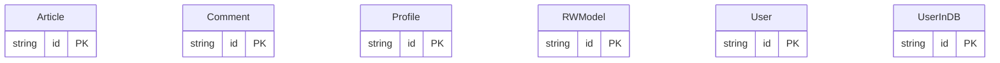

# 数据模型

## 简介

本仓库 `fastapi-realworld-example-app` 是一个用于演示如何完整实现 Conduit / RealWorld 规范后端的示例项目。需要注意的是，仓库根 README 已声明：**"
<cite>app/api/routes/comments.py:31-34</cite>

## 核心数据模型

系统的领域对象以 Pydantic 模型定义在 `app/models/domain`，它们既承担请求/响应契约，又作为服务层与路由层之间共享的数据载体。例如 `User`、`Article`、`Comment`、`Profile` 共同覆盖了 RealWorld 规范的全部核心实体，而 `RWModel` 与 `RWSchema` 提供了带有自定义配置（如别名生成、字段白名单）的基础类。在认证上下文中还存在 `JWTUser` 与 `JWTMeta`，用于在解码 Token 后构造最小化的用户上下文对象，避免把完整用户表直接暴露给中间件。
<cite>app/api/dependencies/profiles.py:15-18</cite>

所有领域模型普遍继承自 `IDModelMixin`、`DateTimeModelMixin`，使得每个持久化对象都拥有统一的 `id`、`created_at`、`updated_at` 字段语义，便于在响应序列化时输出标准时间戳。`User` 与 `UserInDB` 之间通过字段拆分隔离了入参形态与持久化形态：前者只携带注册所需字段，后者额外包含 `salt` 与 `password` 等敏感信息。类似的拆分思路也作用于 Article：`ArticleInCreate`、`ArticleInUpdate` 与 `ArticleForResponse` 分别承担创建、更新与响应职责，使请求体与持久化结构解耦。
<cite>app/api/dependencies/comments.py:16-24</cite>

## 服务数据模型

服务层使用的过滤器与查询结构以独立的 Pydantic 模型表达，避免把 FastAPI 的 `Query` 参数原样透传到仓库层。例如 `ArticlesFilters` 聚合了 `tag`、`author`、`favorited`、`limit`、`offset` 五个维度，并在 `get_articles_filters` 依赖函数中通过 `Query` 注解进行参数校验（`limit` 必须 `>= 1`，`offset` 必须 `>= 0`）<cite>app/api/dependencies/articles.py:21-26</cite>。这一设计让路由处理器只接收一个干净的过滤器对象，而把边界校验收敛到依赖层。

路径解析相关的模型同样保持轻量化：`get_comment_by_id_from_path` 通过 `Path(..., ge=1)` 校验评论 id 的合法性，并依赖上层 `Article` 实例保证 slug 解析已完成<cite>app/api/dependencies/comments.py:16-24</cite>；`get_profile_by_username_from_path` 则要求 `username` 至少包含 1 个字符，并将当前可选登录用户一并注入<cite>app/api/dependencies/profiles.py:15-18</cite>。这些依赖的产物 `Article`、`Comment`、`Profile` 都直接来自领域模型，体现"路径参数 → 领域对象"的统一抽象。

读取类路由例如 `list_comments_for_article` 与 `retrieve_profile_by_username` 仅依赖已解析的领域对象与仓储实例，不在处理器内部再做参数解析，从而形成清晰的"依赖注入 → 仓储调用"链路<cite>app/api/routes/comments.py:31-34</cite><cite>app/api/routes/profiles.py:21-22</cite>。

## 数据库与迁移策略

仓库的实体表结构由 `app/db/migrations` 目录下的迁移脚本定义，包含 `users`、`profiles`、`articles`、`tags`、`favorites`、`comments` 等核心表，对应 RealWorld 规范要求的多对多标签、用户收藏、文章作者、评论归属等关系。该项目并不使用 ORM，而是直接基于 `asyncpg` 编写 SQL，并通过手写迁移来演进 schema，因此迁移文件本身就是表的真实来源。
<cite>app/api/dependencies/articles.py:21-26</cite>

仓储层位于 `app/db/repositories`，每个实体对应一个 `*Repository` 类（如 `ArticlesRepository`、`CommentsRepository`、`ProfilesRepository`），它们以参数化 SQL 与领域模型互转。在路由依赖中，通过 `Depends(get_repository(...))` 工厂按请求注入具体的仓储实例，例如评论依赖注入 `CommentsRepository`<cite>app/api/dependencies/comments.py:16-24</cite>，profile 路由则注入 `ProfilesRepository`<cite>app/api/dependencies/profiles.py:15-18</cite>。

由于 schema 由迁移脚本而非 ORM 驱动，Pydantic 领域模型与数据库表之间需要显式的字段映射。这种"领域模型即 API 契约、SQL 即存储"的取舍在保持透明的同时，也要求开发者在新增字段时同步更新迁移文件与领域模型两处；这正是阅读本仓库数据模型时最需要关注的边界。

## 目录

1. 简介
2. 核心数据模型
3. 服务数据模型
4. 数据库与迁移策略

## 架构图

持久化表以 app/db/migrations 为准；app/models/domain 是 Pydantic 领域模型，不是 ORM 实体，请求/响应 schema 不列入实体。 <cite>app/models/domain/articles.py:1-16</cite> <cite>app/models/domain/comments.py:1-8</cite> <cite>app/models/domain/profiles.py:1-10</cite> <cite>app/models/domain/rwmodel.py:1-21</cite> <cite>app/models/domain/users.py:1-24</cite> <cite>app/db/migrations/env.py:1-38</cite>
