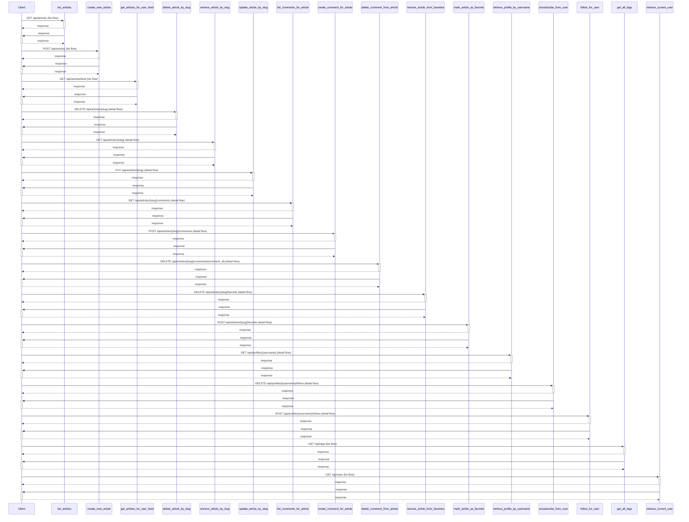
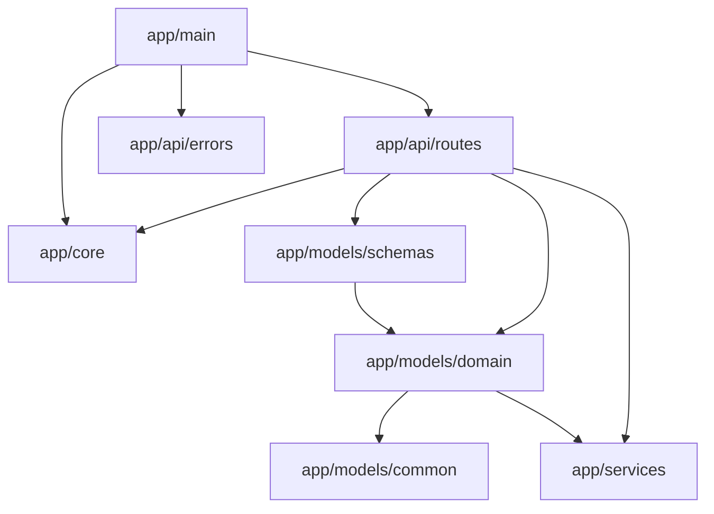

# API参考

## 简介

## 项目结构

应用入口与配置位于仓库根目录与 `app/core` 之下，HTTP 路由按业务域拆分到 `app/api/routes` 的子目录中：通用认证路由在 `app/api/routes/authentication.py`，文章相关路由分散在 `app/api/routes/articles/` 下，用户资料路由集中在 `app/api/routes/profiles.py` 。文章类操作共用同一组依赖函数，例如 `get_article_by_slug_from_path` 与 `get_current_user_authorizer` 用于解析路径与鉴权 <cite>app/api/routes/articles/articles_common.py:52-55</cite>。依赖项通过 `Depends(get_repository(...))` 注入仓储层，从而把 HTTP 层与持久层解耦 <cite>app/api/routes/articles/articles_common.py:27-31</cite>。

## 核心组件

核心组件以路由处理函数和鉴权依赖为主。`login` 是认证入口，接收 `UserInLogin` 请求体并通过 `UsersRepository` 与 `AppSettings` 完成校验 <cite>app/api/routes/authentication.py:23-26</cite>。`follow_for_user` 与 `unsubscribe_from_user` 都先把 `:username` 解析为 `Profile` 对象，再通过 `ProfilesRepository` 修改关注关系 <cite>app/api/routes/profiles.py:32-35</cite> <cite>app/api/routes/profiles.py:62-65</cite>。`get_articles_for_user_feed` 使用 `Query` 校验分页参数，并依赖当前登录用户输出个性化订阅流 <cite>app/api/routes/articles/articles_common.py:27-31</cite>。`mark_article_as_favorite` 复用同一鉴权与路径解析模式，仅替换仓储类型为 `ArticlesRepository` <cite>app/api/routes/articles/articles_common.py:52-55</cite>。

## 架构总览

整体采用典型的“路由 → 服务/仓储 → 数据模型”分层。HTTP 层位于 `app/api/routes/`，仅承担参数解析、鉴权和响应组装；持久化由各 Repository 负责并通过 `Depends(get_repository(...))` 注入 <cite>app/api/routes/articles/articles_common.py:27-31</cite>。鉴权统一收敛在 `get_current_user_authorizer` 依赖，几乎所有写操作（关注、收藏、登录态读取）都依赖它 <cite>app/api/routes/profiles.py:32-35</cite>。配置通过 `AppSettings` 依赖注入，避免在路由中硬编码 <cite>app/api/routes/authentication.py:23-26</cite>。

## 详细组件分析

认证流程中，`login` 在收到 `UserInLogin` 后通过仓储校验凭据，并使用 `AppSettings` 生成或校验令牌，登录成功即返回用户资源 <cite>app/api/routes/authentication.py:23-26</cite>。关注与取关路径几乎对称：先用 `get_profile_by_username_from_path` 把 URL 中的 `:username` 转成 `Profile` 实体，再调用 `profiles_repo` 的对应方法 <cite>app/api/routes/profiles.py:32-35</cite> <cite>app/api/routes/profiles.py:62-65</cite>。文章流接口通过 `limit` 与 `offset` 两个查询参数控制分页，并在依赖中校验非负范围，由仓储返回当前用户订阅作者的文章集合 <cite>app/api/routes/articles/articles_common.py:27-31</cite>。文章收藏接口依赖 `Article` 实例而非裸 slug，避免在 handler 内再做一次数据库查询，体现“路径依赖解析实体”的设计 <cite>app/api/routes/articles/articles_common.py:52-55</cite>。

## 附录：关键端点

| 方法 | 路径 | 说明 |
|------|------|------|
| POST | `/api/users/login` | 登录并返回令牌，对应 `login` <cite>app/api/routes/authentication.py:23-26</cite> |
| GET | `/api/articles/feed` | 获取关注作者文章流，对应 `get_articles_for_user_feed` <cite>app/api/routes/articles/articles_common.py:27-31</cite> |
| POST | `/api/articles/{slug}/favorite` | 收藏文章，对应 `mark_article_as_favorite` <cite>app/api/routes/articles/articles_common.py:52-55</cite> |
| POST | `/api/profiles/{username}/follow` | 关注用户，对应 `follow_for_user` <cite>app/api/routes/profiles.py:32-35</cite> |
| DELETE | `/api/profiles/{username}/follow` | 取消关注，对应 `unsubscribe_from_user` <cite>app/api/routes/profiles.py:62-65</cite> |

## API 分组

按资源分组的接口：

### api/articles

GET /api/articles（handler `list_articles`） <cite>app/api/routes/articles/articles_resource.py:31-41</cite>。 POST /api/articles（handler `create_new_article`） <cite>app/api/routes/articles/articles_resource.py:59-69</cite>。 DELETE /api/articles/{slug}（handler `delete_article_by_slug`） 。 GET /api/articles/{slug}（handler `retrieve_article_by_slug`） <cite>app/api/routes/articles/articles_resource.py:83-93</cite>。 PUT /api/articles/{slug}（handler `update_article_by_slug`） <cite>app/api/routes/articles/articles_resource.py:95-105</cite>。

### api/articles/comments

GET /api/articles/{slug}/comments（handler `list_comments_for_article`） <cite>app/api/routes/comments.py:31-41</cite>。 POST /api/articles/{slug}/comments（handler `create_comment_for_article`） <cite>app/api/routes/comments.py:46-56</cite>。 DELETE /api/articles/{slug}/comments/{comment_id}（handler `delete_comment_from_article`） 。

### api/articles/favorite

DELETE /api/articles/{slug}/favorite（handler `remove_article_from_favorites`） <cite>app/api/routes/articles/articles_common.py:82-92</cite>。 POST /api/articles/{slug}/favorite（handler `mark_article_as_favorite`） <cite>app/api/routes/articles/articles_common.py:52-62</cite>。

### api/articles/feed

GET /api/articles/feed（handler `get_articles_for_user_feed`） <cite>app/api/routes/articles/articles_common.py:27-37</cite>。

### api/profiles

GET /api/profiles/{username}（handler `retrieve_profile_by_username`） <cite>app/api/routes/profiles.py:21-31</cite>。

### api/profiles/follow

DELETE /api/profiles/{username}/follow（handler `unsubscribe_from_user`） <cite>app/api/routes/profiles.py:62-72</cite>。 POST /api/profiles/{username}/follow（handler `follow_for_user`） <cite>app/api/routes/profiles.py:32-42</cite>。

### api/tags

GET /api/tags（handler `get_all_tags`） 。

### api/user

GET /api/user（handler `retrieve_current_user`） <cite>app/api/routes/users.py:19-29</cite>。 PUT /api/user（handler `update_current_user`） <cite>app/api/routes/users.py:39-49</cite>。

### api/users

POST /api/users（handler `register`） <cite>app/api/routes/authentication.py:62-72</cite>。

### api/users/login

POST /api/users/login（handler `login`） <cite>app/api/routes/authentication.py:23-33</cite>。

## 调用约定

HTTP 方法: DELETE, GET, POST, PUT。 认证: bearer。

## Schema 摘要

证据中可确认的 schema 相关元数据：

POST /api/articles: request_body=true, response_type=json, error_codes=[400, 401, 403, 404, 500]。 PUT /api/articles/{slug}: request_body=true, response_type=json, error_codes=[400, 401, 403, 404, 500]。 POST /api/articles/{slug}/comments: request_body=true, response_type=json, error_codes=[400, 401, 403, 404, 500]。 POST /api/articles/{slug}/favorite: request_body=true, response_type=json, error_codes=[400, 401, 403, 404, 500]。 POST /api/profiles/{username}/follow: request_body=true, response_type=json, error_codes=[400, 401, 403, 404, 500]。 PUT /api/user: request_body=true, response_type=json, error_codes=[400, 401, 403, 404, 500]。 POST /api/users: request_body=true, response_type=json, error_codes=[400, 401, 403, 404, 500]。 POST /api/users/login: request_body=true, response_type=json, error_codes=[400, 401, 403, 404, 500]。
<cite>app/api/routes/profiles.py:32-35</cite>
<cite>app/api/routes/articles/articles_common.py:27-31</cite>
<cite>app/api/routes/authentication.py:23-26</cite>
<cite>app/api/routes/profiles.py:62-65</cite>
<cite>app/api/routes/articles/articles_common.py:52-55</cite>
<cite>app/api/routes/profiles.py:32-35</cite>
<cite>app/api/routes/articles/articles_common.py:27-31</cite>
<cite>app/api/routes/authentication.py:23-26</cite>

## 架构图

## 目录

1. 简介
2. 项目结构
3. 核心组件
4. 架构总览
5. 详细组件分析
6. 附录：关键端点
7. API 分组
8. 调用约定
9. Schema 摘要
10. 架构图
