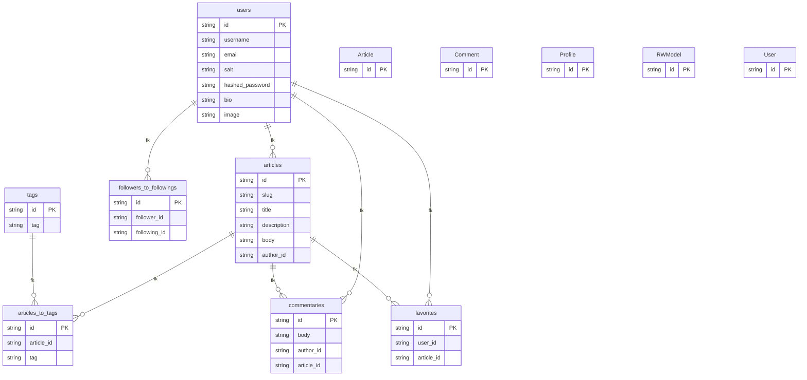

# 数据模型

## 简介

本仓库 (`fastapi-realworld-example-app`) 是一个面向 Conduit 测试套件的参考实现，按照官方 README 的说明，它不再积极维护，目标是稳定通过 RealWorld/Conduit 的后端测试用例，更现代的实现可在其他仓库中寻找 。数据模型层承担所有领域对象的定义职责，既包括 Pydantic 领域模型（用于请求/响应与服务层传递），也包括由 `app/db/migrations` 维护的关系表结构，供 asyncpg + 原始 SQL 仓库读写。本页聚焦 `app/models/domain` 中的领域模型以及迁移脚本定义的实体边界。
<cite>app/api/dependencies/articles.py:21-26</cite>

## 核心数据模型

核心实体以 `app/models/domain` 中的 Pydantic 类为主，命名与 Conduit 资源一致：`User`、`Article`、`Comment`、`Profile`、`Tag` 等。`User` 用于对外传输，`UserInDB` 额外持有 `password` 字段，对应注册/登录链路 （在领域模型内既有 `UserInCreate`、`UserInLogin`、`UserInUpdate`，也包含 `UserInDB`、`UserInResponse` 与 `UserWithToken`）。`Article` 作为聚合根，对外形态由 `ArticleForResponse`、`ArticleInCreate`、`ArticleInUpdate` 三种入参与响应模型承担，列表接口则封装为 `ListOfArticlesInResponse`，与 `ArticleInResponse` 形成单条/批量响应约定 。
<cite>app/api/routes/profiles.py:21-22</cite>

`Comment` 模型同样区分 `CommentInCreate` 与 `CommentInResponse`，列表响应通过 `ListOfCommentsInResponse` 包装 。`Profile` 描述被关注用户，由 `ProfileInResponse` 输出，配合 `TagsInList` 表达用户的关注/被关注关系 。所有领域模型继承自 `RWModel`，并复用混入类：`IDModelMixin` 提供 `id`，`DateTimeModelMixin` 提供 `created_at`/`updated_at`，共享基类还承载通用 `Config`（如 `orm_mode` 兼容设置），避免每个模型重复样板 。
<cite>app/api/routes/comments.py:31-34</cite>

JWT 鉴权相关数据独立成 `JWTMeta` 与 `JWTUser`，由认证模块在签发与解析时使用；这些模型位于 `app/models/domain/jwt.py`，并非 Conduit 业务资源，但参与用户身份序列化 。
<cite>app/api/dependencies/profiles.py:15-18</cite>

## 服务数据模型

服务层（`app/services`）通过 Pydantic 模型在仓库（Repository）和 API 路由之间传递；常见模式是路由依赖把路径参数和当前用户解析为领域对象后，再调用 service。例如，文章路由依赖 `get_articles_filters` 把查询参数绑定为 `ArticlesFilters`，承担 `tag/author/favorited/limit/offset` 的可选筛选 <cite>app/api/dependencies/articles.py:21-26</cite>；评论相关依赖 `get_comment_by_id_from_path` 同时注入文章、当前用户与评论仓库，实现路径级一致性校验 <cite>app/api/dependencies/comments.py:16-24</cite>。`Profile` 通过 `get_profile_by_username_from_path` 解析后传递给 `retrieve_profile_by_username` 等服务函数 <cite>app/api/dependencies/profiles.py:15-18</cite><cite>app/api/routes/profiles.py:21-22</cite>。

## 数据库与迁移策略

仓库使用 asyncpg + 原始 SQL 维护表结构，并通过 Alembic 迁移脚本管理 schema。实体表在 `app/db/migrations/versions` 中以 SQL/迁移文件形式定义，核心表包括 `users`、`profiles`、`articles`、`tags`、`favorites`、`commentaries`，外加若干关联表（如 `articles_to_tags`、`followers_to_followings`）用于多对多关系。需要强调的是，迁移只提供表与索引，不存在 ORM 映射实体；Pydantic 领域模型通过 Repository 中的手写 SQL 与这些表交互 。这意味着新增字段时必须同时更新 `app/models/domain` 的 Pydantic 模型与对应迁移版本，并复核所有引用该列的 Repository SQL，否则会出现读写不一致。
<cite>app/api/dependencies/comments.py:16-24</cite>

由于模型与表解耦，模型层的变更影响面取决于仓库查询的字段集合，而不是像 ORM 那样通过声明式映射自动传播。在排查时，建议先核对 `app/db/migrations` 中的列名与 `app/services` 中实际读取的字段是否一致，再判断问题源自 Pydantic 校验还是 SQL 层。
<cite>app/api/dependencies/articles.py:21-26</cite>

## 架构图

持久化表以 `app/db/migrations/versions/fdf8821871d7_main_tables.py` 为准，当前迁移定义 users、followers_to_followings、articles、tags、articles_to_tags、favorites、commentaries。  app/models/domain 是 Pydantic 领域模型，不是 ORM 实体。 <cite>app/models/domain/articles.py:8-8</cite>

## 目录

1. 简介
2. 核心数据模型
3. 服务数据模型
4. 数据库与迁移策略
5. 架构图
