# 架构设计

## 简介

本页描述 `probe_exporter` 仓库的架构设计。该仓库面向企业级的服务探针拨测与结果导出平台，支持**双模式探测**（Blackbox + Custom Probe）、灵活的验证引擎、多渠道导出，并提供完整的 Web 管理界面。<cite>cmd/ccagent/main.go:16-22</cite><cite>cmd/ccprobe-control/main.go:23-80</cite><cite>cmd/custom-probe/main.go:20-27</cite>

## 项目结构

仓库的入口可执行文件位于 `cmd/` 目录下，分别承载不同的运行时角色。`cmd/probe-agent/main.go` 是采集与上报节点，其配置结构体 `config` 同时声明了 `AgentID`、`BufferSize`、`WALPath`、`HealthListen`、`ControlToken`、`SnapshotPath` 等字段，表明它既是 WAL 写入端，也是 HTTP 控制面与健康检查端点。<cite>cmd/probe-agent/main.go:24-36</cite>`cmd/ccagent/main.go` 在 `init()` 中针对 Alpine 容器环境强制 `GODEBUG=netdns=go`，用以规避 musl libc 与 Go 网络轮询器之间的兼容性问题。<cite>cmd/ccagent/main.go:16-22</cite>`cmd/ccprobe-control/main.go` 是一个 CLI 控制器，默认连接 `http://127.0.0.1:19080` 并支持 `--target` / `--agent-token` 等参数，可针对 `https://ip.cc/` 等目标发起请求，属于运维侧工具而非核心运行时。<cite>cmd/ccprobe-control/main.go:23-80</cite>

业务侧模块按职责切分到 `internal/` 各包：`config` 负责配置装配；`deploy` 处理部署编排；`agent` 封装 Agent 行为；`audit` / `auth` 提供审计与认证；`contract` 定义组件间契约；`control` 暴露控制面能力；`dbconn` 管理数据库连接；`exporter` 实现结果导出；`legacycutover` 处理新老版本切换；`metrics` / `opsmetrics` 输出指标；`models` 定义领域模型；`netguard` 处理网络防护；`opsstore` 提供运维存储；`probe` 实现探测引擎；`repository` 负责数据访问；`secrets` / `security` 处理密钥与安全；`services` 编排业务服务；`validator` 提供验证逻辑；`tls.go` 集中处理 TLS 配置。
<cite>cmd/ccprobe-control/main.go:23-80</cite>

## 核心组件

- **Probe Agent（`cmd/probe-agent`）**：作为双模式探测与导出的执行节点，通过 `config` 中的 `BufferSize` 与 `WALPath` 实现缓冲与预写日志，`ControlToken` 与 `HealthListen` 对应控制面鉴权与健康端点。<cite>cmd/probe-agent/main.go:24-36</cite>
- **CC Agent（`cmd/ccagent`）**：在 Alpine 容器中以 `netdns=go` 启动，确保 DNS 解析不依赖 musl libc，是部署形态相关的重要初始化点。<cite>cmd/ccagent/main.go:16-22</cite>
- **Control CLI（`cmd/ccprobe-control`）**：面向 Agent 控制面的命令行客户端，可指定目标 URL 与 Agent 令牌，用于人工触发或脚本化探测验证。<cite>cmd/ccprobe-control/main.go:23-80</cite>
- **Custom Probe（`cmd/custom-probe`）**：通过 `ProbeResult` 结构体表达探测结果，包含 `Success`、`StatusCode`、`ResponseTimeMs`、`ErrorMessage`、`Details` 与 `Metrics` 等字段，是双模式探测中自定义探针的结果契约。<cite>cmd/custom-probe/main.go:20-27</cite>
- **业务核心包（`internal/services`、`internal/repository`、`internal/control`、`internal/validator`、`internal/probe`、`internal/exporter`）**：分别承担业务编排、持久化访问、控制面暴露、验证、探测引擎与导出职责，构成系统的运行时主干。

## 详细分析

`cmd/probe-agent/main.go` 中的 `config` 结构体同时聚合了运行时缓冲（`BufferSize`）、持久化路径（`WALPath`、`SnapshotPath`）、控制面（`ControlToken`）与健康检查（`HealthListen`），说明 Agent 在进程内承担了采集、暂存、上报与被管控四种角色。<cite>cmd/probe-agent/main.go:24-36</cite>`cmd/custom-probe/main.go` 中的 `ProbeResult` 用 JSON 字段表达结果，既包含布尔成功标志与状态码，也附带耗时、错误信息以及 `Metrics` 文本，可被导出端直接消费。<cite>cmd/custom-probe/main.go:20-27</cite>控制面 CLI 默认指向本地 Agent 的 `19080` 端口，体现 Agent 与控制端之间是基于 HTTP 的进程内或同机调用关系。<cite>cmd/ccprobe-control/main.go:23-80</cite>

## 依赖关系分析

Agent 二进制初始化时依赖系统层 DNS 解析行为，因此通过 `GODEBUG=netdns=go` 显式覆盖默认行为，这表明其下游（探测/网络栈）对运行环境敏感。<cite>cmd/ccagent/main.go:16-22</cite>控制面 CLI 与 Agent 之间通过 `--agent-url` / `--agent-token` 形成强耦合鉴权依赖，变更 `ControlToken` 字段会直接影响 CLI 可用性。<cite>cmd/ccprobe-control/main.go:23-80</cite><cite>cmd/probe-agent/main.go:24-36</cite>Custom Probe 的结果结构若新增字段，会通过 JSON 透传到上游 exporter，因此 `ProbeResult` 是契约面，应视为跨包稳定接口。<cite>cmd/custom-probe/main.go:20-27</cite>

## 性能考虑

`config.BufferSize` 直接决定了探测结果的内存缓冲上限，配置过小会导致结果被丢弃或阻塞；`WALPath` / `SnapshotPath` 的磁盘 IO 会影响故障恢复时间。<cite>cmd/probe-agent/main.go:24-36</cite>`ProbeResult.ResponseTimeMs` 与 `Metrics` 文本字段对每次探测都会写入并随 JSON 序列化输出，建议在 exporter 侧关注序列化放大问题。<cite>cmd/custom-probe/main.go:20-27</cite>Alpine 容器下的 DNS 强制切换为 Go 实现会带来一定 CPU 开销，应在容量评估时纳入。<cite>cmd/ccagent/main.go:16-22</cite>

## 故障排查指南

若 Agent 无法在 Alpine 环境中发起探测，应首先检查 `init()` 是否正确设置了 `GODEBUG=netdns=go`，避免 musl 与 Go 网络轮询器冲突。<cite>cmd/ccagent/main.go:16-22</cite>若控制面 CLI 报鉴权错误，需比对 CLI 的 `--agent-token` 与 Agent 配置中的 `ControlToken`。<cite>cmd/ccprobe-control/main.go:23-80</cite><cite>cmd/probe-agent/main.go:24-36</cite>若探测结果未导出，应检查 `ProbeResult.Metrics` 是否被填充以及 WAL/Snapshot 路径磁盘可用性。<cite>cmd/custom-probe/main.go:20-27</cite><cite>cmd/probe-agent/main.go:24-36</cite>

## 结论

本页通过对 `cmd/probe-agent`、`cmd/ccagent`、`cmd/ccprobe-control`、`cmd/custom-probe` 入口及 `internal/` 各核心包的解读，勾勒出 `probe_exporter` 以 Agent 为执行节点、以控制面与验证/导出/仓储为支撑的双模式拨测与导出平台架构。理解这些入口配置与契约结构，是后续在 `services`、`repository`、`control` 等包内做功能演进与排障的基础。
<cite>cmd/ccagent/main.go:16-22</cite>

## 目录

1. 简介
2. 项目结构
3. 核心组件
4. 详细分析
5. 依赖关系分析
6. 性能考虑
7. 故障排查指南
8. 结论

## 架构图

```mermaid
flowchart TD
    api[api]
    cmd_ccagent[cmd/ccagent]
    cmd_ccprobe_control[cmd/ccprobe-control]
    cmd_custom_probe[cmd/custom-probe]
    cmd_probe_agent[cmd/probe-agent]
    internal_agent[internal/agent]
    internal_audit[internal/audit]
    internal_auth[internal/auth]
    internal_contract[internal/contract]
    internal_control[internal/control]
    internal_dbconn[internal/dbconn]
    internal_exporter[internal/exporter]
    internal_legacycutover[internal/legacycutover]
    internal_metrics[internal/metrics]
    internal_models[internal/models]
    internal_netguard[internal/netguard]
    internal_opsmetrics[internal/opsmetrics]
    internal_opsstore[internal/opsstore]
    internal_probe[internal/probe]
    internal_repository[internal/repository]
    internal_secrets[internal/secrets]
    internal_security[internal/security]
    internal_services[internal/services]
    internal_validator[internal/validator]
    test[test]
    web[web]
    xstats[xstats]
    layer_docs[docs/]
    cmd_ccagent --> internal_services
    cmd_ccprobe_control --> internal_agent
    cmd_ccprobe_control --> internal_contract
    cmd_ccprobe_control --> internal_control
    cmd_probe_agent --> api
    cmd_probe_agent --> internal_agent
    internal_agent --> api
    internal_agent --> internal_auth
    internal_agent --> internal_contract
    internal_agent --> internal_control
    internal_agent --> internal_models
    internal_agent --> internal_netguard
    internal_agent --> internal_opsmetrics
    internal_agent --> internal_validator
    internal_audit --> internal_security
    internal_auth --> internal_models
    internal_control --> api
    internal_control --> internal_contract
    internal_control --> internal_models
    internal_control --> internal_opsmetrics
    internal_control --> test
    internal_exporter --> internal_metrics
    internal_exporter --> internal_models
    internal_exporter --> internal_security
    internal_metrics --> internal_models
    internal_metrics --> internal_repository
    internal_models --> internal_dbconn
    internal_opsmetrics --> api
    internal_opsstore --> internal_models
    internal_opsstore --> internal_opsmetrics
    internal_opsstore --> internal_repository
    internal_probe --> internal_audit
    internal_probe --> internal_auth
    internal_probe --> internal_exporter
    internal_probe --> internal_legacycutover
    internal_probe --> internal_metrics
    internal_probe --> internal_models
    internal_probe --> internal_netguard
    internal_probe --> internal_repository
    internal_probe --> internal_validator
    internal_repository --> internal_models
    internal_secrets --> internal_models
    internal_secrets --> internal_repository
    internal_security --> internal_models
    internal_services --> internal_audit
    internal_services --> internal_auth
    internal_services --> internal_contract
    internal_services --> internal_control
    internal_services --> internal_exporter
    internal_services --> internal_legacycutover
    internal_services --> internal_metrics
    internal_services --> internal_models
    internal_services --> internal_opsmetrics
    internal_services --> internal_opsstore
    internal_services --> internal_probe
    internal_services --> internal_repository
    internal_services --> internal_secrets
    internal_services --> internal_security
    internal_validator --> internal_models
    test --> internal_models
    web --> api
    web --> test
```

核心实现位于控制面与内部包，而不是示例或脚手架程序。 <cite>cmd/ccagent/main.go:1-8</cite> <cite>internal/control/expand.go:1-8</cite> <cite>internal/services/agent_ops.go:1-8</cite> <cite>internal/repository/agent_ops_repo.go:1-8</cite>
