# 架构设计

## 简介
本页描述 `probe_exporter` 仓库的总体架构设计。仓库定位为面向企业级的服务探针拨测与结果导出平台，支持**双模式探测**（Blackbox + Custom Probe）、灵活的验证引擎、多渠道导出，并提供完整的Web管理界面。✨ 核心特性 🎯 双模式探测。控制面以 `ccprobe-control -serve -transport grpc` 形式启动 gRPC 服务，区别于普通 CLI 入口；而 `ccprobe-control` 也可作为命令行探测客户端运行单次拨测。<cite>cmd/ccprobe-control/main.go:23-80</cite><cite>cmd/ccprobe-control/serve.go:29-187</cite>

## 项目结构
仓库以 `cmd/` 为入口边界，按二进制划分职责：`cmd/ccprobe-control` 既是 gRPC 控制面入口也是探测客户端，`cmd/ccagent` 是运行在容器内的 Agent，`cmd/custom-probe` 提供对外可调用的自定义探针 SDK 形态。内部能力由多组 internal 包承担，主要覆盖 `internal/control`、`internal/services`、`internal/repository`、`internal/exporter` 等核心包，以及 `config`、`deploy`、`audit`、`auth`、`contract`、`dbconn`、`legacycutover`、`metrics`、`models`、`netguard`、`opsmetrics`、`opsstore`、`probe`、`secrets`、`security`、`validator`、`tls.go` 等辅助包。`deploy/` 目录承载部署相关配置。
<cite>cmd/ccprobe-control/serve_test.go:9-24</cite>

## 核心组件
- **控制面（ccprobe-control）**：以 `ccprobe-control -serve -transport grpc` 启动 gRPC 服务，承担集群控制、会话隧道与心跳维护。<cite>cmd/ccprobe-control/serve.go:29-187</cite>
- **Agent（ccagent）**：独立二进制，容器内运行；`init()` 在 Alpine 环境下强制 `GODEBUG=netdns=go`，规避 musl 与 Go 网络轮询器冲突。<cite>cmd/ccagent/main.go:16-22</cite>
- **自定义探针 SDK（custom-probe）**：通过 `ProbeResult` 结构体统一探测结果协议，含成功标志、状态码、耗时、错误信息与指标负载。<cite>cmd/custom-probe/main.go:20-27</cite>
- **核心包集合**：`internal/control`、`internal/services`、`internal/repository`、`internal/exporter` 与 `internal/probe`、`internal/validator`、`internal/metrics`、`internal/security`、`internal/secrets`、`internal/netguard`、`internal/audit`、`internal/legacycutover` 协同完成控制流、领域服务、持久化与导出。
- **辅助能力**：配置通过 `config.go` 与 `config` 包加载；通信面包含 `tls.go`、`internal/auth`、`internal/contract`、`internal/dbconn`、`internal/opsstore`、`internal/opsmetrics`、`internal/models`。
<cite>cmd/ccprobe-control/main.go:23-80</cite>

## 详细分析
控制面入口 `main()` 既支持 `-serve` 模式将自身注册为 gRPC 控制中心，也支持 `-target` 等参数作为单次拨测客户端使用，行为由 flag 决定；`runGRPCServe` 内部构造 `control.NewTunnelHub` 并通过 `control.SetTunnelHub` 注入到全局，随后为隧道会话设置心跳回调，统计 `heartbeats`。<cite>cmd/ccprobe-control/main.go:23-80</cite><cite>cmd/ccprobe-control/serve.go:29-187</cite>

Agent 端以 `init()` 注入 DNS 解析器策略，确保在 Alpine 容器中探测网络栈稳定，然后由 `ccagent` 接受控制面下发的探测任务。<cite>cmd/ccagent/main.go:16-22</cite>

探测执行结果在自定义探针侧通过 `ProbeResult` 标准化：成功位、HTTP 状态码、响应耗时、错误信息、可选详情与指标负载均以 JSON 字段暴露，便于跨 SDK 复用并接入 `internal/exporter`。<cite>cmd/custom-probe/main.go:20-27</cite>

监听地址合法性通过 `isLoopbackListen` 测试覆盖常见 IPv4/IPv6 与错误输入，间接约束控制面监听策略。<cite>cmd/ccprobe-control/serve_test.go:9-24</cite>

## 依赖关系分析
`cmd/ccprobe-control/serve.go` 直接依赖 `internal/control` 的 `TunnelHub`、`TunnelSession`、`SoftLimits`、`GRPCTLSFiles` 与 `SetOnHeartbeat`，表明控制面是围绕会话与心跳构建的 gRPC 服务。<cite>cmd/ccprobe-control/serve.go:29-187</cite>

`cmd/custom-probe` 暴露的 `ProbeResult` 作为契约被 `internal/services`、`internal/exporter` 复用，使探测结果可在不依赖具体协议的前提下被导出。`internal/security`、`internal/auth`、`internal/secrets`、`internal/validator` 与 `internal/tls.go` 共同构成横切安全层，向控制面与服务层提供凭据与传输安全。`internal/legacycutover`、`internal/opsmetrics`、`internal/opsstore` 提供兼容与运维观测路径，影响升级与监控链路。变更影响方面：调整 `internal/control` 会同时波及控制面入口与 Agent 协议；调整 `ProbeResult` 字段会影响所有下游导出器。
<cite>cmd/ccagent/main.go:16-22</cite>

## 性能考虑
控制面 `runGRPCServe` 使用 `sync.Mutex` 保护 `heartbeats` 映射并在每次心跳回调中更新，频率较高时需关注锁竞争与 map 增长；建议控制心跳频率并定期清理离线会话。<cite>cmd/ccprobe-control/serve.go:29-187</cite>

Agent 在 Alpine 容器中显式切换 `GODEBUG=netdns=go`，绕过 musl 的 cgo 解析以换取稳定性，但 DNS 解析性能完全依赖 Go 运行时，跨平台一致性需要评估。<cite>cmd/ccagent/main.go:16-22</cite>

`ProbeResult.Details` 为 `map[string]interface{}`，自定义探针滥用大对象会显著放大序列化与导出开销；导出链路 `internal/exporter` 需考虑批处理与压缩。<cite>cmd/custom-probe/main.go:20-27</cite>

## 故障排查指南
- **控制面无法监听**：根据 `isLoopbackListen` 的语义核对监听地址，未匹配环回/通配策略时服务将拒绝绑定；先检查 flag 与 `-transport grpc`。<cite>cmd/ccprobe-control/serve_test.go:9-24</cite>
- **心跳计数异常**：定位 `runGRPCServe` 中的 `SetOnHeartbeat` 回调与 `heartMu` 锁区域，确认回调中 `s == nil` 保护是否生效以及是否触发 panic。<cite>cmd/ccprobe-control/serve.go:29-187</cite>
- **Alpine Agent DNS 故障**：确认环境变量未被覆盖，`GODEBUG=netdns=go` 应由 `init()` 设置，否则 musl 与 Go 轮询器会冲突。<cite>cmd/ccagent/main.go:16-22</cite>
- **自定义探针结果缺失字段**：核对 `ProbeResult` 的 JSON tag 与下游 `internal/exporter` 的解码逻辑，关注 `omitempty` 对关键字段的影响。<cite>cmd/custom-probe/main.go:20-27</cite>

## 结论
本页面梳理了 `probe_exporter` 以 `ccprobe-control` gRPC 控制面为核心、辅以 `ccagent` 与 `custom-probe` SDK 的整体架构，并明确 `internal/control`、`internal/services`、`internal/repository`、`internal/exporter` 等核心包的协作关系与横切关注点，为后续深入各模块实现提供导航。
<cite>cmd/ccprobe-control/serve.go:29-187</cite>

## 目录

1. 简介
2. 项目结构
3. 核心组件
4. 详细分析
5. 依赖关系分析
6. 性能考虑
7. 故障排查指南
8. 结论

## 架构图

```mermaid
flowchart TD
    api[api]
    cmd_ccagent[cmd/ccagent]
    cmd_ccprobe_control[cmd/ccprobe-control]
    cmd_custom_probe[cmd/custom-probe]
    cmd_probe_agent[cmd/probe-agent]
    internal_agent[internal/agent]
    internal_audit[internal/audit]
    internal_auth[internal/auth]
    internal_contract[internal/contract]
    internal_control[internal/control]
    internal_dbconn[internal/dbconn]
    internal_exporter[internal/exporter]
    internal_legacycutover[internal/legacycutover]
    internal_metrics[internal/metrics]
    internal_models[internal/models]
    internal_netguard[internal/netguard]
    internal_opsmetrics[internal/opsmetrics]
    internal_opsstore[internal/opsstore]
    internal_probe[internal/probe]
    internal_repository[internal/repository]
    internal_secrets[internal/secrets]
    internal_security[internal/security]
    internal_services[internal/services]
    internal_validator[internal/validator]
    test[test]
    web[web]
    xstats[xstats]
    layer_docs[docs/]
    cmd_ccagent --> internal_services
    cmd_ccprobe_control --> internal_agent
    cmd_ccprobe_control --> internal_contract
    cmd_ccprobe_control --> internal_control
    cmd_probe_agent --> api
    cmd_probe_agent --> internal_agent
    internal_agent --> api
    internal_agent --> internal_auth
    internal_agent --> internal_contract
    internal_agent --> internal_control
    internal_agent --> internal_models
    internal_agent --> internal_netguard
    internal_agent --> internal_opsmetrics
    internal_agent --> internal_validator
    internal_audit --> internal_security
    internal_auth --> internal_models
    internal_control --> api
    internal_control --> internal_contract
    internal_control --> internal_models
    internal_control --> internal_opsmetrics
    internal_control --> test
    internal_exporter --> internal_metrics
    internal_exporter --> internal_models
    internal_exporter --> internal_security
    internal_metrics --> internal_models
    internal_metrics --> internal_repository
    internal_models --> internal_dbconn
    internal_opsmetrics --> api
    internal_opsstore --> internal_models
    internal_opsstore --> internal_opsmetrics
    internal_opsstore --> internal_repository
    internal_probe --> internal_audit
    internal_probe --> internal_auth
    internal_probe --> internal_exporter
    internal_probe --> internal_legacycutover
    internal_probe --> internal_metrics
    internal_probe --> internal_models
    internal_probe --> internal_netguard
    internal_probe --> internal_repository
    internal_probe --> internal_validator
    internal_repository --> internal_models
    internal_secrets --> internal_models
    internal_secrets --> internal_repository
    internal_security --> internal_models
    internal_services --> internal_audit
    internal_services --> internal_auth
    internal_services --> internal_contract
    internal_services --> internal_control
    internal_services --> internal_exporter
    internal_services --> internal_legacycutover
    internal_services --> internal_metrics
    internal_services --> internal_models
    internal_services --> internal_opsmetrics
    internal_services --> internal_opsstore
    internal_services --> internal_probe
    internal_services --> internal_repository
    internal_services --> internal_secrets
    internal_services --> internal_security
    internal_validator --> internal_models
    test --> internal_models
    web --> api
    web --> test
```

控制面通过 gRPC（ccprobe-control -serve -transport grpc）调度 services → repository → exporter，而不是把控制面当成普通 CLI。 <cite>cmd/ccagent/main.go:1-8</cite> <cite>cmd/ccprobe-control/main.go:1-8</cite> <cite>internal/control/expand.go:1-8</cite> <cite>internal/services/agent_ops.go:1-8</cite> <cite>internal/repository/agent_ops_repo.go:1-8</cite> <cite>internal/exporter/exporter.go:1-8</cite> <cite>internal/agent/buffer/ring.go:1-8</cite> <cite>internal/probe/agent_auth.go:1-8</cite>
