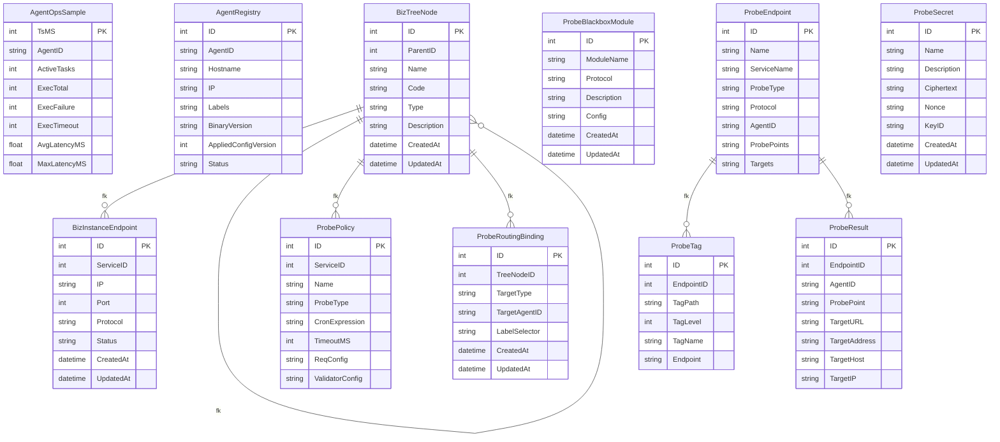

# 数据模型

probe_exporter 是面向企业级的服务探针拨测与结果导出平台，支持**双模式探测**（Blackbox + Custom Probe）、灵活的验证引擎、多渠道导出，并提供完整的 Web 管理界面。本页聚焦于平台的数据模型层，基于仓库 `db/schema.sql` 与 `internal/models` 中的 GORM 结构体，梳理核心表与业务表的字段定义、外键关系以及迁移策略，帮助读者快速建立对持久化层的整体认知。<cite>README.md:1-1</cite>

## 核心数据模型

核心数据模型围绕"探针端点、探针结果、Blackbox 模块、密钥"四条主线展开，所有表主键统一为 `BIGINT PRIMARY KEY AUTO_INCREMENT`，与 GORM 模型中的 `uint`/`int64` 字段保持一致，便于在 `internal/models` 中通过 `gorm.Model` 或显式 `gorm:"primaryKey;autoIncrement"` 标签映射。
<cite>db/schema.sql:13-62</cite>

`probe_endpoints` 表是拨测的源头实体，定义了端点名称、服务归属与探测类型，其中 `probe_type` 使用 `ENUM('blackbox', 'custom', 'local')` 枚举，对应 GORM 中常见的字符串字段+枚举校验。<cite>db/schema.sql:13-62</cite> `probe_results` 表记录每一次拨测的执行结果，通过 `endpoint_id BIGINT NOT NULL` 与 `probe_endpoints` 形成外键关联，并额外保留 `agent_id`、`probe_point`、`target_url`、`target_address` 等运行期字段，便于多代理协同与问题回溯。<cite>db/schema.sql:86-138</cite>

`probe_blackbox_modules` 表用于管理 Blackbox 探测模块，`module_name VARCHAR(64) NOT NULL UNIQUE` 约束保证模块名全局唯一，与 `protocol` 共同描述探测能力；模块配置以 JSON 形式落地在独立列中，便于在不改表结构的前提下扩展协议参数。<cite>db/schema.sql:143-159</cite>

`probe_secret` 表承担敏感凭据的加密存储，`ciphertext BLOB NOT NULL` 与 `nonce VARBINARY(32) NOT NULL` 表明平台采用 AES-GCM 加密方案，`key_id` 用于密钥版本轮换，`name` 字段供其他表的 `secret_refs` 引用，符合 KMS 风格的设计。<cite>db/schema.sql:508-520</cite>

## 服务数据模型

服务域以 `biz_tree_node` 为顶层抽象，构建"业务树 → 服务节点 → 实例端点"的层级结构。`biz_instance_endpoint` 表位于服务域最末端，`service_id BIGINT NOT NULL` 注释明确指向 `biz_tree_node.type=SERVICE` 的节点，`ip`、`port`、`protocol ENUM('HTTP', 'HTTPS', 'TCP', 'ICMP')` 描述真实实例的网络属性，端口对 ICMP 类型允许为 0，体现了协议适配性。<cite>db/schema.sql:434-449</cite>

该模型与 `probe_endpoints` 通过服务维度的引用形成松耦合：`probe_endpoints` 中的 `service_name` 与 `biz_tree_node` 形成语义关联，避免在拨测表中重复存储实例拓扑信息。这种"服务树 + 实例 + 端点"的三段式结构，为后续 Policy 编排、Routing Binding 和结果聚合提供了稳定的归一化基础。
<cite>db/schema.sql:508-520</cite>

## 数据库与迁移策略

仓库的持久化迁移以 `db/schema.sql` 为单一事实源，所有关键表均使用 `CREATE TABLE IF NOT EXISTS` 保证可重复执行。GORM 模型位于 `internal/models`，在结构体上以 `gorm` 标签声明列名、类型、外键与索引，对应到 SQL 中的 `COMMENT`、枚举与唯一约束，例如 `probe_endpoints` 的 `probe_type` 枚举与 `probe_blackbox_modules.module_name` 的唯一性，都需要在模型层同步声明以避免运行时 panic。<cite>db/schema.sql:13-62</cite><cite>db/schema.sql:143-159</cite>

新增模型时需遵循三条原则：一是字段类型严格沿用 SQL 真实类型（如 `BIGINT`、`VARBINARY`、`ENUM`），二是在 `*_id` 字段上显式标注 `gorm:"foreignKey:..."` 或 `references` 以建立模型层关系，三是大对象或敏感字段（如 `ciphertext`、JSON 配置列）保持与 SQL 一致，避免在应用层做隐式转换。
<cite>db/schema.sql:434-449</cite>

## 依赖关系分析

数据模型层被服务编排、Agent 调度与导出通道共同依赖：`probe_endpoints` 与 `probe_policy`、`probe_routing_binding` 共同参与策略评估，`probe_results` 被结果聚合与多渠道导出读写，`probe_secret` 则通过 `secret_refs` 被探测执行器在运行期引用。`biz_instance_endpoint` 作为服务实例视图，是路由绑定和自定义探测（Custom Probe）选择目标的事实来源。
<cite>db/schema.sql:143-159</cite>

变更任何核心表都会级联影响 Agent 调度、结果导出与 Web 管理界面，因此对 `probe_endpoints`、`probe_results`、`probe_secret` 的 schema 修改应同步更新 `internal/models` 结构体、迁移脚本以及读取这些表的导出器逻辑，避免出现模型与 SQL 漂移。
<cite>db/schema.sql:86-138</cite>

## 结论

本页围绕 `probe_endpoints`、`probe_results`、`probe_blackbox_modules`、`probe_secret` 等核心表与 `biz_instance_endpoint` 等服务域表，给出了字段定义、外键关系与迁移要点。结合 `internal/models` 中的 GORM 结构体，可清晰还原 probe_exporter 的持久化全貌，为后续策略编排、Agent 调度与导出功能的扩展提供统一的模型基线。
<cite>db/schema.sql:13-62</cite>

## 目录

1. 核心数据模型
2. 服务数据模型
3. 数据库与迁移策略
4. 依赖关系分析
5. 结论

## 架构图

实体定义见 internal/models 中的 GORM 结构体，表结构见 db/schema.sql。 <cite>internal/models/agent_ops_sample.go:7-27</cite> <cite>internal/models/agent_registry.go:12-32</cite> <cite>internal/models/biz_tree.go:30-50</cite> <cite>internal/models/biz_tree.go:48-68</cite> <cite>internal/models/biz_tree.go:67-87</cite> <cite>internal/models/biz_tree.go:87-107</cite> <cite>internal/models/biz_tree.go:108-119</cite> <cite>internal/models/blackbox.go:11-31</cite>
