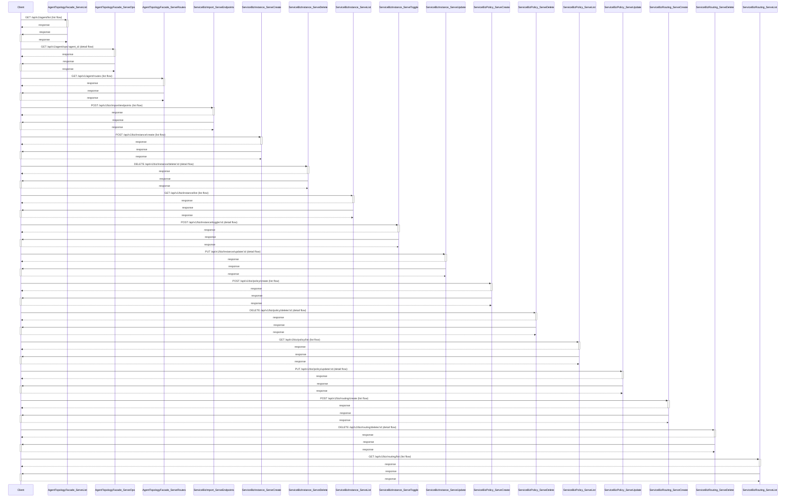
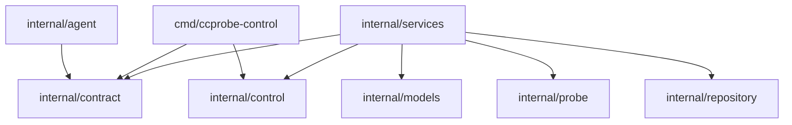

# API参考

## 简介

probe_exporter 是面向企业级的服务探针拨测与结果导出平台。它支持**双模式探测**（Blackbox + Custom Probe）、灵活的验证引擎、多渠道导出，并提供完整的 Web 管理界面与可编程的 HTTP API 集合。本页聚焦仓库源码中暴露的 HTTP 路由与控制器（Controller）层的反射式调用约定，作为对外能力的索引参考。<cite>controller.go:52-154</cite>

## 项目结构

仓库以 `controller.go` 为路由分发核心，使用 Gin 框架注册各业务路径。控制器的 `Run()` 方法负责启动入口，并在启动阶段通过 `legacycutover.Set` 写入旧版 endpoint 写入与调度开关，随后依据配置装载 Blackbox / Endpoint / Schedule / Result / Tag / Profile / Biz 等多组路由。<cite>controller.go:52-154</cite>

源码中可见的关键符号集中于 `controller.go`：自定义错误类型 `paramBindError`、其 `Error()` 与 `Unwrap()` 方法，以及基于反射的参数绑定函数 `invokeServiceMethod`。这些符号共同构成「路由 → 服务方法」之间的绑定与错误包装层。<cite>controller.go:218-219</cite><cite>controller.go:220-221</cite><cite>controller.go:221-222</cite><cite>controller.go:223-263</cite>

## 核心组件

`Controller.Run`：进程级入口，负责初始化 legacy 写入与调度开关并驱动 Gin 引擎运行。<cite>controller.go:52-154</cite>。 `paramBindError`：参数绑定阶段的错误包装类型，实现 `Error()` 与 `Unwrap()`，便于 `errors.Is/As` 追溯根因。<cite>controller.go:218-219</cite><cite>controller.go:220-221</cite><cite>controller.go:221-222</cite>。 `invokeServiceMethod`：控制器层反射调用入口，依据请求体、路径与查询参数动态绑定到具体 `serviceMethod`。<cite>controller.go:223-263</cite>。

## 架构总览

整体采用「路由表 + 反射服务方法」的分发模式：HTTP 请求先到达 Gin 路由，控制器读取 `ContentLength` 判断是否需要解析 JSON 请求体，再调用 `bindParams` 写入路径与查询参数，最后通过反射调用对应的服务方法并返回结果。当 `ContentLength` 为 0 或 Body 为空时，跳过 JSON 绑定以兼容 GET 类操作。<cite>controller.go:223-263</cite>

`paramBindError` 通过 `Unwrap()` 把内层错误透传出去，使上层可以基于原始错误类型（如参数校验失败、类型转换错误）做差异化处理，而不必依赖字符串匹配。<cite>controller.go:218-219</cite><cite>controller.go:221-222</cite>

## 详细组件分析

`invokeServiceMethod` 的执行流程可以概括为三步：第一步使用 `reflect.New(service.paramType).Interface()` 构造参数实例，确保即使没有请求体也能调用无参方法；第二步在 `ContentLength > 0` 且 Body 非空时调用 `ShouldBindJSON`，避免对无 Body 请求强制解析；第三步进入 `bindParams`，由路由上下文注入路径参数与查询参数。任何一步出错都会被包装为 `paramBindError` 并通过 `Unwrap()` 上抛，调用方可以据此返回 400 或更精细的状态码。<cite>controller.go:223-263</cite>

在控制器启动阶段，`Controller.Run` 通过 `legacycutover.Set` 同步写入旧版 endpoint 的写入与调度开关，并在日志中打印当前生效的配置值，便于运维确认是否处于「只读迁移」状态。<cite>controller.go:52-154</cite>

错误包装方面，`paramBindError.Error()` 直接返回内层错误的字符串描述，`Unwrap()` 返回原始 `error`，符合 Go 1.13+ 的 `errors` 约定，使得上游既能看到可读消息，也能用 `errors.Is/As` 判断具体错误类型。<cite>controller.go:220-221</cite><cite>controller.go:221-222</cite>

## 附录：关键端点索引

下表仅列出与控制器直接相关的关键端点，便于快速定位。完整路由清单包含 Blackbox、Endpoint、Schedule、Result、Tag、Profile、Biz、Agent、Debug 等多组路径，覆盖运维、健康检查、探针配置与诊断能力。

| 方法 | 路径 | 作用 |
| --- | --- | --- |
| GET | `/healthz` | 基础存活检查 |
| GET | `/readyz` | 就绪状态检查 |
| GET | `/v1/ops` | 运维视图 |
| GET | `/v1/tasks` | 任务列表 |
| GET | `/v1/tasks/diff` | 任务差异 |
| GET | `/v1/tasks/trigger` | 手动触发任务 |
| GET | `/metrics` | 指标导出 |
| ANY | `/probe/blackbox/create` | 创建 Blackbox 探针 |
| ANY | `/probe/endpoint/list` | 探针端点列表 |
| ANY | `/probe/result/latest` | 最新探针结果 |
| ANY | `/probe/schedule/listjobs` | 调度任务列表 |
| GET | `/debug/pprof/` | 性能诊断入口 |

## API 分组

按资源分组的接口：

### /

GET /（handler `r.GET`） <cite>controller.go:107</cite>。 GET /（handler `func`） <cite>cmd/custom-probe/main.go:424-434</cite>。

### api/v1/agent

GET /api/v1/agent/list（handler `AgentTopologyFacade.ServeList`） <cite>internal/services/serv_ccprobe.go:224-234</cite>。 GET /api/v1/agent/ops/:agent_id（handler `AgentTopologyFacade.ServeOps`） <cite>internal/services/agent_ops.go:215-225</cite>。 GET /api/v1/agent/routes（handler `AgentTopologyFacade.ServeRoutes`） <cite>internal/services/serv_ccprobe.go:314-324</cite>。

### api/v1/biz

POST /api/v1/biz/import/endpoints（handler `ServiceBizImport.ServeEndpoints`） <cite>internal/services/serv_biz_import.go:46-56</cite>。 POST /api/v1/biz/instance/create（handler `ServiceBizInstance.ServeCreate`） <cite>internal/services/serv_biz.go:341-351</cite>。 DELETE /api/v1/biz/instance/delete/:id（handler `ServiceBizInstance.ServeDelete`） <cite>internal/services/serv_biz.go:470-480</cite>。 GET /api/v1/biz/instance/list（handler `ServiceBizInstance.ServeList`） <cite>internal/services/serv_biz.go:315-325</cite>。 POST /api/v1/biz/instance/toggle/:id（handler `ServiceBizInstance.ServeToggle`） <cite>internal/services/serv_biz.go:498-508</cite>。 PUT /api/v1/biz/instance/update/:id（handler `ServiceBizInstance.ServeUpdate`） <cite>internal/services/serv_biz.go:422-432</cite>。 POST /api/v1/biz/policy/create（handler `ServiceBizPolicy.ServeCreate`） <cite>internal/services/serv_biz.go:733-743</cite>。 DELETE /api/v1/biz/policy/delete/:id（handler `ServiceBizPolicy.ServeDelete`） <cite>internal/services/serv_biz.go:851-861</cite>。 GET /api/v1/biz/policy/list（handler `ServiceBizPolicy.ServeList`） <cite>internal/services/serv_biz.go:693-703</cite>。 PUT /api/v1/biz/policy/update/:id（handler `ServiceBizPolicy.ServeUpdate`） <cite>internal/services/serv_biz.go:794-804</cite>。 POST /api/v1/biz/routing/create（handler `ServiceBizRouting.ServeCreate`） <cite>internal/services/serv_biz.go:914-924</cite>。 DELETE /api/v1/biz/routing/delete/:id（handler `ServiceBizRouting.ServeDelete`） <cite>internal/services/serv_biz.go:1025-1035</cite>。 GET /api/v1/biz/routing/list（handler `ServiceBizRouting.ServeList`） <cite>internal/services/serv_biz.go:884-894</cite>。 PUT /api/v1/biz/routing/update/:id（handler `ServiceBizRouting.ServeUpdate`） <cite>internal/services/serv_biz.go:983-993</cite>。 POST /api/v1/biz/secret/create（handler `ServiceBizSecret.ServeCreate`） <cite>internal/services/serv_biz_secret.go:129-139</cite>。 DELETE /api/v1/biz/secret/delete/:id（handler `ServiceBizSecret.ServeDelete`） <cite>internal/services/serv_biz_secret.go:209-219</cite>。 GET /api/v1/biz/secret/get/:id（handler `ServiceBizSecret.ServeGet`） <cite>internal/services/serv_biz_secret.go:105-115</cite>。 GET /api/v1/biz/secret/list（handler `ServiceBizSecret.ServeList`） <cite>internal/services/serv_biz_secret.go:80-90</cite>。 PUT /api/v1/biz/secret/update/:id（handler `ServiceBizSecret.ServeUpdate`） <cite>internal/services/serv_biz_secret.go:158-168</cite>。 POST /api/v1/biz/tree/create（handler `ServiceBizTree.ServeCreate`） <cite>internal/services/serv_biz.go:110-120</cite>。 DELETE /api/v1/biz/tree/delete/:id（handler `ServiceBizTree.ServeDelete`） <cite>internal/services/serv_biz.go:232-242</cite>。 GET /api/v1/biz/tree/list（handler `ServiceBizTree.ServeList`） <cite>internal/services/serv_biz.go:81-91</cite>。 GET /api/v1/biz/tree/tree（handler `ServiceBizTree.ServeTree`） <cite>internal/services/serv_biz.go:64-74</cite>。 PUT /api/v1/biz/tree/update/:id（handler `ServiceBizTree.ServeUpdate`） <cite>internal/services/serv_biz.go:155-165</cite>。

### api/v1/dryrun

POST /api/v1/dryrun/execute（handler `DryRunFacade.ServeExecute`） <cite>internal/services/serv_ccprobe.go:388-398</cite>。

### api/v1/internal

POST /api/v1/internal/agent/publish（handler `ServiceInternalAgent.ServePublish`） <cite>internal/services/serv_internal_publish.go:41-51</cite>。

### api/v1/profile

GET /api/v1/profile/:service_name/instances/list（handler `ServiceProfileFacade.ServeList`） <cite>internal/services/serv_ccprobe.go:79-89</cite>。 POST /api/v1/profile/:service_name/instances/sync（handler `ServiceProfileFacade.ServeSync`） <cite>internal/services/serv_ccprobe.go:114-124</cite>。 GET /api/v1/profile/list（handler `ServiceProfileFacade.ServeList`） <cite>internal/services/serv_ccprobe.go:79-89</cite>。 POST /api/v1/profile/sync/:service_name（handler `ServiceProfileFacade.ServeSync`） <cite>internal/services/serv_ccprobe.go:114-124</cite>。

### force-resync

GET /force-resync（handler `func`） <cite>cmd/ccprobe-control/serve.go:126-136</cite>。

### health

GET /health（handler `r.GET`） <cite>controller.go:87</cite>。 GET /health（handler `server`） <cite>cmd/custom-probe/main.go:423-433</cite>。

### healthz

GET /healthz（handler `func`） <cite>internal/agent/http_transport.go:18-28</cite>。 GET /healthz（handler `func`） <cite>cmd/ccprobe-control/serve.go:56-66</cite>。

### live

GET /live（handler `r.GET`） <cite>controller.go:88</cite>。

### metrics

GET /metrics（handler `RegisterRawRoute`） <cite>internal/services/agent_ops.go:273-283</cite>。

### metrics/get

GET /metrics/get（handler `ServiceMetrics.ServeGet`） <cite>internal/services/serv_metrics.go:49-59</cite>。

### probe

GET /probe（handler `server`） <cite>cmd/custom-probe/main.go:422-432</cite>。

### probe/blackbox

ANY /probe/blackbox/create（handler `ServiceProbeBlackbox.ServeCreate`） <cite>internal/services/serv_probe_blackbox.go:45-55</cite>。 DELETE /probe/blackbox/delete/:id（handler `ServiceProbeBlackbox.ServeDelete`） <cite>internal/services/serv_probe_blackbox.go:155-165</cite>。 GET /probe/blackbox/get/:id（handler `ServiceProbeBlackbox.ServeGet`） <cite>internal/services/serv_probe_blackbox.go:178-188</cite>。 ANY /probe/blackbox/getall（handler `ServiceProbeBlackbox.ServeGetAll`） <cite>internal/services/serv_probe_blackbox.go:253-263</cite>。 ANY /probe/blackbox/getbyname/:name（handler `ServiceProbeBlackbox.ServeGetByName`） <cite>internal/services/serv_probe_blackbox.go:202-212</cite>。 ANY /probe/blackbox/list（handler `ServiceProbeBlackbox.ServeList`） <cite>internal/services/serv_probe_blackbox.go:227-237</cite>。 ANY /probe/blackbox/update/:id（handler `ServiceProbeBlackbox.ServeUpdate`） <cite>internal/services/serv_probe_blackbox.go:95-105</cite>。

### probe/endpoint

ANY /probe/endpoint/activate/:id（handler `ServiceProbeEndpoint.ServeActivate`） <cite>internal/services/serv_probe_endpoint.go:748-758</cite>。 ANY /probe/endpoint/batchactivate（handler `ServiceProbeEndpoint.ServeBatchActivate`） <cite>internal/services/serv_probe_endpoint.go:818-828</cite>。 ANY /probe/endpoint/batchdeactivate（handler `ServiceProbeEndpoint.ServeBatchDeactivate`） <cite>internal/services/serv_probe_endpoint.go:851-861</cite>。 ANY /probe/endpoint/create（handler `ServiceProbeEndpoint.ServeCreate`） <cite>internal/services/serv_probe_endpoint.go:284-294</cite>。 ANY /probe/endpoint/deactivate/:id（handler `ServiceProbeEndpoint.ServeDeactivate`） <cite>internal/services/serv_probe_endpoint.go:783-793</cite>。 DELETE /probe/endpoint/delete/:id（handler `ServiceProbeEndpoint.ServeDelete`） <cite>internal/services/serv_probe_endpoint.go:638-648</cite>。 ANY /probe/endpoint/dryrun（handler `ServiceProbeEndpoint.ServeDryRun`） <cite>internal/services/serv_probe_endpoint.go:100-110</cite>。 GET /probe/endpoint/get/:id（handler `ServiceProbeEndpoint.ServeGet`） <cite>internal/services/serv_probe_endpoint.go:673-683</cite>。 ANY /probe/endpoint/legacystatus（handler `ServiceProbeEndpoint.ServeLegacyStatus`） <cite>internal/services/serv_probe_endpoint.go:889-899</cite>。 ANY /probe/endpoint/list（handler `ServiceProbeEndpoint.ServeList`） <cite>internal/services/serv_probe_endpoint.go:705-715</cite>。 ANY /probe/endpoint/update/:id（handler `ServiceProbeEndpoint.ServeUpdate`） <cite>internal/services/serv_probe_endpoint.go:397-407</cite>。

### probe/result

GET /probe/result/get/:id（handler `ServiceProbeResult.ServeGet`） <cite>internal/services/serv_probe_result.go:136-146</cite>。 ANY /probe/result/latest（handler `ServiceProbeResult.ServeLatest`） <cite>internal/services/serv_probe_result.go:269-279</cite>。 ANY /probe/result/list（handler `ServiceProbeResult.ServeList`） <cite>internal/services/serv_probe_result.go:55-65</cite>。 ANY /probe/result/stats（handler `ServiceProbeResult.ServeStats`） <cite>internal/services/serv_probe_result.go:174-184</cite>。

### probe/schedule

ANY /probe/schedule/getjob/:id（handler `ServiceProbeSchedule.ServeGetJob`） <cite>internal/services/serv_probe_schedule.go:87-97</cite>。 ANY /probe/schedule/listjobs（handler `ServiceProbeSchedule.ServeListJobs`） <cite>internal/services/serv_probe_schedule.go:65-75</cite>。 ANY /probe/schedule/pausejob/:id（handler `ServiceProbeSchedule.ServePauseJob`） <cite>internal/services/serv_probe_schedule.go:111-121</cite>。 ANY /probe/schedule/reload（handler `ServiceProbeSchedule.ServeReload`） <cite>internal/services/serv_probe_schedule.go:40-50</cite>。 ANY /probe/schedule/resumejob/:id（handler `ServiceProbeSchedule.ServeResumeJob`） <cite>internal/services/serv_probe_schedule.go:134-144</cite>。 ANY /probe/schedule/status（handler `ServiceProbeSchedule.ServeStatus`） <cite>internal/services/serv_probe_schedule.go:160-170</cite>。

### publish

GET /publish（handler `func`） <cite>cmd/ccprobe-control/serve.go:105-115</cite>。

### ready

GET /ready（handler `r.GET`） <cite>controller.go:89</cite>。

### readyz

GET /readyz（handler `func`） <cite>internal/agent/http_transport.go:21-31</cite>。

### status

GET /status（handler `func`） <cite>cmd/ccprobe-control/serve.go:59-69</cite>。

### tag/assign

ANY /tag/assign（handler `ServiceTag.ServeAssign`） <cite>internal/services/serv_tag.go:230-240</cite>。

### tag/endpointget

GET /tag/endpointget/:id（handler `ServiceTag.ServeEndpointGet`） <cite>internal/services/serv_tag.go:166-176</cite>。

### tag/endpoints

ANY /tag/endpoints（handler `ServiceTag.ServeEndpoints`） <cite>internal/services/serv_tag.go:400-410</cite>。

### tag/list

ANY /tag/list（handler `ServiceTag.ServeList`） <cite>internal/services/serv_tag.go:90-100</cite>。

### tag/tree

GET /tag/tree（handler `ServiceTag.ServeTree`） <cite>internal/services/serv_tag.go:49-59</cite>。

### tag/unassign

ANY /tag/unassign（handler `ServiceTag.ServeUnassign`） <cite>internal/services/serv_tag.go:350-360</cite>。

### v1/ops

GET /v1/ops（handler `func`） <cite>internal/agent/http_transport.go:44-54</cite>。

### v1/tasks

GET /v1/tasks（handler `func`） <cite>internal/agent/http_transport.go:28-38</cite>。 GET /v1/tasks/diff（handler `func`） <cite>internal/agent/http_transport.go:58-68</cite>。 GET /v1/tasks/trigger（handler `func`） <cite>internal/agent/http_transport.go:83-93</cite>。

### version

GET /version（handler `r.GET`） <cite>controller.go:90</cite>。

### debug/pprof

GET /debug/pprof/（handler `pprof`） <cite>xstats/pprof.go:48-58</cite>。 GET /debug/pprof/allocs（handler `Handle`） 。 GET /debug/pprof/block（handler `Handle`） 。 GET /debug/pprof/cmdline（handler `pprof`） 。 GET /debug/pprof/goroutine（handler `Handle`） <cite>xstats/pprof.go:50-60</cite>。 GET /debug/pprof/heap（handler `Handle`） <cite>xstats/pprof.go:49-59</cite>。 GET /debug/pprof/mutex（handler `Handle`） 。 GET /debug/pprof/profile（handler `pprof`） 。 GET /debug/pprof/symbol（handler `pprof`） 。 POST /debug/pprof/symbol（handler `pprof`） 。 GET /debug/pprof/threadcreate（handler `Handle`） 。 GET /debug/pprof/trace（handler `pprof`） 。

### debug/statsviz

GET /debug/statsviz/*filepath（handler `r.GET`） <cite>xstats/statsviz.go:39</cite>。

### hello/echo

ANY /hello/echo（handler `ServiceHello.ServeEcho`） <cite>serv_hello.go:41-51</cite>。

### hello/error

ANY /hello/error（handler `ServiceHello.ServeError`） <cite>serv_hello.go:57-67</cite>。

### hello/get

GET /hello/get/:id（handler `ServiceHello.ServeGet`） 。

### hello/status

ANY /hello/status（handler `ServiceHello.ServeStatus`） <cite>serv_hello.go:80-90</cite>。

### reflect/list

ANY /reflect/list（handler `ServiceReflect.ServeList`） <cite>serv_reflect.go:44-54</cite>。

## 调用约定

HTTP 方法: ANY, DELETE, GET, POST, PUT。 认证: bearer, none。

## Schema 摘要

证据中可确认的 schema 相关元数据：

POST /api/v1/biz/import/endpoints: request_body=true, response_type=json, error_codes=[400, 401, 403, 404, 500]。 POST /api/v1/biz/instance/create: request_body=true, response_type=json, error_codes=[400, 401, 403, 404, 500]。 POST /api/v1/biz/instance/toggle/:id: request_body=true, response_type=json, error_codes=[400, 401, 403, 404, 500]。 PUT /api/v1/biz/instance/update/:id: request_body=true, response_type=json, error_codes=[400, 401, 403, 404, 500]。 POST /api/v1/biz/policy/create: request_body=true, response_type=json, error_codes=[400, 401, 403, 404, 500]。 PUT /api/v1/biz/policy/update/:id: request_body=true, response_type=json, error_codes=[400, 401, 403, 404, 500]。 POST /api/v1/biz/routing/create: request_body=true, response_type=json, error_codes=[400, 401, 403, 404, 500]。 PUT /api/v1/biz/routing/update/:id: request_body=true, response_type=json, error_codes=[400, 401, 403, 404, 500]。 POST /api/v1/biz/secret/create: request_body=true, response_type=json, error_codes=[400, 401, 403, 404, 500]。 PUT /api/v1/biz/secret/update/:id: request_body=true, response_type=json, error_codes=[400, 401, 403, 404, 500]。
<cite>controller.go:223-263</cite>
<cite>controller.go:221-222</cite>
<cite>controller.go:220-221</cite>
<cite>controller.go:52-154</cite>
<cite>controller.go:218-219</cite>
<cite>controller.go:223-263</cite>
<cite>controller.go:221-222</cite>
<cite>controller.go:220-221</cite>
<cite>controller.go:52-154</cite>
<cite>controller.go:218-219</cite>

## 架构图

## 目录

1. 简介
2. 项目结构
3. 核心组件
4. 架构总览
5. 详细组件分析
6. 附录：关键端点索引
7. API 分组
8. 调用约定
9. Schema 摘要
10. 架构图
