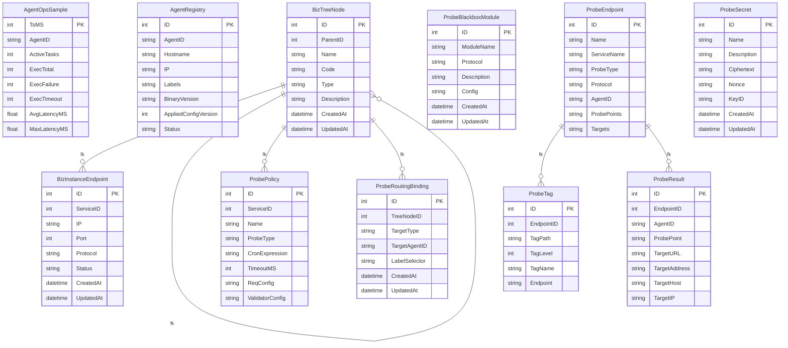

# 数据模型

## 简介

probe_exporter 是面向企业级的服务探针拨测与结果导出平台，支持**双模式探测**（Blackbox + Custom Probe）、灵活的验证引擎、多渠道导出，并提供完整的 Web 管理界面。本页聚焦其持久化层 GORM 结构体与 MySQL 表结构，覆盖探测端点、拨测结果、Blackbox 模块、服务树节点、密钥等核心实体的字段语义与关系，是理解配置面与执行面数据流的基础。

## 核心数据模型

`probe_endpoints` 是探测端的“定义表”，使用自增 BIGINT 主键，`name` 与 `service_name` 共同标识探测目标；`probe_type` 以枚举限定 `blackbox / custom / local` 三种拨测类型，用于区分是否走 Blackbox Exporter 还是本地自定义拨测 <cite>db/schema.sql:13-62</cite>。`probe_results` 是结果事实表，主键虽非显式 PRIMARY KEY，但采用 BIGINT AUTO_INCREMENT 并通过 `endpoint_id` 回指端点，记录 `agent_id`、`probe_point`、`target_url`、`target_address` 等运行时字段 <cite>db/schema.sql:86-138</cite>。`probe_blackbox_modules` 维护 Blackbox 模块元信息，`module_name` 唯一（如 `http_2xx`、`tcp_connect`），`module_config` 以 JSON 保存完整的 Blackbox 配置片段 <cite>db/schema.sql:143-159</cite>。`probe_secret` 使用 AES-GCM 保护拨测凭据，`name` 作为 `secret_refs` 引用键，`ciphertext` 与 `nonce` 强约束非空，配合 `key_id` 描述解密来源 <cite>db/schema.sql:508-520</cite>。

## 服务数据模型

`biz_instance_endpoint` 描述服务树叶子层的实例端点，`service_id` 外键关联 `biz_tree_node` 中 `type=SERVICE` 的服务节点，约束保证实例必须挂在服务下；`protocol` 枚举限定 `HTTP / HTTPS / TCP / ICMP`，`port` 默认 0 兼容 ICMP 场景 <cite>db/schema.sql:434-449</cite>。该模型与 `probe_endpoints` 通过 `service_name` 形成语义关联：端点声明所属服务，实例节点提供真实 IP/Protocol，供拨测器解析目标。结合 `probe_secret` 的 `secret_refs` 引用与 `probe_blackbox_modules` 的协议模板，可在执行端动态拼装出探测 payload。

## 数据库与迁移策略

源码证据中可见的表结构均使用 `CREATE TABLE IF NOT EXISTS` 创建，未提供显式迁移脚本 <cite>db/schema.sql:13-62</cite>。生产部署应以该 schema 为基准，结合 GORM 模型双向校验结构一致性；对于 `probe_endpoints.probe_type` 与 `biz_instance_endpoint.protocol` 这类枚举列，变更需同步业务枚举常量，避免应用层写入非法值 <cite>db/schema.sql:13-62</cite> <cite>db/schema.sql:434-449</cite>。`probe_secret` 的密文与 nonce 在 schema 层强非空，迁移时务必保证密钥管理服务先于数据写入可用，否则会出现写入失败 <cite>db/schema.sql:508-520</cite>。

## 结论

本页通过 `db/schema.sql` 真实表结构勾勒出 probe_exporter 的配置面（端点、模块、密钥）与服务树（节点、实例）数据图谱，为后续分析 Agent 注册、路由绑定与结果导出提供基础事实。
<cite>db/schema.sql:13-62</cite>

## 架构图

实体定义见 internal/models 中的 GORM 结构体： ProbeEndpoint <cite>internal/models/endpoint.go:11-31</cite>，<cite>internal/models/result.go:11-31</cite> <cite>internal/models/tag.go:4-24</cite> <cite>internal/models/secret.go:7-27</cite>。表结构见 db/schema.sql。

## 目录

1. 简介
2. 核心数据模型
3. 服务数据模型
4. 数据库与迁移策略
5. 结论
6. 架构图
